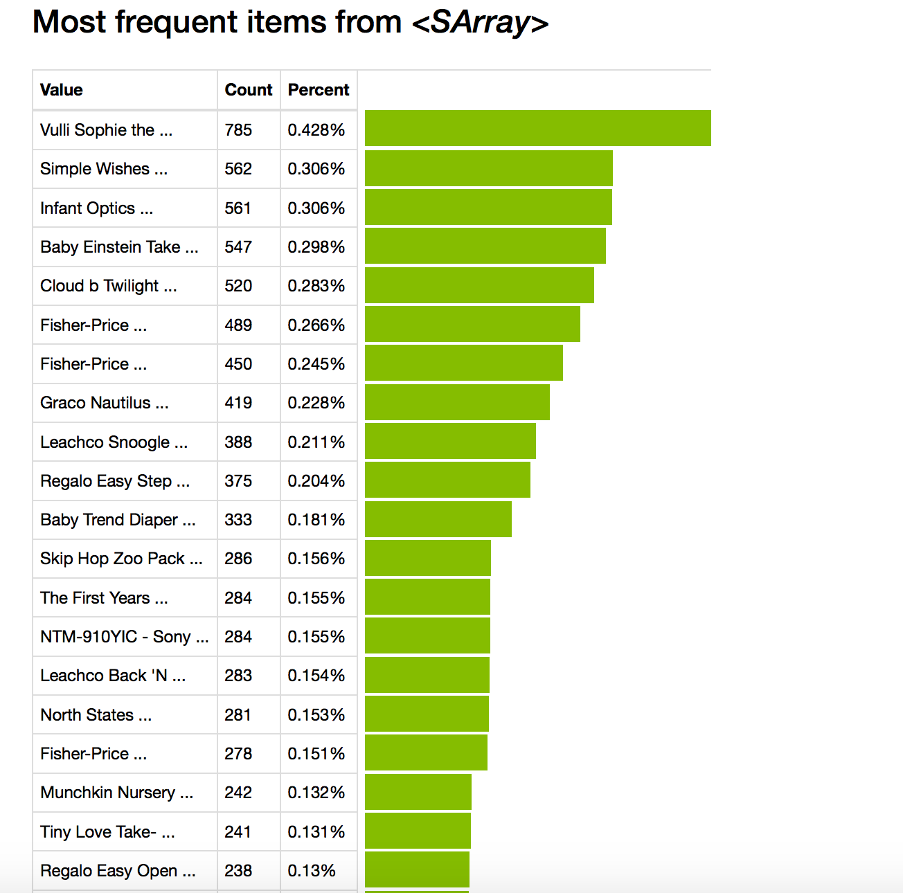
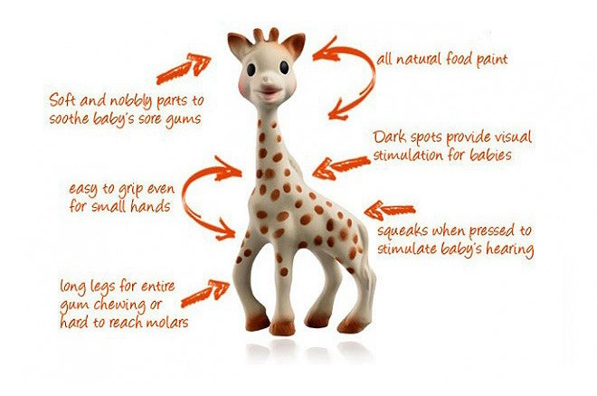
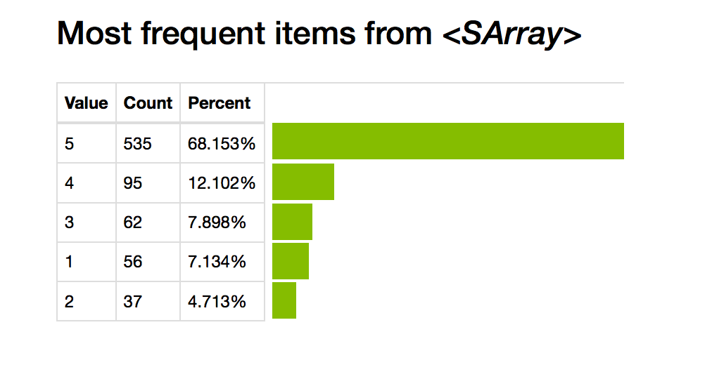
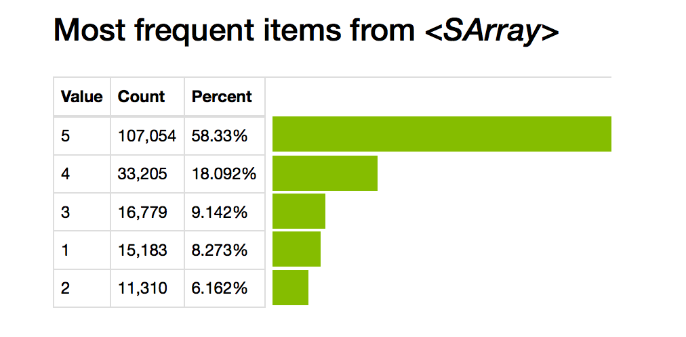
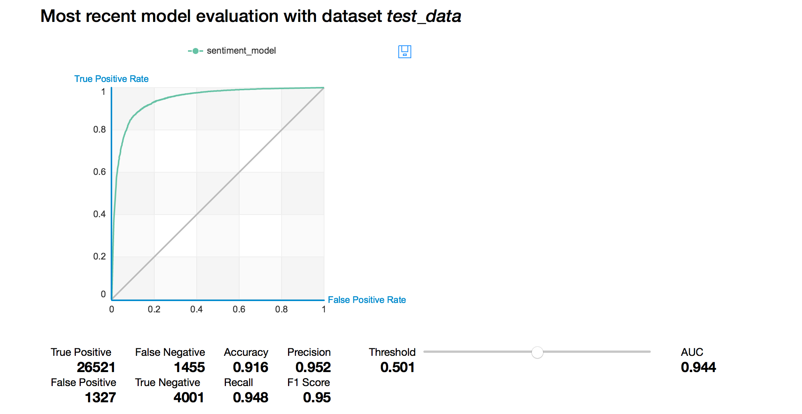
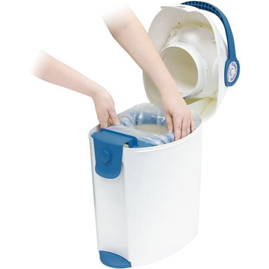

    import graphlab

#Read some product review data

    products = graphlab.SFrame('data/amazon_baby.gl')

#Lets explore this data together

    products.head()

<table frame="box" rules="cols">
    <tr>
        <th style="padding-left: 1em; padding-right: 1em; text-align: center">name</th>
        <th style="padding-left: 1em; padding-right: 1em; text-align: center">review</th>
        <th style="padding-left: 1em; padding-right: 1em; text-align: center">rating</th>
    </tr>
    <tr>
        <td style="padding-left: 1em; padding-right: 1em; text-align: center; vertical-align: top">Planetwise Flannel Wipes</td>
        <td style="padding-left: 1em; padding-right: 1em; text-align: center; vertical-align: top">These flannel wipes are OK, but in my opinion ...</td>
        <td style="padding-left: 1em; padding-right: 1em; text-align: center; vertical-align: top">3.0</td>
    </tr>
    <tr>
        <td style="padding-left: 1em; padding-right: 1em; text-align: center; vertical-align: top">Planetwise Wipe Pouch</td>
        <td style="padding-left: 1em; padding-right: 1em; text-align: center; vertical-align: top">it came early and was not disappointed. i love ...</td>
        <td style="padding-left: 1em; padding-right: 1em; text-align: center; vertical-align: top">5.0</td>
    </tr>
    <tr>
        <td style="padding-left: 1em; padding-right: 1em; text-align: center; vertical-align: top">Annas Dream Full Quilt with 2 Shams ...</td>
        <td style="padding-left: 1em; padding-right: 1em; text-align: center; vertical-align: top">Very soft and comfortable and warmer than it ...</td>
        <td style="padding-left: 1em; padding-right: 1em; text-align: center; vertical-align: top">5.0</td>
    </tr>
    <tr>
        <td style="padding-left: 1em; padding-right: 1em; text-align: center; vertical-align: top">Stop Pacifier Sucking without tears with ...</td>
        <td style="padding-left: 1em; padding-right: 1em; text-align: center; vertical-align: top">This is a product well worth the purchase.  I ...</td>
        <td style="padding-left: 1em; padding-right: 1em; text-align: center; vertical-align: top">5.0</td>
    </tr>
    <tr>
        <td style="padding-left: 1em; padding-right: 1em; text-align: center; vertical-align: top">Stop Pacifier Sucking without tears with ...</td>
        <td style="padding-left: 1em; padding-right: 1em; text-align: center; vertical-align: top">All of my kids have cried non-stop when I tried to ...</td>
        <td style="padding-left: 1em; padding-right: 1em; text-align: center; vertical-align: top">5.0</td>
    </tr>
    <tr>
        <td style="padding-left: 1em; padding-right: 1em; text-align: center; vertical-align: top">Stop Pacifier Sucking without tears with ...</td>
        <td style="padding-left: 1em; padding-right: 1em; text-align: center; vertical-align: top">When the Binky Fairy came to our house, we didn't ...</td>
        <td style="padding-left: 1em; padding-right: 1em; text-align: center; vertical-align: top">5.0</td>
    </tr>
    <tr>
        <td style="padding-left: 1em; padding-right: 1em; text-align: center; vertical-align: top">A Tale of Baby's Days with Peter Rabbit ...</td>
        <td style="padding-left: 1em; padding-right: 1em; text-align: center; vertical-align: top">Lovely book, it's bound tightly so you may no ...</td>
        <td style="padding-left: 1em; padding-right: 1em; text-align: center; vertical-align: top">4.0</td>
    </tr>
    <tr>
        <td style="padding-left: 1em; padding-right: 1em; text-align: center; vertical-align: top">Baby Tracker&amp;reg; - Daily Childcare Journal, ...</td>
        <td style="padding-left: 1em; padding-right: 1em; text-align: center; vertical-align: top">Perfect for new parents. We were able to keep ...</td>
        <td style="padding-left: 1em; padding-right: 1em; text-align: center; vertical-align: top">5.0</td>
    </tr>
    <tr>
        <td style="padding-left: 1em; padding-right: 1em; text-align: center; vertical-align: top">Baby Tracker&amp;reg; - Daily Childcare Journal, ...</td>
        <td style="padding-left: 1em; padding-right: 1em; text-align: center; vertical-align: top">A friend of mine pinned this product on Pinte ...</td>
        <td style="padding-left: 1em; padding-right: 1em; text-align: center; vertical-align: top">5.0</td>
    </tr>
    <tr>
        <td style="padding-left: 1em; padding-right: 1em; text-align: center; vertical-align: top">Baby Tracker&amp;reg; - Daily Childcare Journal, ...</td>
        <td style="padding-left: 1em; padding-right: 1em; text-align: center; vertical-align: top">This has been an easy way for my nanny to record ...</td>
        <td style="padding-left: 1em; padding-right: 1em; text-align: center; vertical-align: top">4.0</td>
    </tr>
</table>
[10 rows x 3 columns] 

#Build the word count vector for each review

    products['word_count'] = graphlab.text_analytics.count_words(products['review'])

    products.head()

<table frame="box" rules="cols">
    <tr>
        <th style="padding-left: 1em; padding-right: 1em; text-align: center">name</th>
        <th style="padding-left: 1em; padding-right: 1em; text-align: center">review</th>
        <th style="padding-left: 1em; padding-right: 1em; text-align: center">rating</th>
        <th style="padding-left: 1em; padding-right: 1em; text-align: center">word_count</th>
    </tr>
    <tr>
        <td style="padding-left: 1em; padding-right: 1em; text-align: center; vertical-align: top">Planetwise Flannel Wipes</td>
        <td style="padding-left: 1em; padding-right: 1em; text-align: center; vertical-align: top">These flannel wipes are OK, but in my opinion ...</td>
        <td style="padding-left: 1em; padding-right: 1em; text-align: center; vertical-align: top">3.0</td>
        <td style="padding-left: 1em; padding-right: 1em; text-align: center; vertical-align: top">{'and': 5, '6': 1, 'stink': 1, 'because' ...</td>
    </tr>
    <tr>
        <td style="padding-left: 1em; padding-right: 1em; text-align: center; vertical-align: top">Planetwise Wipe Pouch</td>
        <td style="padding-left: 1em; padding-right: 1em; text-align: center; vertical-align: top">it came early and was not disappointed. i love ...</td>
        <td style="padding-left: 1em; padding-right: 1em; text-align: center; vertical-align: top">5.0</td>
        <td style="padding-left: 1em; padding-right: 1em; text-align: center; vertical-align: top">{'and': 3, 'love': 1, 'it': 2, 'highly': 1, ...</td>
    </tr>
    <tr>
        <td style="padding-left: 1em; padding-right: 1em; text-align: center; vertical-align: top">Annas Dream Full Quilt with 2 Shams ...</td>
        <td style="padding-left: 1em; padding-right: 1em; text-align: center; vertical-align: top">Very soft and comfortable and warmer than it ...</td>
        <td style="padding-left: 1em; padding-right: 1em; text-align: center; vertical-align: top">5.0</td>
        <td style="padding-left: 1em; padding-right: 1em; text-align: center; vertical-align: top">{'and': 2, 'quilt': 1, 'it': 1, 'comfortable': ...</td>
    </tr>
    <tr>
        <td style="padding-left: 1em; padding-right: 1em; text-align: center; vertical-align: top">Stop Pacifier Sucking without tears with ...</td>
        <td style="padding-left: 1em; padding-right: 1em; text-align: center; vertical-align: top">This is a product well worth the purchase.  I ...</td>
        <td style="padding-left: 1em; padding-right: 1em; text-align: center; vertical-align: top">5.0</td>
        <td style="padding-left: 1em; padding-right: 1em; text-align: center; vertical-align: top">{'ingenious': 1, 'and': 3, 'love': 2, ...</td>
    </tr>
    <tr>
        <td style="padding-left: 1em; padding-right: 1em; text-align: center; vertical-align: top">Stop Pacifier Sucking without tears with ...</td>
        <td style="padding-left: 1em; padding-right: 1em; text-align: center; vertical-align: top">All of my kids have cried non-stop when I tried to ...</td>
        <td style="padding-left: 1em; padding-right: 1em; text-align: center; vertical-align: top">5.0</td>
        <td style="padding-left: 1em; padding-right: 1em; text-align: center; vertical-align: top">{'and': 2, 'parents!!': 1, 'all': 2, 'puppet.': ...</td>
    </tr>
    <tr>
        <td style="padding-left: 1em; padding-right: 1em; text-align: center; vertical-align: top">Stop Pacifier Sucking without tears with ...</td>
        <td style="padding-left: 1em; padding-right: 1em; text-align: center; vertical-align: top">When the Binky Fairy came to our house, we didn't ...</td>
        <td style="padding-left: 1em; padding-right: 1em; text-align: center; vertical-align: top">5.0</td>
        <td style="padding-left: 1em; padding-right: 1em; text-align: center; vertical-align: top">{'and': 2, 'this': 2, 'her': 1, 'help': 2, ...</td>
    </tr>
    <tr>
        <td style="padding-left: 1em; padding-right: 1em; text-align: center; vertical-align: top">A Tale of Baby's Days with Peter Rabbit ...</td>
        <td style="padding-left: 1em; padding-right: 1em; text-align: center; vertical-align: top">Lovely book, it's bound tightly so you may no ...</td>
        <td style="padding-left: 1em; padding-right: 1em; text-align: center; vertical-align: top">4.0</td>
        <td style="padding-left: 1em; padding-right: 1em; text-align: center; vertical-align: top">{'shop': 1, 'noble': 1, 'is': 1, 'it': 1, 'as': ...</td>
    </tr>
    <tr>
        <td style="padding-left: 1em; padding-right: 1em; text-align: center; vertical-align: top">Baby Tracker&amp;reg; - Daily Childcare Journal, ...</td>
        <td style="padding-left: 1em; padding-right: 1em; text-align: center; vertical-align: top">Perfect for new parents. We were able to keep ...</td>
        <td style="padding-left: 1em; padding-right: 1em; text-align: center; vertical-align: top">5.0</td>
        <td style="padding-left: 1em; padding-right: 1em; text-align: center; vertical-align: top">{'and': 2, 'all': 1, 'right': 1, 'when': 1, ...</td>
    </tr>
    <tr>
        <td style="padding-left: 1em; padding-right: 1em; text-align: center; vertical-align: top">Baby Tracker&amp;reg; - Daily Childcare Journal, ...</td>
        <td style="padding-left: 1em; padding-right: 1em; text-align: center; vertical-align: top">A friend of mine pinned this product on Pinte ...</td>
        <td style="padding-left: 1em; padding-right: 1em; text-align: center; vertical-align: top">5.0</td>
        <td style="padding-left: 1em; padding-right: 1em; text-align: center; vertical-align: top">{'and': 1, 'help': 1, 'give': 1, 'is': 1, ' ...</td>
    </tr>
    <tr>
        <td style="padding-left: 1em; padding-right: 1em; text-align: center; vertical-align: top">Baby Tracker&amp;reg; - Daily Childcare Journal, ...</td>
        <td style="padding-left: 1em; padding-right: 1em; text-align: center; vertical-align: top">This has been an easy way for my nanny to record ...</td>
        <td style="padding-left: 1em; padding-right: 1em; text-align: center; vertical-align: top">4.0</td>
        <td style="padding-left: 1em; padding-right: 1em; text-align: center; vertical-align: top">{'journal.': 1, 'nanny': 1, 'standarad': 1, ...</td>
    </tr>
</table>
[10 rows x 4 columns] 

    graphlab.canvas.set_target('ipynb')

    products['name'].show()

#Explore Vulli Sophie

    giraffe_reviews = products[products['name'] == 'Vulli Sophie the Giraffe Teether']

    len(giraffe_reviews)

    785

    giraffe_reviews['rating'].show(view='Categorical')

#Build a sentiment classifier

    products['rating'].show(view='Categorical')

##Define what's a positive and negative sentiment

    #ignore all 3 * reviews
    products = products[products['rating'] != 3]

    #positive sentiment = 4 * or 5 * reviews
    products['sentiment'] = products['rating'] >= 4

    products.head()

<table frame="box" rules="cols">
    <tr>
        <th style="padding-left: 1em; padding-right: 1em; text-align: center">name</th>
        <th style="padding-left: 1em; padding-right: 1em; text-align: center">review</th>
        <th style="padding-left: 1em; padding-right: 1em; text-align: center">rating</th>
        <th style="padding-left: 1em; padding-right: 1em; text-align: center">word_count</th>
        <th style="padding-left: 1em; padding-right: 1em; text-align: center">sentiment</th>
    </tr>
    <tr>
        <td style="padding-left: 1em; padding-right: 1em; text-align: center; vertical-align: top">Planetwise Wipe Pouch</td>
        <td style="padding-left: 1em; padding-right: 1em; text-align: center; vertical-align: top">it came early and was not disappointed. i love ...</td>
        <td style="padding-left: 1em; padding-right: 1em; text-align: center; vertical-align: top">5.0</td>
        <td style="padding-left: 1em; padding-right: 1em; text-align: center; vertical-align: top">{'and': 3, 'love': 1, 'it': 2, 'highly': 1, ...</td>
        <td style="padding-left: 1em; padding-right: 1em; text-align: center; vertical-align: top">1</td>
    </tr>
    <tr>
        <td style="padding-left: 1em; padding-right: 1em; text-align: center; vertical-align: top">Annas Dream Full Quilt with 2 Shams ...</td>
        <td style="padding-left: 1em; padding-right: 1em; text-align: center; vertical-align: top">Very soft and comfortable and warmer than it ...</td>
        <td style="padding-left: 1em; padding-right: 1em; text-align: center; vertical-align: top">5.0</td>
        <td style="padding-left: 1em; padding-right: 1em; text-align: center; vertical-align: top">{'and': 2, 'quilt': 1, 'it': 1, 'comfortable': ...</td>
        <td style="padding-left: 1em; padding-right: 1em; text-align: center; vertical-align: top">1</td>
    </tr>
    <tr>
        <td style="padding-left: 1em; padding-right: 1em; text-align: center; vertical-align: top">Stop Pacifier Sucking without tears with ...</td>
        <td style="padding-left: 1em; padding-right: 1em; text-align: center; vertical-align: top">This is a product well worth the purchase.  I ...</td>
        <td style="padding-left: 1em; padding-right: 1em; text-align: center; vertical-align: top">5.0</td>
        <td style="padding-left: 1em; padding-right: 1em; text-align: center; vertical-align: top">{'ingenious': 1, 'and': 3, 'love': 2, ...</td>
        <td style="padding-left: 1em; padding-right: 1em; text-align: center; vertical-align: top">1</td>
    </tr>
    <tr>
        <td style="padding-left: 1em; padding-right: 1em; text-align: center; vertical-align: top">Stop Pacifier Sucking without tears with ...</td>
        <td style="padding-left: 1em; padding-right: 1em; text-align: center; vertical-align: top">All of my kids have cried non-stop when I tried to ...</td>
        <td style="padding-left: 1em; padding-right: 1em; text-align: center; vertical-align: top">5.0</td>
        <td style="padding-left: 1em; padding-right: 1em; text-align: center; vertical-align: top">{'and': 2, 'parents!!': 1, 'all': 2, 'puppet.': ...</td>
        <td style="padding-left: 1em; padding-right: 1em; text-align: center; vertical-align: top">1</td>
    </tr>
    <tr>
        <td style="padding-left: 1em; padding-right: 1em; text-align: center; vertical-align: top">Stop Pacifier Sucking without tears with ...</td>
        <td style="padding-left: 1em; padding-right: 1em; text-align: center; vertical-align: top">When the Binky Fairy came to our house, we didn't ...</td>
        <td style="padding-left: 1em; padding-right: 1em; text-align: center; vertical-align: top">5.0</td>
        <td style="padding-left: 1em; padding-right: 1em; text-align: center; vertical-align: top">{'and': 2, 'this': 2, 'her': 1, 'help': 2, ...</td>
        <td style="padding-left: 1em; padding-right: 1em; text-align: center; vertical-align: top">1</td>
    </tr>
    <tr>
        <td style="padding-left: 1em; padding-right: 1em; text-align: center; vertical-align: top">A Tale of Baby's Days with Peter Rabbit ...</td>
        <td style="padding-left: 1em; padding-right: 1em; text-align: center; vertical-align: top">Lovely book, it's bound tightly so you may no ...</td>
        <td style="padding-left: 1em; padding-right: 1em; text-align: center; vertical-align: top">4.0</td>
        <td style="padding-left: 1em; padding-right: 1em; text-align: center; vertical-align: top">{'shop': 1, 'noble': 1, 'is': 1, 'it': 1, 'as': ...</td>
        <td style="padding-left: 1em; padding-right: 1em; text-align: center; vertical-align: top">1</td>
    </tr>
    <tr>
        <td style="padding-left: 1em; padding-right: 1em; text-align: center; vertical-align: top">Baby Tracker&amp;reg; - Daily Childcare Journal, ...</td>
        <td style="padding-left: 1em; padding-right: 1em; text-align: center; vertical-align: top">Perfect for new parents. We were able to keep ...</td>
        <td style="padding-left: 1em; padding-right: 1em; text-align: center; vertical-align: top">5.0</td>
        <td style="padding-left: 1em; padding-right: 1em; text-align: center; vertical-align: top">{'and': 2, 'all': 1, 'right': 1, 'when': 1, ...</td>
        <td style="padding-left: 1em; padding-right: 1em; text-align: center; vertical-align: top">1</td>
    </tr>
    <tr>
        <td style="padding-left: 1em; padding-right: 1em; text-align: center; vertical-align: top">Baby Tracker&amp;reg; - Daily Childcare Journal, ...</td>
        <td style="padding-left: 1em; padding-right: 1em; text-align: center; vertical-align: top">A friend of mine pinned this product on Pinte ...</td>
        <td style="padding-left: 1em; padding-right: 1em; text-align: center; vertical-align: top">5.0</td>
        <td style="padding-left: 1em; padding-right: 1em; text-align: center; vertical-align: top">{'and': 1, 'help': 1, 'give': 1, 'is': 1, ' ...</td>
        <td style="padding-left: 1em; padding-right: 1em; text-align: center; vertical-align: top">1</td>
    </tr>
    <tr>
        <td style="padding-left: 1em; padding-right: 1em; text-align: center; vertical-align: top">Baby Tracker&amp;reg; - Daily Childcare Journal, ...</td>
        <td style="padding-left: 1em; padding-right: 1em; text-align: center; vertical-align: top">This has been an easy way for my nanny to record ...</td>
        <td style="padding-left: 1em; padding-right: 1em; text-align: center; vertical-align: top">4.0</td>
        <td style="padding-left: 1em; padding-right: 1em; text-align: center; vertical-align: top">{'journal.': 1, 'nanny': 1, 'standarad': 1, ...</td>
        <td style="padding-left: 1em; padding-right: 1em; text-align: center; vertical-align: top">1</td>
    </tr>
    <tr>
        <td style="padding-left: 1em; padding-right: 1em; text-align: center; vertical-align: top">Baby Tracker&amp;reg; - Daily Childcare Journal, ...</td>
        <td style="padding-left: 1em; padding-right: 1em; text-align: center; vertical-align: top">I love this journal and our nanny uses it ...</td>
        <td style="padding-left: 1em; padding-right: 1em; text-align: center; vertical-align: top">4.0</td>
        <td style="padding-left: 1em; padding-right: 1em; text-align: center; vertical-align: top">{'all': 1, 'forget': 1, 'just': 1, 'food': 1, ...</td>
        <td style="padding-left: 1em; padding-right: 1em; text-align: center; vertical-align: top">1</td>
    </tr>
</table>
[10 rows x 5 columns] 

#Lets train the sentiment classifier

    train_data,test_data = products.random_split(.8,seed=0)

    sentiment_model = graphlab.logistic_classifier.create(train_data,target='sentiment',features=['word_count'], validation_set=test_data)

    PROGRESS: Logistic regression:
    PROGRESS: --------------------------------------------------------
    PROGRESS: Number of examples          : 133448
    PROGRESS: Number of classes           : 2
    PROGRESS: Number of feature columns   : 1
    PROGRESS: Number of unpacked features : 219217
    PROGRESS: Number of coefficients    : 219218
    PROGRESS: Starting L-BFGS
    PROGRESS: --------------------------------------------------------
    PROGRESS: +-----------+----------+-----------+--------------+-------------------+---------------------+
    PROGRESS: | Iteration | Passes   | Step size | Elapsed Time | Training-accuracy | Validation-accuracy |
    PROGRESS: +-----------+----------+-----------+--------------+-------------------+---------------------+
    PROGRESS: | 1         | 5        | 0.000002  | 2.608392     | 0.841481          | 0.839989            |
    PROGRESS: | 2         | 9        | 3.000000  | 4.218989     | 0.947425          | 0.894877            |
    PROGRESS: | 3         | 10       | 3.000000  | 4.921914     | 0.923768          | 0.866232            |
    PROGRESS: | 4         | 11       | 3.000000  | 5.597670     | 0.971779          | 0.912743            |
    PROGRESS: | 5         | 12       | 3.000000  | 6.182103     | 0.975511          | 0.908900            |
    PROGRESS: | 6         | 13       | 3.000000  | 6.719349     | 0.899991          | 0.825967            |
    PROGRESS: | 10        | 18       | 1.000000  | 9.436274     | 0.988715          | 0.916256            |
    PROGRESS: +-----------+----------+-----------+--------------+-------------------+---------------------+
    PROGRESS: TERMINATED: Iteration limit reached.
    PROGRESS: This model may not be optimal. To improve it, consider increasing `max_iterations`.

#Evaluate the sentiment model

    sentiment_model.evaluate(test_data, metric='roc_curve')

    {'roc_curve': Columns:
     	threshold	float
     	fpr	float
     	tpr	float
     	p	int
     	n	int
     
     Rows: 100001
     
     Data:
     +-----------+----------------+----------------+-------+------+
     | threshold |      fpr       |      tpr       |   p   |  n   |
     +-----------+----------------+----------------+-------+------+
     |    0.0    |      1.0       |      1.0       | 27976 | 5328 |
     |   1e-05   | 0.909346846847 | 0.998856162425 | 27976 | 5328 |
     |   2e-05   | 0.896021021021 | 0.998748927652 | 27976 | 5328 |
     |   3e-05   | 0.886448948949 | 0.998462968259 | 27976 | 5328 |
     |   4e-05   | 0.879692192192 | 0.998284243637 | 27976 | 5328 |
     |   5e-05   | 0.875187687688 | 0.998212753789 | 27976 | 5328 |
     |   6e-05   | 0.872184684685 | 0.998177008865 | 27976 | 5328 |
     |   7e-05   | 0.868618618619 | 0.998034029168 | 27976 | 5328 |
     |   8e-05   | 0.864677177177 | 0.997998284244 | 27976 | 5328 |
     |   9e-05   | 0.860735735736 | 0.997962539319 | 27976 | 5328 |
     +-----------+----------------+----------------+-------+------+
     [100001 rows x 5 columns]
     Note: Only the head of the SFrame is printed.
     You can use print_rows(num_rows=m, num_columns=n) to print more rows and columns.}

    sentiment_model.show(view='Evaluation')

#Applying the learned model to understand sentiment for Giraffe

    giraffe_reviews['predicted_sentiment'] = sentiment_model.predict(giraffe_reviews,output_type='probability')

    giraffe_reviews.head()

<table frame="box" rules="cols">
    <tr>
        <th style="padding-left: 1em; padding-right: 1em; text-align: center">name</th>
        <th style="padding-left: 1em; padding-right: 1em; text-align: center">review</th>
        <th style="padding-left: 1em; padding-right: 1em; text-align: center">rating</th>
        <th style="padding-left: 1em; padding-right: 1em; text-align: center">word_count</th>
        <th style="padding-left: 1em; padding-right: 1em; text-align: center">predicted_sentiment</th>
    </tr>
    <tr>
        <td style="padding-left: 1em; padding-right: 1em; text-align: center; vertical-align: top">Vulli Sophie the Giraffe Teether ...</td>
        <td style="padding-left: 1em; padding-right: 1em; text-align: center; vertical-align: top">He likes chewing on all the parts especially the ...</td>
        <td style="padding-left: 1em; padding-right: 1em; text-align: center; vertical-align: top">5.0</td>
        <td style="padding-left: 1em; padding-right: 1em; text-align: center; vertical-align: top">{'and': 1, 'all': 1, 'because': 1, 'it': 1, ...</td>
        <td style="padding-left: 1em; padding-right: 1em; text-align: center; vertical-align: top">0.999513023521</td>
    </tr>
    <tr>
        <td style="padding-left: 1em; padding-right: 1em; text-align: center; vertical-align: top">Vulli Sophie the Giraffe Teether ...</td>
        <td style="padding-left: 1em; padding-right: 1em; text-align: center; vertical-align: top">My son loves this toy and fits great in the diaper ...</td>
        <td style="padding-left: 1em; padding-right: 1em; text-align: center; vertical-align: top">5.0</td>
        <td style="padding-left: 1em; padding-right: 1em; text-align: center; vertical-align: top">{'and': 1, 'right': 1, 'help': 1, 'just': 1, ...</td>
        <td style="padding-left: 1em; padding-right: 1em; text-align: center; vertical-align: top">0.999320678306</td>
    </tr>
    <tr>
        <td style="padding-left: 1em; padding-right: 1em; text-align: center; vertical-align: top">Vulli Sophie the Giraffe Teether ...</td>
        <td style="padding-left: 1em; padding-right: 1em; text-align: center; vertical-align: top">There really should be a large warning on the  ...</td>
        <td style="padding-left: 1em; padding-right: 1em; text-align: center; vertical-align: top">1.0</td>
        <td style="padding-left: 1em; padding-right: 1em; text-align: center; vertical-align: top">{'and': 2, 'all': 1, 'would': 1, 'latex.': 1, ...</td>
        <td style="padding-left: 1em; padding-right: 1em; text-align: center; vertical-align: top">0.013558811687</td>
    </tr>
    <tr>
        <td style="padding-left: 1em; padding-right: 1em; text-align: center; vertical-align: top">Vulli Sophie the Giraffe Teether ...</td>
        <td style="padding-left: 1em; padding-right: 1em; text-align: center; vertical-align: top">All the moms in my moms' group got Sophie for ...</td>
        <td style="padding-left: 1em; padding-right: 1em; text-align: center; vertical-align: top">5.0</td>
        <td style="padding-left: 1em; padding-right: 1em; text-align: center; vertical-align: top">{'and': 2, 'one!': 1, 'all': 1, 'love': 1, ...</td>
        <td style="padding-left: 1em; padding-right: 1em; text-align: center; vertical-align: top">0.995769474148</td>
    </tr>
    <tr>
        <td style="padding-left: 1em; padding-right: 1em; text-align: center; vertical-align: top">Vulli Sophie the Giraffe Teether ...</td>
        <td style="padding-left: 1em; padding-right: 1em; text-align: center; vertical-align: top">I was a little skeptical on whether Sophie was ...</td>
        <td style="padding-left: 1em; padding-right: 1em; text-align: center; vertical-align: top">5.0</td>
        <td style="padding-left: 1em; padding-right: 1em; text-align: center; vertical-align: top">{'and': 3, 'all': 1, 'months': 1, 'old': 1, ...</td>
        <td style="padding-left: 1em; padding-right: 1em; text-align: center; vertical-align: top">0.662374415673</td>
    </tr>
    <tr>
        <td style="padding-left: 1em; padding-right: 1em; text-align: center; vertical-align: top">Vulli Sophie the Giraffe Teether ...</td>
        <td style="padding-left: 1em; padding-right: 1em; text-align: center; vertical-align: top">I have been reading about Sophie and was going  ...</td>
        <td style="padding-left: 1em; padding-right: 1em; text-align: center; vertical-align: top">5.0</td>
        <td style="padding-left: 1em; padding-right: 1em; text-align: center; vertical-align: top">{'and': 6, 'seven': 1, 'already': 1, 'love': 1, ...</td>
        <td style="padding-left: 1em; padding-right: 1em; text-align: center; vertical-align: top">0.999997148186</td>
    </tr>
    <tr>
        <td style="padding-left: 1em; padding-right: 1em; text-align: center; vertical-align: top">Vulli Sophie the Giraffe Teether ...</td>
        <td style="padding-left: 1em; padding-right: 1em; text-align: center; vertical-align: top">My neice loves her sophie and has spent hours ...</td>
        <td style="padding-left: 1em; padding-right: 1em; text-align: center; vertical-align: top">5.0</td>
        <td style="padding-left: 1em; padding-right: 1em; text-align: center; vertical-align: top">{'and': 4, 'drooling,': 1, 'love': 1, ...</td>
        <td style="padding-left: 1em; padding-right: 1em; text-align: center; vertical-align: top">0.989190989536</td>
    </tr>
    <tr>
        <td style="padding-left: 1em; padding-right: 1em; text-align: center; vertical-align: top">Vulli Sophie the Giraffe Teether ...</td>
        <td style="padding-left: 1em; padding-right: 1em; text-align: center; vertical-align: top">What a friendly face! And those mesmerizing ...</td>
        <td style="padding-left: 1em; padding-right: 1em; text-align: center; vertical-align: top">5.0</td>
        <td style="padding-left: 1em; padding-right: 1em; text-align: center; vertical-align: top">{'and': 3, 'chew': 1, 'be': 1, 'is': 1, ...</td>
        <td style="padding-left: 1em; padding-right: 1em; text-align: center; vertical-align: top">0.999563518413</td>
    </tr>
    <tr>
        <td style="padding-left: 1em; padding-right: 1em; text-align: center; vertical-align: top">Vulli Sophie the Giraffe Teether ...</td>
        <td style="padding-left: 1em; padding-right: 1em; text-align: center; vertical-align: top">We got this just for my son to chew on instea ...</td>
        <td style="padding-left: 1em; padding-right: 1em; text-align: center; vertical-align: top">5.0</td>
        <td style="padding-left: 1em; padding-right: 1em; text-align: center; vertical-align: top">{'chew': 2, 'seemed': 1, 'because': 1, 'about.': ...</td>
        <td style="padding-left: 1em; padding-right: 1em; text-align: center; vertical-align: top">0.970160542725</td>
    </tr>
    <tr>
        <td style="padding-left: 1em; padding-right: 1em; text-align: center; vertical-align: top">Vulli Sophie the Giraffe Teether ...</td>
        <td style="padding-left: 1em; padding-right: 1em; text-align: center; vertical-align: top">My baby seems to like this toy, but I could ...</td>
        <td style="padding-left: 1em; padding-right: 1em; text-align: center; vertical-align: top">3.0</td>
        <td style="padding-left: 1em; padding-right: 1em; text-align: center; vertical-align: top">{'and': 2, 'already': 1, 'some': 1, 'it': 3, ...</td>
        <td style="padding-left: 1em; padding-right: 1em; text-align: center; vertical-align: top">0.195367644588</td>
    </tr>
</table>
[10 rows x 5 columns] 

#Sort the reviews based on the predicted sentiment and explore

    giraffe_reviews = giraffe_reviews.sort('predicted_sentiment',ascending=False)

    giraffe_reviews.head()

<table frame="box" rules="cols">
    <tr>
        <th style="padding-left: 1em; padding-right: 1em; text-align: center">name</th>
        <th style="padding-left: 1em; padding-right: 1em; text-align: center">review</th>
        <th style="padding-left: 1em; padding-right: 1em; text-align: center">rating</th>
        <th style="padding-left: 1em; padding-right: 1em; text-align: center">word_count</th>
        <th style="padding-left: 1em; padding-right: 1em; text-align: center">predicted_sentiment</th>
    </tr>
    <tr>
        <td style="padding-left: 1em; padding-right: 1em; text-align: center; vertical-align: top">Vulli Sophie the Giraffe Teether ...</td>
        <td style="padding-left: 1em; padding-right: 1em; text-align: center; vertical-align: top">Sophie, oh Sophie, your time has come. My ...</td>
        <td style="padding-left: 1em; padding-right: 1em; text-align: center; vertical-align: top">5.0</td>
        <td style="padding-left: 1em; padding-right: 1em; text-align: center; vertical-align: top">{'giggles': 1, 'all': 1, "violet's": 2, 'bring': ...</td>
        <td style="padding-left: 1em; padding-right: 1em; text-align: center; vertical-align: top">1.0</td>
    </tr>
    <tr>
        <td style="padding-left: 1em; padding-right: 1em; text-align: center; vertical-align: top">Vulli Sophie the Giraffe Teether ...</td>
        <td style="padding-left: 1em; padding-right: 1em; text-align: center; vertical-align: top">I'm not sure why Sophie is such a hit with the ...</td>
        <td style="padding-left: 1em; padding-right: 1em; text-align: center; vertical-align: top">4.0</td>
        <td style="padding-left: 1em; padding-right: 1em; text-align: center; vertical-align: top">{'adoring': 1, 'find': 1, 'month': 1, 'bright': 1, ...</td>
        <td style="padding-left: 1em; padding-right: 1em; text-align: center; vertical-align: top">0.999999999703</td>
    </tr>
    <tr>
        <td style="padding-left: 1em; padding-right: 1em; text-align: center; vertical-align: top">Vulli Sophie the Giraffe Teether ...</td>
        <td style="padding-left: 1em; padding-right: 1em; text-align: center; vertical-align: top">I'll be honest...I bought this toy because all the ...</td>
        <td style="padding-left: 1em; padding-right: 1em; text-align: center; vertical-align: top">4.0</td>
        <td style="padding-left: 1em; padding-right: 1em; text-align: center; vertical-align: top">{'all': 2, 'discovered': 1, 'existence.': 1, ...</td>
        <td style="padding-left: 1em; padding-right: 1em; text-align: center; vertical-align: top">0.999999999392</td>
    </tr>
    <tr>
        <td style="padding-left: 1em; padding-right: 1em; text-align: center; vertical-align: top">Vulli Sophie the Giraffe Teether ...</td>
        <td style="padding-left: 1em; padding-right: 1em; text-align: center; vertical-align: top">We got this little giraffe as a gift from a ...</td>
        <td style="padding-left: 1em; padding-right: 1em; text-align: center; vertical-align: top">5.0</td>
        <td style="padding-left: 1em; padding-right: 1em; text-align: center; vertical-align: top">{'all': 2, "don't": 1, '(literally).so': 1, ...</td>
        <td style="padding-left: 1em; padding-right: 1em; text-align: center; vertical-align: top">0.99999999919</td>
    </tr>
    <tr>
        <td style="padding-left: 1em; padding-right: 1em; text-align: center; vertical-align: top">Vulli Sophie the Giraffe Teether ...</td>
        <td style="padding-left: 1em; padding-right: 1em; text-align: center; vertical-align: top">As a mother of 16month old twins; I bought ...</td>
        <td style="padding-left: 1em; padding-right: 1em; text-align: center; vertical-align: top">5.0</td>
        <td style="padding-left: 1em; padding-right: 1em; text-align: center; vertical-align: top">{'cute': 1, 'all': 1, 'reviews.': 2, 'just' ...</td>
        <td style="padding-left: 1em; padding-right: 1em; text-align: center; vertical-align: top">0.999999998657</td>
    </tr>
    <tr>
        <td style="padding-left: 1em; padding-right: 1em; text-align: center; vertical-align: top">Vulli Sophie the Giraffe Teether ...</td>
        <td style="padding-left: 1em; padding-right: 1em; text-align: center; vertical-align: top">Sophie the Giraffe is the perfect teething toy. ...</td>
        <td style="padding-left: 1em; padding-right: 1em; text-align: center; vertical-align: top">5.0</td>
        <td style="padding-left: 1em; padding-right: 1em; text-align: center; vertical-align: top">{'just': 2, 'both': 1, 'month': 1, 'ears,': 1, ...</td>
        <td style="padding-left: 1em; padding-right: 1em; text-align: center; vertical-align: top">0.999999997108</td>
    </tr>
    <tr>
        <td style="padding-left: 1em; padding-right: 1em; text-align: center; vertical-align: top">Vulli Sophie the Giraffe Teether ...</td>
        <td style="padding-left: 1em; padding-right: 1em; text-align: center; vertical-align: top">Sophie la giraffe is absolutely the best toy ...</td>
        <td style="padding-left: 1em; padding-right: 1em; text-align: center; vertical-align: top">5.0</td>
        <td style="padding-left: 1em; padding-right: 1em; text-align: center; vertical-align: top">{'and': 5, 'the': 1, 'all': 1, 'that': 2, ...</td>
        <td style="padding-left: 1em; padding-right: 1em; text-align: center; vertical-align: top">0.999999995589</td>
    </tr>
    <tr>
        <td style="padding-left: 1em; padding-right: 1em; text-align: center; vertical-align: top">Vulli Sophie the Giraffe Teether ...</td>
        <td style="padding-left: 1em; padding-right: 1em; text-align: center; vertical-align: top">My 5-mos old son took to this immediately. The ...</td>
        <td style="padding-left: 1em; padding-right: 1em; text-align: center; vertical-align: top">5.0</td>
        <td style="padding-left: 1em; padding-right: 1em; text-align: center; vertical-align: top">{'just': 1, 'shape': 2, 'mutt': 1, '"dog': 1, ...</td>
        <td style="padding-left: 1em; padding-right: 1em; text-align: center; vertical-align: top">0.999999995573</td>
    </tr>
    <tr>
        <td style="padding-left: 1em; padding-right: 1em; text-align: center; vertical-align: top">Vulli Sophie the Giraffe Teether ...</td>
        <td style="padding-left: 1em; padding-right: 1em; text-align: center; vertical-align: top">My nephews and my four kids all had Sophie in ...</td>
        <td style="padding-left: 1em; padding-right: 1em; text-align: center; vertical-align: top">5.0</td>
        <td style="padding-left: 1em; padding-right: 1em; text-align: center; vertical-align: top">{'and': 4, 'chew': 1, 'all': 1, 'perfect;': 1, ...</td>
        <td style="padding-left: 1em; padding-right: 1em; text-align: center; vertical-align: top">0.999999989527</td>
    </tr>
    <tr>
        <td style="padding-left: 1em; padding-right: 1em; text-align: center; vertical-align: top">Vulli Sophie the Giraffe Teether ...</td>
        <td style="padding-left: 1em; padding-right: 1em; text-align: center; vertical-align: top">Never thought I'd see my son French kissing a ...</td>
        <td style="padding-left: 1em; padding-right: 1em; text-align: center; vertical-align: top">5.0</td>
        <td style="padding-left: 1em; padding-right: 1em; text-align: center; vertical-align: top">{'giggles': 1, 'all': 1, 'out,': 1, 'over': 1, ...</td>
        <td style="padding-left: 1em; padding-right: 1em; text-align: center; vertical-align: top">0.999999985069</td>
    </tr>
</table>
[10 rows x 5 columns] 

#Show most positive reviews

    
    giraffe_reviews[0]['review']

    "Sophie, oh Sophie, your time has come. My granddaughter, Violet is 5 months old and starting to teeth. What joy little Sophie brings to Violet. Sophie is made of a very pliable rubber that is sturdy but not tough. It is quite easy for Violet to twist Sophie into unheard of positions to get Sophie into her mouth. The little nose and hooves fit perfectly into small mouths, and the drooling has purpose. The paint on Sophie is food quality.Sophie was born in 1961 in France. The maker had wondered why there was nothing available for babies and made Sophie from the finest rubber, phthalate-free on St Sophie's Day, thus the name was born. Since that time millions of Sophie's populate the world. She is soft and for babies little hands easy to grasp. Violet especially loves the bumpy head and horns of Sophie. Sophie has a long neck that easy to grasp and twist. She has lovely, sizable spots that attract Violet's attention. Sophie has happy little squeaks that bring squeals of delight from Violet. She is able to make Sophie squeak and that brings much joy. Sophie's smooth skin is soothing to Violet's little gums. Sophie is 7 inches tall and is the exact correct size for babies to hold and love.As you well know the first thing babies grasp, goes into their mouths- how wonderful to have a toy that stimulates all of the senses and helps with the issue of teething. Sophie is small enough to fit into any size pocket or bag. Sophie is the perfect find for babies from a few months to a year old. How wonderful to hear the giggles and laughs that emanate from babies who find Sophie irresistible. Viva La Sophie!Highly Recommended.  prisrob 12-11-09"

    giraffe_reviews[1]['review']

    "I'm not sure why Sophie is such a hit with the little ones, but my 7 month old baby girl is one of her adoring fans.  The rubber is softer and more pleasant to handle, and my daughter has enjoyed chewing on her legs and the nubs on her head even before she started teething.  She also loves the squeak that Sophie makes when you squeeze her.  Not sure what it is but if Sophie is amongst a pile of her other toys, my daughter will more often than not reach for Sophie.  And I have the peace of mind of knowing that only edible and safe paints and materials have been used to make Sophie, as opposed to Bright Starts and other baby toys made in China.  Now that the research is out on phthalates and other toxic substances in baby toys, I think it's more important than ever to find good quality toys that are also safe for our babies to handle and put in their mouths.  Sophie is a must-have for every new mom in my opinion.  Even if your kid is one of the few that can take or leave her, it's worth a try.  Vulli, the makers of Sophie, also make natural rubber teething rings that my daughter loves as well."

#Show most negative reviews

    giraffe_reviews[-1]['review']

    "My son (now 2.5) LOVED his Sophie, and I bought one for every baby shower I've gone to. Now, my daughter (6 months) just today nearly choked on it and I will never give it to her again. Had I not been within hearing range it could have been fatal. The strange sound she was making caught my attention and when I went to her and found the front curved leg shoved well down her throat and her face a purply/blue I panicked. I pulled it out and she vomited all over the carpet before screaming her head off. I can't believe how my opinion of this toy has changed from a must-have to a must-not-use. Please don't disregard any of the choking hazard comments, they are not over exaggerated!"

    giraffe_reviews[-2]['review']

    "This children's toy is nostalgic and very cute. However, there is a distinct rubber smell and a very odd taste, yes I tried it, that my baby did not enjoy. Also, if it is soiled it is extremely difficult to clean as the rubber is a kind of porus material and does not clean well. The final thing is the squeaking device inside which stopped working after the first couple of days. I returned this item feeling I had overpaid for a toy that was defective and did not meet my expectations. Please do not be swayed by the cute packaging and hype surounding it as I was. One more thing, I was given a full refund from Amazon without any problem."

    giraffe_reviews[-3]['review']

    'I wanted to love this product and was excited to buy it when I became pregnant but am now hesitant to let my baby use it after reading about the recall in Europe. Apparently, as I understand it, their toxin standards of measurement are lower than ours so they have not been recalled here (apparently we are OK with low levels of nitrates in the toys our children put in their mouths, but Europeans are not...hmmm)...Be that as it may, toxins registering even CLOSE to a dangerous level made me nervous about using. After digging around online I did discover that the company claims to have changed the product after a certain date and lists manufacturing codes so you can check yours (those listed were made after a certain date and are said to be safer). Sadly mine was not made after the &#34;improved&#34; date but I could not return it because there was no formal recall in our country. I considered returning it and hunting for one with an approved manufacturing date but man that was just too much work. Bummed but not ready to take a risk with my baby.'

#Calculate count for word 'awesome'

    def awesome_count(dict):
      if ('awesome' in dict):
        return dict['awesome']
      return 0

    products['awesome'] = products['word_count'].apply(awesome_count)

    products.head()

<table frame="box" rules="cols">
    <tr>
        <th style="padding-left: 1em; padding-right: 1em; text-align: center">name</th>
        <th style="padding-left: 1em; padding-right: 1em; text-align: center">review</th>
        <th style="padding-left: 1em; padding-right: 1em; text-align: center">rating</th>
        <th style="padding-left: 1em; padding-right: 1em; text-align: center">word_count</th>
        <th style="padding-left: 1em; padding-right: 1em; text-align: center">sentiment</th>
        <th style="padding-left: 1em; padding-right: 1em; text-align: center">awesome</th>
    </tr>
    <tr>
        <td style="padding-left: 1em; padding-right: 1em; text-align: center; vertical-align: top">Planetwise Wipe Pouch</td>
        <td style="padding-left: 1em; padding-right: 1em; text-align: center; vertical-align: top">it came early and was not disappointed. i love ...</td>
        <td style="padding-left: 1em; padding-right: 1em; text-align: center; vertical-align: top">5.0</td>
        <td style="padding-left: 1em; padding-right: 1em; text-align: center; vertical-align: top">{'and': 3, 'love': 1, 'it': 2, 'highly': 1, ...</td>
        <td style="padding-left: 1em; padding-right: 1em; text-align: center; vertical-align: top">1</td>
        <td style="padding-left: 1em; padding-right: 1em; text-align: center; vertical-align: top">0</td>
    </tr>
    <tr>
        <td style="padding-left: 1em; padding-right: 1em; text-align: center; vertical-align: top">Annas Dream Full Quilt with 2 Shams ...</td>
        <td style="padding-left: 1em; padding-right: 1em; text-align: center; vertical-align: top">Very soft and comfortable and warmer than it ...</td>
        <td style="padding-left: 1em; padding-right: 1em; text-align: center; vertical-align: top">5.0</td>
        <td style="padding-left: 1em; padding-right: 1em; text-align: center; vertical-align: top">{'and': 2, 'quilt': 1, 'it': 1, 'comfortable': ...</td>
        <td style="padding-left: 1em; padding-right: 1em; text-align: center; vertical-align: top">1</td>
        <td style="padding-left: 1em; padding-right: 1em; text-align: center; vertical-align: top">0</td>
    </tr>
    <tr>
        <td style="padding-left: 1em; padding-right: 1em; text-align: center; vertical-align: top">Stop Pacifier Sucking without tears with ...</td>
        <td style="padding-left: 1em; padding-right: 1em; text-align: center; vertical-align: top">This is a product well worth the purchase.  I ...</td>
        <td style="padding-left: 1em; padding-right: 1em; text-align: center; vertical-align: top">5.0</td>
        <td style="padding-left: 1em; padding-right: 1em; text-align: center; vertical-align: top">{'ingenious': 1, 'and': 3, 'love': 2, ...</td>
        <td style="padding-left: 1em; padding-right: 1em; text-align: center; vertical-align: top">1</td>
        <td style="padding-left: 1em; padding-right: 1em; text-align: center; vertical-align: top">0</td>
    </tr>
    <tr>
        <td style="padding-left: 1em; padding-right: 1em; text-align: center; vertical-align: top">Stop Pacifier Sucking without tears with ...</td>
        <td style="padding-left: 1em; padding-right: 1em; text-align: center; vertical-align: top">All of my kids have cried non-stop when I tried to ...</td>
        <td style="padding-left: 1em; padding-right: 1em; text-align: center; vertical-align: top">5.0</td>
        <td style="padding-left: 1em; padding-right: 1em; text-align: center; vertical-align: top">{'and': 2, 'parents!!': 1, 'all': 2, 'puppet.': ...</td>
        <td style="padding-left: 1em; padding-right: 1em; text-align: center; vertical-align: top">1</td>
        <td style="padding-left: 1em; padding-right: 1em; text-align: center; vertical-align: top">0</td>
    </tr>
    <tr>
        <td style="padding-left: 1em; padding-right: 1em; text-align: center; vertical-align: top">Stop Pacifier Sucking without tears with ...</td>
        <td style="padding-left: 1em; padding-right: 1em; text-align: center; vertical-align: top">When the Binky Fairy came to our house, we didn't ...</td>
        <td style="padding-left: 1em; padding-right: 1em; text-align: center; vertical-align: top">5.0</td>
        <td style="padding-left: 1em; padding-right: 1em; text-align: center; vertical-align: top">{'and': 2, 'this': 2, 'her': 1, 'help': 2, ...</td>
        <td style="padding-left: 1em; padding-right: 1em; text-align: center; vertical-align: top">1</td>
        <td style="padding-left: 1em; padding-right: 1em; text-align: center; vertical-align: top">0</td>
    </tr>
    <tr>
        <td style="padding-left: 1em; padding-right: 1em; text-align: center; vertical-align: top">A Tale of Baby's Days with Peter Rabbit ...</td>
        <td style="padding-left: 1em; padding-right: 1em; text-align: center; vertical-align: top">Lovely book, it's bound tightly so you may no ...</td>
        <td style="padding-left: 1em; padding-right: 1em; text-align: center; vertical-align: top">4.0</td>
        <td style="padding-left: 1em; padding-right: 1em; text-align: center; vertical-align: top">{'shop': 1, 'noble': 1, 'is': 1, 'it': 1, 'as': ...</td>
        <td style="padding-left: 1em; padding-right: 1em; text-align: center; vertical-align: top">1</td>
        <td style="padding-left: 1em; padding-right: 1em; text-align: center; vertical-align: top">0</td>
    </tr>
    <tr>
        <td style="padding-left: 1em; padding-right: 1em; text-align: center; vertical-align: top">Baby Tracker&amp;reg; - Daily Childcare Journal, ...</td>
        <td style="padding-left: 1em; padding-right: 1em; text-align: center; vertical-align: top">Perfect for new parents. We were able to keep ...</td>
        <td style="padding-left: 1em; padding-right: 1em; text-align: center; vertical-align: top">5.0</td>
        <td style="padding-left: 1em; padding-right: 1em; text-align: center; vertical-align: top">{'and': 2, 'all': 1, 'right': 1, 'when': 1, ...</td>
        <td style="padding-left: 1em; padding-right: 1em; text-align: center; vertical-align: top">1</td>
        <td style="padding-left: 1em; padding-right: 1em; text-align: center; vertical-align: top">0</td>
    </tr>
    <tr>
        <td style="padding-left: 1em; padding-right: 1em; text-align: center; vertical-align: top">Baby Tracker&amp;reg; - Daily Childcare Journal, ...</td>
        <td style="padding-left: 1em; padding-right: 1em; text-align: center; vertical-align: top">A friend of mine pinned this product on Pinte ...</td>
        <td style="padding-left: 1em; padding-right: 1em; text-align: center; vertical-align: top">5.0</td>
        <td style="padding-left: 1em; padding-right: 1em; text-align: center; vertical-align: top">{'and': 1, 'help': 1, 'give': 1, 'is': 1, ' ...</td>
        <td style="padding-left: 1em; padding-right: 1em; text-align: center; vertical-align: top">1</td>
        <td style="padding-left: 1em; padding-right: 1em; text-align: center; vertical-align: top">0</td>
    </tr>
    <tr>
        <td style="padding-left: 1em; padding-right: 1em; text-align: center; vertical-align: top">Baby Tracker&amp;reg; - Daily Childcare Journal, ...</td>
        <td style="padding-left: 1em; padding-right: 1em; text-align: center; vertical-align: top">This has been an easy way for my nanny to record ...</td>
        <td style="padding-left: 1em; padding-right: 1em; text-align: center; vertical-align: top">4.0</td>
        <td style="padding-left: 1em; padding-right: 1em; text-align: center; vertical-align: top">{'journal.': 1, 'nanny': 1, 'standarad': 1, ...</td>
        <td style="padding-left: 1em; padding-right: 1em; text-align: center; vertical-align: top">1</td>
        <td style="padding-left: 1em; padding-right: 1em; text-align: center; vertical-align: top">0</td>
    </tr>
    <tr>
        <td style="padding-left: 1em; padding-right: 1em; text-align: center; vertical-align: top">Baby Tracker&amp;reg; - Daily Childcare Journal, ...</td>
        <td style="padding-left: 1em; padding-right: 1em; text-align: center; vertical-align: top">I love this journal and our nanny uses it ...</td>
        <td style="padding-left: 1em; padding-right: 1em; text-align: center; vertical-align: top">4.0</td>
        <td style="padding-left: 1em; padding-right: 1em; text-align: center; vertical-align: top">{'all': 1, 'forget': 1, 'just': 1, 'food': 1, ...</td>
        <td style="padding-left: 1em; padding-right: 1em; text-align: center; vertical-align: top">1</td>
        <td style="padding-left: 1em; padding-right: 1em; text-align: center; vertical-align: top">0</td>
    </tr>
</table>
[10 rows x 6 columns] 

#Sum of word 'awesome' which appear in all review

    products['awesome'].sum()

    2002

#Calculate count for selected words

    selected_words = ['awesome', 'great', 'fantastic', 'amazing', 'love', 'horrible', 'bad', 'terrible', 'awful', 'wow', 'hate']

    products['great'] = products['word_count'].apply(lambda dict: 'great' in dict and dict['great'] or 0)

    products['great'].sum()

    42420

    def word_count(word_list,the_dict):
        for word in word_list:
            the_dict[word] = the_dict['word_count'].apply(lambda dict: word in dict and dict[word] or 0)

    word_count(selected_words,products)

    products.head()

<table frame="box" rules="cols">
    <tr>
        <th style="padding-left: 1em; padding-right: 1em; text-align: center">name</th>
        <th style="padding-left: 1em; padding-right: 1em; text-align: center">review</th>
        <th style="padding-left: 1em; padding-right: 1em; text-align: center">rating</th>
        <th style="padding-left: 1em; padding-right: 1em; text-align: center">word_count</th>
        <th style="padding-left: 1em; padding-right: 1em; text-align: center">sentiment</th>
        <th style="padding-left: 1em; padding-right: 1em; text-align: center">awesome</th>
    </tr>
    <tr>
        <td style="padding-left: 1em; padding-right: 1em; text-align: center; vertical-align: top">Planetwise Wipe Pouch</td>
        <td style="padding-left: 1em; padding-right: 1em; text-align: center; vertical-align: top">it came early and was not disappointed. i love ...</td>
        <td style="padding-left: 1em; padding-right: 1em; text-align: center; vertical-align: top">5.0</td>
        <td style="padding-left: 1em; padding-right: 1em; text-align: center; vertical-align: top">{'and': 3, 'love': 1, 'it': 2, 'highly': 1, ...</td>
        <td style="padding-left: 1em; padding-right: 1em; text-align: center; vertical-align: top">1</td>
        <td style="padding-left: 1em; padding-right: 1em; text-align: center; vertical-align: top">0</td>
    </tr>
    <tr>
        <td style="padding-left: 1em; padding-right: 1em; text-align: center; vertical-align: top">Annas Dream Full Quilt with 2 Shams ...</td>
        <td style="padding-left: 1em; padding-right: 1em; text-align: center; vertical-align: top">Very soft and comfortable and warmer than it ...</td>
        <td style="padding-left: 1em; padding-right: 1em; text-align: center; vertical-align: top">5.0</td>
        <td style="padding-left: 1em; padding-right: 1em; text-align: center; vertical-align: top">{'and': 2, 'quilt': 1, 'it': 1, 'comfortable': ...</td>
        <td style="padding-left: 1em; padding-right: 1em; text-align: center; vertical-align: top">1</td>
        <td style="padding-left: 1em; padding-right: 1em; text-align: center; vertical-align: top">0</td>
    </tr>
    <tr>
        <td style="padding-left: 1em; padding-right: 1em; text-align: center; vertical-align: top">Stop Pacifier Sucking without tears with ...</td>
        <td style="padding-left: 1em; padding-right: 1em; text-align: center; vertical-align: top">This is a product well worth the purchase.  I ...</td>
        <td style="padding-left: 1em; padding-right: 1em; text-align: center; vertical-align: top">5.0</td>
        <td style="padding-left: 1em; padding-right: 1em; text-align: center; vertical-align: top">{'ingenious': 1, 'and': 3, 'love': 2, ...</td>
        <td style="padding-left: 1em; padding-right: 1em; text-align: center; vertical-align: top">1</td>
        <td style="padding-left: 1em; padding-right: 1em; text-align: center; vertical-align: top">0</td>
    </tr>
    <tr>
        <td style="padding-left: 1em; padding-right: 1em; text-align: center; vertical-align: top">Stop Pacifier Sucking without tears with ...</td>
        <td style="padding-left: 1em; padding-right: 1em; text-align: center; vertical-align: top">All of my kids have cried non-stop when I tried to ...</td>
        <td style="padding-left: 1em; padding-right: 1em; text-align: center; vertical-align: top">5.0</td>
        <td style="padding-left: 1em; padding-right: 1em; text-align: center; vertical-align: top">{'and': 2, 'parents!!': 1, 'all': 2, 'puppet.': ...</td>
        <td style="padding-left: 1em; padding-right: 1em; text-align: center; vertical-align: top">1</td>
        <td style="padding-left: 1em; padding-right: 1em; text-align: center; vertical-align: top">0</td>
    </tr>
    <tr>
        <td style="padding-left: 1em; padding-right: 1em; text-align: center; vertical-align: top">Stop Pacifier Sucking without tears with ...</td>
        <td style="padding-left: 1em; padding-right: 1em; text-align: center; vertical-align: top">When the Binky Fairy came to our house, we didn't ...</td>
        <td style="padding-left: 1em; padding-right: 1em; text-align: center; vertical-align: top">5.0</td>
        <td style="padding-left: 1em; padding-right: 1em; text-align: center; vertical-align: top">{'and': 2, 'this': 2, 'her': 1, 'help': 2, ...</td>
        <td style="padding-left: 1em; padding-right: 1em; text-align: center; vertical-align: top">1</td>
        <td style="padding-left: 1em; padding-right: 1em; text-align: center; vertical-align: top">0</td>
    </tr>
    <tr>
        <td style="padding-left: 1em; padding-right: 1em; text-align: center; vertical-align: top">A Tale of Baby's Days with Peter Rabbit ...</td>
        <td style="padding-left: 1em; padding-right: 1em; text-align: center; vertical-align: top">Lovely book, it's bound tightly so you may no ...</td>
        <td style="padding-left: 1em; padding-right: 1em; text-align: center; vertical-align: top">4.0</td>
        <td style="padding-left: 1em; padding-right: 1em; text-align: center; vertical-align: top">{'shop': 1, 'noble': 1, 'is': 1, 'it': 1, 'as': ...</td>
        <td style="padding-left: 1em; padding-right: 1em; text-align: center; vertical-align: top">1</td>
        <td style="padding-left: 1em; padding-right: 1em; text-align: center; vertical-align: top">0</td>
    </tr>
    <tr>
        <td style="padding-left: 1em; padding-right: 1em; text-align: center; vertical-align: top">Baby Tracker&amp;reg; - Daily Childcare Journal, ...</td>
        <td style="padding-left: 1em; padding-right: 1em; text-align: center; vertical-align: top">Perfect for new parents. We were able to keep ...</td>
        <td style="padding-left: 1em; padding-right: 1em; text-align: center; vertical-align: top">5.0</td>
        <td style="padding-left: 1em; padding-right: 1em; text-align: center; vertical-align: top">{'and': 2, 'all': 1, 'right': 1, 'when': 1, ...</td>
        <td style="padding-left: 1em; padding-right: 1em; text-align: center; vertical-align: top">1</td>
        <td style="padding-left: 1em; padding-right: 1em; text-align: center; vertical-align: top">0</td>
    </tr>
    <tr>
        <td style="padding-left: 1em; padding-right: 1em; text-align: center; vertical-align: top">Baby Tracker&amp;reg; - Daily Childcare Journal, ...</td>
        <td style="padding-left: 1em; padding-right: 1em; text-align: center; vertical-align: top">A friend of mine pinned this product on Pinte ...</td>
        <td style="padding-left: 1em; padding-right: 1em; text-align: center; vertical-align: top">5.0</td>
        <td style="padding-left: 1em; padding-right: 1em; text-align: center; vertical-align: top">{'and': 1, 'help': 1, 'give': 1, 'is': 1, ' ...</td>
        <td style="padding-left: 1em; padding-right: 1em; text-align: center; vertical-align: top">1</td>
        <td style="padding-left: 1em; padding-right: 1em; text-align: center; vertical-align: top">0</td>
    </tr>
    <tr>
        <td style="padding-left: 1em; padding-right: 1em; text-align: center; vertical-align: top">Baby Tracker&amp;reg; - Daily Childcare Journal, ...</td>
        <td style="padding-left: 1em; padding-right: 1em; text-align: center; vertical-align: top">This has been an easy way for my nanny to record ...</td>
        <td style="padding-left: 1em; padding-right: 1em; text-align: center; vertical-align: top">4.0</td>
        <td style="padding-left: 1em; padding-right: 1em; text-align: center; vertical-align: top">{'journal.': 1, 'nanny': 1, 'standarad': 1, ...</td>
        <td style="padding-left: 1em; padding-right: 1em; text-align: center; vertical-align: top">1</td>
        <td style="padding-left: 1em; padding-right: 1em; text-align: center; vertical-align: top">0</td>
    </tr>
    <tr>
        <td style="padding-left: 1em; padding-right: 1em; text-align: center; vertical-align: top">Baby Tracker&amp;reg; - Daily Childcare Journal, ...</td>
        <td style="padding-left: 1em; padding-right: 1em; text-align: center; vertical-align: top">I love this journal and our nanny uses it ...</td>
        <td style="padding-left: 1em; padding-right: 1em; text-align: center; vertical-align: top">4.0</td>
        <td style="padding-left: 1em; padding-right: 1em; text-align: center; vertical-align: top">{'all': 1, 'forget': 1, 'just': 1, 'food': 1, ...</td>
        <td style="padding-left: 1em; padding-right: 1em; text-align: center; vertical-align: top">1</td>
        <td style="padding-left: 1em; padding-right: 1em; text-align: center; vertical-align: top">0</td>
    </tr>
</table>
<table frame="box" rules="cols">
    <tr>
        <th style="padding-left: 1em; padding-right: 1em; text-align: center">great</th>
        <th style="padding-left: 1em; padding-right: 1em; text-align: center">fantastic</th>
        <th style="padding-left: 1em; padding-right: 1em; text-align: center">amazing</th>
        <th style="padding-left: 1em; padding-right: 1em; text-align: center">love</th>
        <th style="padding-left: 1em; padding-right: 1em; text-align: center">horrible</th>
        <th style="padding-left: 1em; padding-right: 1em; text-align: center">bad</th>
        <th style="padding-left: 1em; padding-right: 1em; text-align: center">terrible</th>
        <th style="padding-left: 1em; padding-right: 1em; text-align: center">awful</th>
        <th style="padding-left: 1em; padding-right: 1em; text-align: center">wow</th>
        <th style="padding-left: 1em; padding-right: 1em; text-align: center">hate</th>
    </tr>
    <tr>
        <td style="padding-left: 1em; padding-right: 1em; text-align: center; vertical-align: top">0</td>
        <td style="padding-left: 1em; padding-right: 1em; text-align: center; vertical-align: top">0</td>
        <td style="padding-left: 1em; padding-right: 1em; text-align: center; vertical-align: top">0</td>
        <td style="padding-left: 1em; padding-right: 1em; text-align: center; vertical-align: top">1</td>
        <td style="padding-left: 1em; padding-right: 1em; text-align: center; vertical-align: top">0</td>
        <td style="padding-left: 1em; padding-right: 1em; text-align: center; vertical-align: top">0</td>
        <td style="padding-left: 1em; padding-right: 1em; text-align: center; vertical-align: top">0</td>
        <td style="padding-left: 1em; padding-right: 1em; text-align: center; vertical-align: top">0</td>
        <td style="padding-left: 1em; padding-right: 1em; text-align: center; vertical-align: top">0</td>
        <td style="padding-left: 1em; padding-right: 1em; text-align: center; vertical-align: top">0</td>
    </tr>
    <tr>
        <td style="padding-left: 1em; padding-right: 1em; text-align: center; vertical-align: top">0</td>
        <td style="padding-left: 1em; padding-right: 1em; text-align: center; vertical-align: top">0</td>
        <td style="padding-left: 1em; padding-right: 1em; text-align: center; vertical-align: top">0</td>
        <td style="padding-left: 1em; padding-right: 1em; text-align: center; vertical-align: top">0</td>
        <td style="padding-left: 1em; padding-right: 1em; text-align: center; vertical-align: top">0</td>
        <td style="padding-left: 1em; padding-right: 1em; text-align: center; vertical-align: top">0</td>
        <td style="padding-left: 1em; padding-right: 1em; text-align: center; vertical-align: top">0</td>
        <td style="padding-left: 1em; padding-right: 1em; text-align: center; vertical-align: top">0</td>
        <td style="padding-left: 1em; padding-right: 1em; text-align: center; vertical-align: top">0</td>
        <td style="padding-left: 1em; padding-right: 1em; text-align: center; vertical-align: top">0</td>
    </tr>
    <tr>
        <td style="padding-left: 1em; padding-right: 1em; text-align: center; vertical-align: top">0</td>
        <td style="padding-left: 1em; padding-right: 1em; text-align: center; vertical-align: top">0</td>
        <td style="padding-left: 1em; padding-right: 1em; text-align: center; vertical-align: top">0</td>
        <td style="padding-left: 1em; padding-right: 1em; text-align: center; vertical-align: top">2</td>
        <td style="padding-left: 1em; padding-right: 1em; text-align: center; vertical-align: top">0</td>
        <td style="padding-left: 1em; padding-right: 1em; text-align: center; vertical-align: top">0</td>
        <td style="padding-left: 1em; padding-right: 1em; text-align: center; vertical-align: top">0</td>
        <td style="padding-left: 1em; padding-right: 1em; text-align: center; vertical-align: top">0</td>
        <td style="padding-left: 1em; padding-right: 1em; text-align: center; vertical-align: top">0</td>
        <td style="padding-left: 1em; padding-right: 1em; text-align: center; vertical-align: top">0</td>
    </tr>
    <tr>
        <td style="padding-left: 1em; padding-right: 1em; text-align: center; vertical-align: top">1</td>
        <td style="padding-left: 1em; padding-right: 1em; text-align: center; vertical-align: top">0</td>
        <td style="padding-left: 1em; padding-right: 1em; text-align: center; vertical-align: top">0</td>
        <td style="padding-left: 1em; padding-right: 1em; text-align: center; vertical-align: top">0</td>
        <td style="padding-left: 1em; padding-right: 1em; text-align: center; vertical-align: top">0</td>
        <td style="padding-left: 1em; padding-right: 1em; text-align: center; vertical-align: top">0</td>
        <td style="padding-left: 1em; padding-right: 1em; text-align: center; vertical-align: top">0</td>
        <td style="padding-left: 1em; padding-right: 1em; text-align: center; vertical-align: top">0</td>
        <td style="padding-left: 1em; padding-right: 1em; text-align: center; vertical-align: top">0</td>
        <td style="padding-left: 1em; padding-right: 1em; text-align: center; vertical-align: top">0</td>
    </tr>
    <tr>
        <td style="padding-left: 1em; padding-right: 1em; text-align: center; vertical-align: top">1</td>
        <td style="padding-left: 1em; padding-right: 1em; text-align: center; vertical-align: top">0</td>
        <td style="padding-left: 1em; padding-right: 1em; text-align: center; vertical-align: top">0</td>
        <td style="padding-left: 1em; padding-right: 1em; text-align: center; vertical-align: top">0</td>
        <td style="padding-left: 1em; padding-right: 1em; text-align: center; vertical-align: top">0</td>
        <td style="padding-left: 1em; padding-right: 1em; text-align: center; vertical-align: top">0</td>
        <td style="padding-left: 1em; padding-right: 1em; text-align: center; vertical-align: top">0</td>
        <td style="padding-left: 1em; padding-right: 1em; text-align: center; vertical-align: top">0</td>
        <td style="padding-left: 1em; padding-right: 1em; text-align: center; vertical-align: top">0</td>
        <td style="padding-left: 1em; padding-right: 1em; text-align: center; vertical-align: top">0</td>
    </tr>
    <tr>
        <td style="padding-left: 1em; padding-right: 1em; text-align: center; vertical-align: top">0</td>
        <td style="padding-left: 1em; padding-right: 1em; text-align: center; vertical-align: top">0</td>
        <td style="padding-left: 1em; padding-right: 1em; text-align: center; vertical-align: top">0</td>
        <td style="padding-left: 1em; padding-right: 1em; text-align: center; vertical-align: top">0</td>
        <td style="padding-left: 1em; padding-right: 1em; text-align: center; vertical-align: top">0</td>
        <td style="padding-left: 1em; padding-right: 1em; text-align: center; vertical-align: top">0</td>
        <td style="padding-left: 1em; padding-right: 1em; text-align: center; vertical-align: top">0</td>
        <td style="padding-left: 1em; padding-right: 1em; text-align: center; vertical-align: top">0</td>
        <td style="padding-left: 1em; padding-right: 1em; text-align: center; vertical-align: top">0</td>
        <td style="padding-left: 1em; padding-right: 1em; text-align: center; vertical-align: top">0</td>
    </tr>
    <tr>
        <td style="padding-left: 1em; padding-right: 1em; text-align: center; vertical-align: top">0</td>
        <td style="padding-left: 1em; padding-right: 1em; text-align: center; vertical-align: top">0</td>
        <td style="padding-left: 1em; padding-right: 1em; text-align: center; vertical-align: top">0</td>
        <td style="padding-left: 1em; padding-right: 1em; text-align: center; vertical-align: top">0</td>
        <td style="padding-left: 1em; padding-right: 1em; text-align: center; vertical-align: top">0</td>
        <td style="padding-left: 1em; padding-right: 1em; text-align: center; vertical-align: top">0</td>
        <td style="padding-left: 1em; padding-right: 1em; text-align: center; vertical-align: top">0</td>
        <td style="padding-left: 1em; padding-right: 1em; text-align: center; vertical-align: top">0</td>
        <td style="padding-left: 1em; padding-right: 1em; text-align: center; vertical-align: top">0</td>
        <td style="padding-left: 1em; padding-right: 1em; text-align: center; vertical-align: top">0</td>
    </tr>
    <tr>
        <td style="padding-left: 1em; padding-right: 1em; text-align: center; vertical-align: top">0</td>
        <td style="padding-left: 1em; padding-right: 1em; text-align: center; vertical-align: top">0</td>
        <td style="padding-left: 1em; padding-right: 1em; text-align: center; vertical-align: top">0</td>
        <td style="padding-left: 1em; padding-right: 1em; text-align: center; vertical-align: top">0</td>
        <td style="padding-left: 1em; padding-right: 1em; text-align: center; vertical-align: top">0</td>
        <td style="padding-left: 1em; padding-right: 1em; text-align: center; vertical-align: top">0</td>
        <td style="padding-left: 1em; padding-right: 1em; text-align: center; vertical-align: top">0</td>
        <td style="padding-left: 1em; padding-right: 1em; text-align: center; vertical-align: top">0</td>
        <td style="padding-left: 1em; padding-right: 1em; text-align: center; vertical-align: top">0</td>
        <td style="padding-left: 1em; padding-right: 1em; text-align: center; vertical-align: top">0</td>
    </tr>
    <tr>
        <td style="padding-left: 1em; padding-right: 1em; text-align: center; vertical-align: top">0</td>
        <td style="padding-left: 1em; padding-right: 1em; text-align: center; vertical-align: top">0</td>
        <td style="padding-left: 1em; padding-right: 1em; text-align: center; vertical-align: top">0</td>
        <td style="padding-left: 1em; padding-right: 1em; text-align: center; vertical-align: top">0</td>
        <td style="padding-left: 1em; padding-right: 1em; text-align: center; vertical-align: top">0</td>
        <td style="padding-left: 1em; padding-right: 1em; text-align: center; vertical-align: top">0</td>
        <td style="padding-left: 1em; padding-right: 1em; text-align: center; vertical-align: top">0</td>
        <td style="padding-left: 1em; padding-right: 1em; text-align: center; vertical-align: top">0</td>
        <td style="padding-left: 1em; padding-right: 1em; text-align: center; vertical-align: top">0</td>
        <td style="padding-left: 1em; padding-right: 1em; text-align: center; vertical-align: top">0</td>
    </tr>
    <tr>
        <td style="padding-left: 1em; padding-right: 1em; text-align: center; vertical-align: top">0</td>
        <td style="padding-left: 1em; padding-right: 1em; text-align: center; vertical-align: top">0</td>
        <td style="padding-left: 1em; padding-right: 1em; text-align: center; vertical-align: top">0</td>
        <td style="padding-left: 1em; padding-right: 1em; text-align: center; vertical-align: top">2</td>
        <td style="padding-left: 1em; padding-right: 1em; text-align: center; vertical-align: top">0</td>
        <td style="padding-left: 1em; padding-right: 1em; text-align: center; vertical-align: top">0</td>
        <td style="padding-left: 1em; padding-right: 1em; text-align: center; vertical-align: top">0</td>
        <td style="padding-left: 1em; padding-right: 1em; text-align: center; vertical-align: top">0</td>
        <td style="padding-left: 1em; padding-right: 1em; text-align: center; vertical-align: top">0</td>
        <td style="padding-left: 1em; padding-right: 1em; text-align: center; vertical-align: top">0</td>
    </tr>
</table>
[10 rows x 16 columns] 

#Calculate sum for all selected words

    def word_sum(word_list,product_dict):
        new_dict = {}
        for word in word_list:
            new_dict[word] = product_dict[word].sum()
        return new_dict

    sum_dict = word_sum(selected_words,products)

    sum_dict

    {'amazing': 1305,
     'awesome': 2002,
     'awful': 345,
     'bad': 3197,
     'fantastic': 873,
     'great': 42420,
     'hate': 1057,
     'horrible': 659,
     'love': 40277,
     'terrible': 673,
     'wow': 131}

#Create a new sentiment analysis model using only the selected_words as features

    train_data,test_data = products.random_split(.8, seed=0)

    selected_words_model = graphlab.logistic_classifier.create(train_data,target='sentiment',features=selected_words, validation_set=test_data)

    PROGRESS: Logistic regression:
    PROGRESS: --------------------------------------------------------
    PROGRESS: Number of examples          : 133448
    PROGRESS: Number of classes           : 2
    PROGRESS: Number of feature columns   : 11
    PROGRESS: Number of unpacked features : 11
    PROGRESS: Number of coefficients    : 12
    PROGRESS: Starting Newton Method
    PROGRESS: --------------------------------------------------------
    PROGRESS: +-----------+----------+--------------+-------------------+---------------------+
    PROGRESS: | Iteration | Passes   | Elapsed Time | Training-accuracy | Validation-accuracy |
    PROGRESS: +-----------+----------+--------------+-------------------+---------------------+
    PROGRESS: | 1         | 2        | 0.102509     | 0.844299          | 0.842842            |
    PROGRESS: | 2         | 3        | 0.172657     | 0.844186          | 0.842842            |
    PROGRESS: | 3         | 4        | 0.238366     | 0.844276          | 0.843142            |
    PROGRESS: | 4         | 5        | 0.303784     | 0.844269          | 0.843142            |
    PROGRESS: | 5         | 6        | 0.375805     | 0.844269          | 0.843142            |
    PROGRESS: | 6         | 7        | 0.443830     | 0.844269          | 0.843142            |
    PROGRESS: +-----------+----------+--------------+-------------------+---------------------+
    PROGRESS: SUCCESS: Optimal solution found.
    PROGRESS:

#The weights in the learned classifier which assigned to each of the selected word

    selected_words_model['coefficients'].print_rows()

    +-------------+-------+-------+-----------------+
    |     name    | index | class |      value      |
    +-------------+-------+-------+-----------------+
    | (intercept) |  None |   1   |  1.36728315229  |
    |   awesome   |  None |   1   |  1.05800888878  |
    |    great    |  None |   1   |  0.883937894898 |
    |  fantastic  |  None |   1   |  0.891303090304 |
    |   amazing   |  None |   1   |  0.892802422508 |
    |     love    |  None |   1   |  1.39989834302  |
    |   horrible  |  None |   1   |  -1.99651800559 |
    |     bad     |  None |   1   | -0.985827369929 |
    |   terrible  |  None |   1   |  -2.09049998487 |
    |    awful    |  None |   1   |  -1.76469955631 |
    +-------------+-------+-------+-----------------+
    [12 rows x 4 columns]
    

    selected_words_model['coefficients'].sort('value',ascending=False).print_rows(num_rows=12)

    +-------------+-------+-------+------------------+
    |     name    | index | class |      value       |
    +-------------+-------+-------+------------------+
    |     love    |  None |   1   |  1.39989834302   |
    | (intercept) |  None |   1   |  1.36728315229   |
    |   awesome   |  None |   1   |  1.05800888878   |
    |   amazing   |  None |   1   |  0.892802422508  |
    |  fantastic  |  None |   1   |  0.891303090304  |
    |    great    |  None |   1   |  0.883937894898  |
    |     wow     |  None |   1   | -0.0541450123333 |
    |     bad     |  None |   1   | -0.985827369929  |
    |     hate    |  None |   1   |  -1.40916406276  |
    |    awful    |  None |   1   |  -1.76469955631  |
    |   horrible  |  None |   1   |  -1.99651800559  |
    |   terrible  |  None |   1   |  -2.09049998487  |
    +-------------+-------+-------+------------------+
    [12 rows x 4 columns]
    

#Evaluate the selected words sentiment model

    selected_words_model.evaluate(test_data)

    {'accuracy': 0.8431419649291376,
     'auc': 0.6648096413721418,
     'confusion_matrix': Columns:
     	target_label	int
     	predicted_label	int
     	count	int
     
     Rows: 4
     
     Data:
     +--------------+-----------------+-------+
     | target_label | predicted_label | count |
     +--------------+-----------------+-------+
     |      0       |        0        |  234  |
     |      0       |        1        |  5094 |
     |      1       |        1        | 27846 |
     |      1       |        0        |  130  |
     +--------------+-----------------+-------+
     [4 rows x 3 columns],
     'f1_score': 0.914242563530107,
     'log_loss': 0.4054747110366022,
     'precision': 0.8453551912568306,
     'recall': 0.9953531598513011,
     'roc_curve': Columns:
     	threshold	float
     	fpr	float
     	tpr	float
     	p	int
     	n	int
     
     Rows: 100001
     
     Data:
     +-----------+-----+-----+-------+------+
     | threshold | fpr | tpr |   p   |  n   |
     +-----------+-----+-----+-------+------+
     |    0.0    | 1.0 | 1.0 | 27976 | 5328 |
     |   1e-05   | 1.0 | 1.0 | 27976 | 5328 |
     |   2e-05   | 1.0 | 1.0 | 27976 | 5328 |
     |   3e-05   | 1.0 | 1.0 | 27976 | 5328 |
     |   4e-05   | 1.0 | 1.0 | 27976 | 5328 |
     |   5e-05   | 1.0 | 1.0 | 27976 | 5328 |
     |   6e-05   | 1.0 | 1.0 | 27976 | 5328 |
     |   7e-05   | 1.0 | 1.0 | 27976 | 5328 |
     |   8e-05   | 1.0 | 1.0 | 27976 | 5328 |
     |   9e-05   | 1.0 | 1.0 | 27976 | 5328 |
     +-----------+-----+-----+-------+------+
     [100001 rows x 5 columns]
     Note: Only the head of the SFrame is printed.
     You can use print_rows(num_rows=m, num_columns=n) to print more rows and columns.}

    selected_words_model.show(view='Evaluation')

#Explore the product 'Baby Trend Diaper Champ'

Baby Trend Diaper Champ is a trash can for soiled baby diapers, which keeps the smell contained.

    diaper_champ_reviews = products[products['name'] == 'Baby Trend Diaper Champ']

    len(diaper_champ_reviews)

    298

    diaper_champ_reviews.head()

<table frame="box" rules="cols">
    <tr>
        <th style="padding-left: 1em; padding-right: 1em; text-align: center">name</th>
        <th style="padding-left: 1em; padding-right: 1em; text-align: center">review</th>
        <th style="padding-left: 1em; padding-right: 1em; text-align: center">rating</th>
        <th style="padding-left: 1em; padding-right: 1em; text-align: center">word_count</th>
        <th style="padding-left: 1em; padding-right: 1em; text-align: center">sentiment</th>
        <th style="padding-left: 1em; padding-right: 1em; text-align: center">awesome</th>
    </tr>
    <tr>
        <td style="padding-left: 1em; padding-right: 1em; text-align: center; vertical-align: top">Baby Trend Diaper Champ</td>
        <td style="padding-left: 1em; padding-right: 1em; text-align: center; vertical-align: top">Ok - newsflash.  Diapers are just smelly.  We've ...</td>
        <td style="padding-left: 1em; padding-right: 1em; text-align: center; vertical-align: top">4.0</td>
        <td style="padding-left: 1em; padding-right: 1em; text-align: center; vertical-align: top">{'son': 1, 'just': 2, 'less': 1, '-': 3, ...</td>
        <td style="padding-left: 1em; padding-right: 1em; text-align: center; vertical-align: top">1</td>
        <td style="padding-left: 1em; padding-right: 1em; text-align: center; vertical-align: top">0</td>
    </tr>
    <tr>
        <td style="padding-left: 1em; padding-right: 1em; text-align: center; vertical-align: top">Baby Trend Diaper Champ</td>
        <td style="padding-left: 1em; padding-right: 1em; text-align: center; vertical-align: top">My husband and I selected the Diaper "Champ" ma ...</td>
        <td style="padding-left: 1em; padding-right: 1em; text-align: center; vertical-align: top">1.0</td>
        <td style="padding-left: 1em; padding-right: 1em; text-align: center; vertical-align: top">{'material)': 1, 'bags,': 1, 'less': 1, 'when': 3, ...</td>
        <td style="padding-left: 1em; padding-right: 1em; text-align: center; vertical-align: top">0</td>
        <td style="padding-left: 1em; padding-right: 1em; text-align: center; vertical-align: top">0</td>
    </tr>
    <tr>
        <td style="padding-left: 1em; padding-right: 1em; text-align: center; vertical-align: top">Baby Trend Diaper Champ</td>
        <td style="padding-left: 1em; padding-right: 1em; text-align: center; vertical-align: top">Excellent diaper disposal unit.  I used it in ...</td>
        <td style="padding-left: 1em; padding-right: 1em; text-align: center; vertical-align: top">5.0</td>
        <td style="padding-left: 1em; padding-right: 1em; text-align: center; vertical-align: top">{'control': 1, 'am': 1, 'it': 1, 'used': 1, ' ...</td>
        <td style="padding-left: 1em; padding-right: 1em; text-align: center; vertical-align: top">1</td>
        <td style="padding-left: 1em; padding-right: 1em; text-align: center; vertical-align: top">0</td>
    </tr>
    <tr>
        <td style="padding-left: 1em; padding-right: 1em; text-align: center; vertical-align: top">Baby Trend Diaper Champ</td>
        <td style="padding-left: 1em; padding-right: 1em; text-align: center; vertical-align: top">We love our diaper champ. It is very easy to use ...</td>
        <td style="padding-left: 1em; padding-right: 1em; text-align: center; vertical-align: top">5.0</td>
        <td style="padding-left: 1em; padding-right: 1em; text-align: center; vertical-align: top">{'and': 3, 'over.': 1, 'all': 1, 'bags.': 1, ...</td>
        <td style="padding-left: 1em; padding-right: 1em; text-align: center; vertical-align: top">1</td>
        <td style="padding-left: 1em; padding-right: 1em; text-align: center; vertical-align: top">0</td>
    </tr>
    <tr>
        <td style="padding-left: 1em; padding-right: 1em; text-align: center; vertical-align: top">Baby Trend Diaper Champ</td>
        <td style="padding-left: 1em; padding-right: 1em; text-align: center; vertical-align: top">Two girlfriends and two family members put me ...</td>
        <td style="padding-left: 1em; padding-right: 1em; text-align: center; vertical-align: top">5.0</td>
        <td style="padding-left: 1em; padding-right: 1em; text-align: center; vertical-align: top">{'just': 1, '-': 3, 'both': 1, 'results': 1, ...</td>
        <td style="padding-left: 1em; padding-right: 1em; text-align: center; vertical-align: top">1</td>
        <td style="padding-left: 1em; padding-right: 1em; text-align: center; vertical-align: top">0</td>
    </tr>
    <tr>
        <td style="padding-left: 1em; padding-right: 1em; text-align: center; vertical-align: top">Baby Trend Diaper Champ</td>
        <td style="padding-left: 1em; padding-right: 1em; text-align: center; vertical-align: top">I waited to review this until I saw how it ...</td>
        <td style="padding-left: 1em; padding-right: 1em; text-align: center; vertical-align: top">4.0</td>
        <td style="padding-left: 1em; padding-right: 1em; text-align: center; vertical-align: top">{'lysol': 1, 'all': 1, 'mom.': 1, 'busy': 1, ...</td>
        <td style="padding-left: 1em; padding-right: 1em; text-align: center; vertical-align: top">1</td>
        <td style="padding-left: 1em; padding-right: 1em; text-align: center; vertical-align: top">0</td>
    </tr>
    <tr>
        <td style="padding-left: 1em; padding-right: 1em; text-align: center; vertical-align: top">Baby Trend Diaper Champ</td>
        <td style="padding-left: 1em; padding-right: 1em; text-align: center; vertical-align: top">I have had a diaper genie for almost 4 years since ...</td>
        <td style="padding-left: 1em; padding-right: 1em; text-align: center; vertical-align: top">1.0</td>
        <td style="padding-left: 1em; padding-right: 1em; text-align: center; vertical-align: top">{'all': 1, 'bags.': 1, 'just': 1, "don't": 2, ...</td>
        <td style="padding-left: 1em; padding-right: 1em; text-align: center; vertical-align: top">0</td>
        <td style="padding-left: 1em; padding-right: 1em; text-align: center; vertical-align: top">0</td>
    </tr>
    <tr>
        <td style="padding-left: 1em; padding-right: 1em; text-align: center; vertical-align: top">Baby Trend Diaper Champ</td>
        <td style="padding-left: 1em; padding-right: 1em; text-align: center; vertical-align: top">I originally put this item on my baby registry ...</td>
        <td style="padding-left: 1em; padding-right: 1em; text-align: center; vertical-align: top">5.0</td>
        <td style="padding-left: 1em; padding-right: 1em; text-align: center; vertical-align: top">{'lysol': 1, 'all': 2, 'bags.': 1, 'feedback': ...</td>
        <td style="padding-left: 1em; padding-right: 1em; text-align: center; vertical-align: top">1</td>
        <td style="padding-left: 1em; padding-right: 1em; text-align: center; vertical-align: top">0</td>
    </tr>
    <tr>
        <td style="padding-left: 1em; padding-right: 1em; text-align: center; vertical-align: top">Baby Trend Diaper Champ</td>
        <td style="padding-left: 1em; padding-right: 1em; text-align: center; vertical-align: top">I am so glad I got the Diaper Champ instead of ...</td>
        <td style="padding-left: 1em; padding-right: 1em; text-align: center; vertical-align: top">5.0</td>
        <td style="padding-left: 1em; padding-right: 1em; text-align: center; vertical-align: top">{'and': 2, 'all': 1, 'just': 1, 'is': 2, ' ...</td>
        <td style="padding-left: 1em; padding-right: 1em; text-align: center; vertical-align: top">1</td>
        <td style="padding-left: 1em; padding-right: 1em; text-align: center; vertical-align: top">0</td>
    </tr>
    <tr>
        <td style="padding-left: 1em; padding-right: 1em; text-align: center; vertical-align: top">Baby Trend Diaper Champ</td>
        <td style="padding-left: 1em; padding-right: 1em; text-align: center; vertical-align: top">We had 2 diaper Genie's both given to us as a ...</td>
        <td style="padding-left: 1em; padding-right: 1em; text-align: center; vertical-align: top">4.0</td>
        <td style="padding-left: 1em; padding-right: 1em; text-align: center; vertical-align: top">{'hand.': 1, 'both': 1, '(required': 1, 'befo ...</td>
        <td style="padding-left: 1em; padding-right: 1em; text-align: center; vertical-align: top">1</td>
        <td style="padding-left: 1em; padding-right: 1em; text-align: center; vertical-align: top">0</td>
    </tr>
</table>
<table frame="box" rules="cols">
    <tr>
        <th style="padding-left: 1em; padding-right: 1em; text-align: center">great</th>
        <th style="padding-left: 1em; padding-right: 1em; text-align: center">fantastic</th>
        <th style="padding-left: 1em; padding-right: 1em; text-align: center">amazing</th>
        <th style="padding-left: 1em; padding-right: 1em; text-align: center">love</th>
        <th style="padding-left: 1em; padding-right: 1em; text-align: center">horrible</th>
        <th style="padding-left: 1em; padding-right: 1em; text-align: center">bad</th>
        <th style="padding-left: 1em; padding-right: 1em; text-align: center">terrible</th>
        <th style="padding-left: 1em; padding-right: 1em; text-align: center">awful</th>
        <th style="padding-left: 1em; padding-right: 1em; text-align: center">wow</th>
        <th style="padding-left: 1em; padding-right: 1em; text-align: center">hate</th>
    </tr>
    <tr>
        <td style="padding-left: 1em; padding-right: 1em; text-align: center; vertical-align: top">0</td>
        <td style="padding-left: 1em; padding-right: 1em; text-align: center; vertical-align: top">0</td>
        <td style="padding-left: 1em; padding-right: 1em; text-align: center; vertical-align: top">0</td>
        <td style="padding-left: 1em; padding-right: 1em; text-align: center; vertical-align: top">0</td>
        <td style="padding-left: 1em; padding-right: 1em; text-align: center; vertical-align: top">0</td>
        <td style="padding-left: 1em; padding-right: 1em; text-align: center; vertical-align: top">0</td>
        <td style="padding-left: 1em; padding-right: 1em; text-align: center; vertical-align: top">0</td>
        <td style="padding-left: 1em; padding-right: 1em; text-align: center; vertical-align: top">0</td>
        <td style="padding-left: 1em; padding-right: 1em; text-align: center; vertical-align: top">0</td>
        <td style="padding-left: 1em; padding-right: 1em; text-align: center; vertical-align: top">0</td>
    </tr>
    <tr>
        <td style="padding-left: 1em; padding-right: 1em; text-align: center; vertical-align: top">0</td>
        <td style="padding-left: 1em; padding-right: 1em; text-align: center; vertical-align: top">0</td>
        <td style="padding-left: 1em; padding-right: 1em; text-align: center; vertical-align: top">0</td>
        <td style="padding-left: 1em; padding-right: 1em; text-align: center; vertical-align: top">0</td>
        <td style="padding-left: 1em; padding-right: 1em; text-align: center; vertical-align: top">0</td>
        <td style="padding-left: 1em; padding-right: 1em; text-align: center; vertical-align: top">0</td>
        <td style="padding-left: 1em; padding-right: 1em; text-align: center; vertical-align: top">0</td>
        <td style="padding-left: 1em; padding-right: 1em; text-align: center; vertical-align: top">0</td>
        <td style="padding-left: 1em; padding-right: 1em; text-align: center; vertical-align: top">0</td>
        <td style="padding-left: 1em; padding-right: 1em; text-align: center; vertical-align: top">0</td>
    </tr>
    <tr>
        <td style="padding-left: 1em; padding-right: 1em; text-align: center; vertical-align: top">0</td>
        <td style="padding-left: 1em; padding-right: 1em; text-align: center; vertical-align: top">0</td>
        <td style="padding-left: 1em; padding-right: 1em; text-align: center; vertical-align: top">0</td>
        <td style="padding-left: 1em; padding-right: 1em; text-align: center; vertical-align: top">0</td>
        <td style="padding-left: 1em; padding-right: 1em; text-align: center; vertical-align: top">0</td>
        <td style="padding-left: 1em; padding-right: 1em; text-align: center; vertical-align: top">0</td>
        <td style="padding-left: 1em; padding-right: 1em; text-align: center; vertical-align: top">0</td>
        <td style="padding-left: 1em; padding-right: 1em; text-align: center; vertical-align: top">0</td>
        <td style="padding-left: 1em; padding-right: 1em; text-align: center; vertical-align: top">0</td>
        <td style="padding-left: 1em; padding-right: 1em; text-align: center; vertical-align: top">0</td>
    </tr>
    <tr>
        <td style="padding-left: 1em; padding-right: 1em; text-align: center; vertical-align: top">0</td>
        <td style="padding-left: 1em; padding-right: 1em; text-align: center; vertical-align: top">0</td>
        <td style="padding-left: 1em; padding-right: 1em; text-align: center; vertical-align: top">0</td>
        <td style="padding-left: 1em; padding-right: 1em; text-align: center; vertical-align: top">1</td>
        <td style="padding-left: 1em; padding-right: 1em; text-align: center; vertical-align: top">0</td>
        <td style="padding-left: 1em; padding-right: 1em; text-align: center; vertical-align: top">0</td>
        <td style="padding-left: 1em; padding-right: 1em; text-align: center; vertical-align: top">0</td>
        <td style="padding-left: 1em; padding-right: 1em; text-align: center; vertical-align: top">0</td>
        <td style="padding-left: 1em; padding-right: 1em; text-align: center; vertical-align: top">0</td>
        <td style="padding-left: 1em; padding-right: 1em; text-align: center; vertical-align: top">0</td>
    </tr>
    <tr>
        <td style="padding-left: 1em; padding-right: 1em; text-align: center; vertical-align: top">0</td>
        <td style="padding-left: 1em; padding-right: 1em; text-align: center; vertical-align: top">0</td>
        <td style="padding-left: 1em; padding-right: 1em; text-align: center; vertical-align: top">0</td>
        <td style="padding-left: 1em; padding-right: 1em; text-align: center; vertical-align: top">0</td>
        <td style="padding-left: 1em; padding-right: 1em; text-align: center; vertical-align: top">1</td>
        <td style="padding-left: 1em; padding-right: 1em; text-align: center; vertical-align: top">0</td>
        <td style="padding-left: 1em; padding-right: 1em; text-align: center; vertical-align: top">0</td>
        <td style="padding-left: 1em; padding-right: 1em; text-align: center; vertical-align: top">0</td>
        <td style="padding-left: 1em; padding-right: 1em; text-align: center; vertical-align: top">0</td>
        <td style="padding-left: 1em; padding-right: 1em; text-align: center; vertical-align: top">0</td>
    </tr>
    <tr>
        <td style="padding-left: 1em; padding-right: 1em; text-align: center; vertical-align: top">0</td>
        <td style="padding-left: 1em; padding-right: 1em; text-align: center; vertical-align: top">0</td>
        <td style="padding-left: 1em; padding-right: 1em; text-align: center; vertical-align: top">0</td>
        <td style="padding-left: 1em; padding-right: 1em; text-align: center; vertical-align: top">0</td>
        <td style="padding-left: 1em; padding-right: 1em; text-align: center; vertical-align: top">0</td>
        <td style="padding-left: 1em; padding-right: 1em; text-align: center; vertical-align: top">1</td>
        <td style="padding-left: 1em; padding-right: 1em; text-align: center; vertical-align: top">0</td>
        <td style="padding-left: 1em; padding-right: 1em; text-align: center; vertical-align: top">0</td>
        <td style="padding-left: 1em; padding-right: 1em; text-align: center; vertical-align: top">0</td>
        <td style="padding-left: 1em; padding-right: 1em; text-align: center; vertical-align: top">0</td>
    </tr>
    <tr>
        <td style="padding-left: 1em; padding-right: 1em; text-align: center; vertical-align: top">0</td>
        <td style="padding-left: 1em; padding-right: 1em; text-align: center; vertical-align: top">0</td>
        <td style="padding-left: 1em; padding-right: 1em; text-align: center; vertical-align: top">0</td>
        <td style="padding-left: 1em; padding-right: 1em; text-align: center; vertical-align: top">0</td>
        <td style="padding-left: 1em; padding-right: 1em; text-align: center; vertical-align: top">0</td>
        <td style="padding-left: 1em; padding-right: 1em; text-align: center; vertical-align: top">0</td>
        <td style="padding-left: 1em; padding-right: 1em; text-align: center; vertical-align: top">0</td>
        <td style="padding-left: 1em; padding-right: 1em; text-align: center; vertical-align: top">0</td>
        <td style="padding-left: 1em; padding-right: 1em; text-align: center; vertical-align: top">0</td>
        <td style="padding-left: 1em; padding-right: 1em; text-align: center; vertical-align: top">0</td>
    </tr>
    <tr>
        <td style="padding-left: 1em; padding-right: 1em; text-align: center; vertical-align: top">0</td>
        <td style="padding-left: 1em; padding-right: 1em; text-align: center; vertical-align: top">0</td>
        <td style="padding-left: 1em; padding-right: 1em; text-align: center; vertical-align: top">0</td>
        <td style="padding-left: 1em; padding-right: 1em; text-align: center; vertical-align: top">0</td>
        <td style="padding-left: 1em; padding-right: 1em; text-align: center; vertical-align: top">0</td>
        <td style="padding-left: 1em; padding-right: 1em; text-align: center; vertical-align: top">0</td>
        <td style="padding-left: 1em; padding-right: 1em; text-align: center; vertical-align: top">0</td>
        <td style="padding-left: 1em; padding-right: 1em; text-align: center; vertical-align: top">0</td>
        <td style="padding-left: 1em; padding-right: 1em; text-align: center; vertical-align: top">0</td>
        <td style="padding-left: 1em; padding-right: 1em; text-align: center; vertical-align: top">0</td>
    </tr>
    <tr>
        <td style="padding-left: 1em; padding-right: 1em; text-align: center; vertical-align: top">0</td>
        <td style="padding-left: 1em; padding-right: 1em; text-align: center; vertical-align: top">0</td>
        <td style="padding-left: 1em; padding-right: 1em; text-align: center; vertical-align: top">0</td>
        <td style="padding-left: 1em; padding-right: 1em; text-align: center; vertical-align: top">0</td>
        <td style="padding-left: 1em; padding-right: 1em; text-align: center; vertical-align: top">0</td>
        <td style="padding-left: 1em; padding-right: 1em; text-align: center; vertical-align: top">0</td>
        <td style="padding-left: 1em; padding-right: 1em; text-align: center; vertical-align: top">0</td>
        <td style="padding-left: 1em; padding-right: 1em; text-align: center; vertical-align: top">0</td>
        <td style="padding-left: 1em; padding-right: 1em; text-align: center; vertical-align: top">0</td>
        <td style="padding-left: 1em; padding-right: 1em; text-align: center; vertical-align: top">0</td>
    </tr>
    <tr>
        <td style="padding-left: 1em; padding-right: 1em; text-align: center; vertical-align: top">0</td>
        <td style="padding-left: 1em; padding-right: 1em; text-align: center; vertical-align: top">0</td>
        <td style="padding-left: 1em; padding-right: 1em; text-align: center; vertical-align: top">0</td>
        <td style="padding-left: 1em; padding-right: 1em; text-align: center; vertical-align: top">2</td>
        <td style="padding-left: 1em; padding-right: 1em; text-align: center; vertical-align: top">0</td>
        <td style="padding-left: 1em; padding-right: 1em; text-align: center; vertical-align: top">0</td>
        <td style="padding-left: 1em; padding-right: 1em; text-align: center; vertical-align: top">0</td>
        <td style="padding-left: 1em; padding-right: 1em; text-align: center; vertical-align: top">0</td>
        <td style="padding-left: 1em; padding-right: 1em; text-align: center; vertical-align: top">0</td>
        <td style="padding-left: 1em; padding-right: 1em; text-align: center; vertical-align: top">0</td>
    </tr>
</table>
[10 rows x 16 columns] 

    diaper_champ_reviews['predicted_sentiment'] = sentiment_model.predict(diaper_champ_reviews,output_type='probability')

    diaper_champ_reviews.head()

<table frame="box" rules="cols">
    <tr>
        <th style="padding-left: 1em; padding-right: 1em; text-align: center">name</th>
        <th style="padding-left: 1em; padding-right: 1em; text-align: center">review</th>
        <th style="padding-left: 1em; padding-right: 1em; text-align: center">rating</th>
        <th style="padding-left: 1em; padding-right: 1em; text-align: center">word_count</th>
        <th style="padding-left: 1em; padding-right: 1em; text-align: center">sentiment</th>
        <th style="padding-left: 1em; padding-right: 1em; text-align: center">awesome</th>
    </tr>
    <tr>
        <td style="padding-left: 1em; padding-right: 1em; text-align: center; vertical-align: top">Baby Trend Diaper Champ</td>
        <td style="padding-left: 1em; padding-right: 1em; text-align: center; vertical-align: top">Ok - newsflash.  Diapers are just smelly.  We've ...</td>
        <td style="padding-left: 1em; padding-right: 1em; text-align: center; vertical-align: top">4.0</td>
        <td style="padding-left: 1em; padding-right: 1em; text-align: center; vertical-align: top">{'son': 1, 'just': 2, 'less': 1, '-': 3, ...</td>
        <td style="padding-left: 1em; padding-right: 1em; text-align: center; vertical-align: top">1</td>
        <td style="padding-left: 1em; padding-right: 1em; text-align: center; vertical-align: top">0</td>
    </tr>
    <tr>
        <td style="padding-left: 1em; padding-right: 1em; text-align: center; vertical-align: top">Baby Trend Diaper Champ</td>
        <td style="padding-left: 1em; padding-right: 1em; text-align: center; vertical-align: top">My husband and I selected the Diaper "Champ" ma ...</td>
        <td style="padding-left: 1em; padding-right: 1em; text-align: center; vertical-align: top">1.0</td>
        <td style="padding-left: 1em; padding-right: 1em; text-align: center; vertical-align: top">{'material)': 1, 'bags,': 1, 'less': 1, 'when': 3, ...</td>
        <td style="padding-left: 1em; padding-right: 1em; text-align: center; vertical-align: top">0</td>
        <td style="padding-left: 1em; padding-right: 1em; text-align: center; vertical-align: top">0</td>
    </tr>
    <tr>
        <td style="padding-left: 1em; padding-right: 1em; text-align: center; vertical-align: top">Baby Trend Diaper Champ</td>
        <td style="padding-left: 1em; padding-right: 1em; text-align: center; vertical-align: top">Excellent diaper disposal unit.  I used it in ...</td>
        <td style="padding-left: 1em; padding-right: 1em; text-align: center; vertical-align: top">5.0</td>
        <td style="padding-left: 1em; padding-right: 1em; text-align: center; vertical-align: top">{'control': 1, 'am': 1, 'it': 1, 'used': 1, ' ...</td>
        <td style="padding-left: 1em; padding-right: 1em; text-align: center; vertical-align: top">1</td>
        <td style="padding-left: 1em; padding-right: 1em; text-align: center; vertical-align: top">0</td>
    </tr>
    <tr>
        <td style="padding-left: 1em; padding-right: 1em; text-align: center; vertical-align: top">Baby Trend Diaper Champ</td>
        <td style="padding-left: 1em; padding-right: 1em; text-align: center; vertical-align: top">We love our diaper champ. It is very easy to use ...</td>
        <td style="padding-left: 1em; padding-right: 1em; text-align: center; vertical-align: top">5.0</td>
        <td style="padding-left: 1em; padding-right: 1em; text-align: center; vertical-align: top">{'and': 3, 'over.': 1, 'all': 1, 'bags.': 1, ...</td>
        <td style="padding-left: 1em; padding-right: 1em; text-align: center; vertical-align: top">1</td>
        <td style="padding-left: 1em; padding-right: 1em; text-align: center; vertical-align: top">0</td>
    </tr>
    <tr>
        <td style="padding-left: 1em; padding-right: 1em; text-align: center; vertical-align: top">Baby Trend Diaper Champ</td>
        <td style="padding-left: 1em; padding-right: 1em; text-align: center; vertical-align: top">Two girlfriends and two family members put me ...</td>
        <td style="padding-left: 1em; padding-right: 1em; text-align: center; vertical-align: top">5.0</td>
        <td style="padding-left: 1em; padding-right: 1em; text-align: center; vertical-align: top">{'just': 1, '-': 3, 'both': 1, 'results': 1, ...</td>
        <td style="padding-left: 1em; padding-right: 1em; text-align: center; vertical-align: top">1</td>
        <td style="padding-left: 1em; padding-right: 1em; text-align: center; vertical-align: top">0</td>
    </tr>
    <tr>
        <td style="padding-left: 1em; padding-right: 1em; text-align: center; vertical-align: top">Baby Trend Diaper Champ</td>
        <td style="padding-left: 1em; padding-right: 1em; text-align: center; vertical-align: top">I waited to review this until I saw how it ...</td>
        <td style="padding-left: 1em; padding-right: 1em; text-align: center; vertical-align: top">4.0</td>
        <td style="padding-left: 1em; padding-right: 1em; text-align: center; vertical-align: top">{'lysol': 1, 'all': 1, 'mom.': 1, 'busy': 1, ...</td>
        <td style="padding-left: 1em; padding-right: 1em; text-align: center; vertical-align: top">1</td>
        <td style="padding-left: 1em; padding-right: 1em; text-align: center; vertical-align: top">0</td>
    </tr>
    <tr>
        <td style="padding-left: 1em; padding-right: 1em; text-align: center; vertical-align: top">Baby Trend Diaper Champ</td>
        <td style="padding-left: 1em; padding-right: 1em; text-align: center; vertical-align: top">I have had a diaper genie for almost 4 years since ...</td>
        <td style="padding-left: 1em; padding-right: 1em; text-align: center; vertical-align: top">1.0</td>
        <td style="padding-left: 1em; padding-right: 1em; text-align: center; vertical-align: top">{'all': 1, 'bags.': 1, 'just': 1, "don't": 2, ...</td>
        <td style="padding-left: 1em; padding-right: 1em; text-align: center; vertical-align: top">0</td>
        <td style="padding-left: 1em; padding-right: 1em; text-align: center; vertical-align: top">0</td>
    </tr>
    <tr>
        <td style="padding-left: 1em; padding-right: 1em; text-align: center; vertical-align: top">Baby Trend Diaper Champ</td>
        <td style="padding-left: 1em; padding-right: 1em; text-align: center; vertical-align: top">I originally put this item on my baby registry ...</td>
        <td style="padding-left: 1em; padding-right: 1em; text-align: center; vertical-align: top">5.0</td>
        <td style="padding-left: 1em; padding-right: 1em; text-align: center; vertical-align: top">{'lysol': 1, 'all': 2, 'bags.': 1, 'feedback': ...</td>
        <td style="padding-left: 1em; padding-right: 1em; text-align: center; vertical-align: top">1</td>
        <td style="padding-left: 1em; padding-right: 1em; text-align: center; vertical-align: top">0</td>
    </tr>
    <tr>
        <td style="padding-left: 1em; padding-right: 1em; text-align: center; vertical-align: top">Baby Trend Diaper Champ</td>
        <td style="padding-left: 1em; padding-right: 1em; text-align: center; vertical-align: top">I am so glad I got the Diaper Champ instead of ...</td>
        <td style="padding-left: 1em; padding-right: 1em; text-align: center; vertical-align: top">5.0</td>
        <td style="padding-left: 1em; padding-right: 1em; text-align: center; vertical-align: top">{'and': 2, 'all': 1, 'just': 1, 'is': 2, ' ...</td>
        <td style="padding-left: 1em; padding-right: 1em; text-align: center; vertical-align: top">1</td>
        <td style="padding-left: 1em; padding-right: 1em; text-align: center; vertical-align: top">0</td>
    </tr>
    <tr>
        <td style="padding-left: 1em; padding-right: 1em; text-align: center; vertical-align: top">Baby Trend Diaper Champ</td>
        <td style="padding-left: 1em; padding-right: 1em; text-align: center; vertical-align: top">We had 2 diaper Genie's both given to us as a ...</td>
        <td style="padding-left: 1em; padding-right: 1em; text-align: center; vertical-align: top">4.0</td>
        <td style="padding-left: 1em; padding-right: 1em; text-align: center; vertical-align: top">{'hand.': 1, 'both': 1, '(required': 1, 'befo ...</td>
        <td style="padding-left: 1em; padding-right: 1em; text-align: center; vertical-align: top">1</td>
        <td style="padding-left: 1em; padding-right: 1em; text-align: center; vertical-align: top">0</td>
    </tr>
</table>
<table frame="box" rules="cols">
    <tr>
        <th style="padding-left: 1em; padding-right: 1em; text-align: center">great</th>
        <th style="padding-left: 1em; padding-right: 1em; text-align: center">fantastic</th>
        <th style="padding-left: 1em; padding-right: 1em; text-align: center">amazing</th>
        <th style="padding-left: 1em; padding-right: 1em; text-align: center">love</th>
        <th style="padding-left: 1em; padding-right: 1em; text-align: center">horrible</th>
        <th style="padding-left: 1em; padding-right: 1em; text-align: center">bad</th>
        <th style="padding-left: 1em; padding-right: 1em; text-align: center">terrible</th>
        <th style="padding-left: 1em; padding-right: 1em; text-align: center">awful</th>
        <th style="padding-left: 1em; padding-right: 1em; text-align: center">wow</th>
        <th style="padding-left: 1em; padding-right: 1em; text-align: center">hate</th>
        <th style="padding-left: 1em; padding-right: 1em; text-align: center">predicted_sentiment</th>
    </tr>
    <tr>
        <td style="padding-left: 1em; padding-right: 1em; text-align: center; vertical-align: top">0</td>
        <td style="padding-left: 1em; padding-right: 1em; text-align: center; vertical-align: top">0</td>
        <td style="padding-left: 1em; padding-right: 1em; text-align: center; vertical-align: top">0</td>
        <td style="padding-left: 1em; padding-right: 1em; text-align: center; vertical-align: top">0</td>
        <td style="padding-left: 1em; padding-right: 1em; text-align: center; vertical-align: top">0</td>
        <td style="padding-left: 1em; padding-right: 1em; text-align: center; vertical-align: top">0</td>
        <td style="padding-left: 1em; padding-right: 1em; text-align: center; vertical-align: top">0</td>
        <td style="padding-left: 1em; padding-right: 1em; text-align: center; vertical-align: top">0</td>
        <td style="padding-left: 1em; padding-right: 1em; text-align: center; vertical-align: top">0</td>
        <td style="padding-left: 1em; padding-right: 1em; text-align: center; vertical-align: top">0</td>
        <td style="padding-left: 1em; padding-right: 1em; text-align: center; vertical-align: top">0.958443580893</td>
    </tr>
    <tr>
        <td style="padding-left: 1em; padding-right: 1em; text-align: center; vertical-align: top">0</td>
        <td style="padding-left: 1em; padding-right: 1em; text-align: center; vertical-align: top">0</td>
        <td style="padding-left: 1em; padding-right: 1em; text-align: center; vertical-align: top">0</td>
        <td style="padding-left: 1em; padding-right: 1em; text-align: center; vertical-align: top">0</td>
        <td style="padding-left: 1em; padding-right: 1em; text-align: center; vertical-align: top">0</td>
        <td style="padding-left: 1em; padding-right: 1em; text-align: center; vertical-align: top">0</td>
        <td style="padding-left: 1em; padding-right: 1em; text-align: center; vertical-align: top">0</td>
        <td style="padding-left: 1em; padding-right: 1em; text-align: center; vertical-align: top">0</td>
        <td style="padding-left: 1em; padding-right: 1em; text-align: center; vertical-align: top">0</td>
        <td style="padding-left: 1em; padding-right: 1em; text-align: center; vertical-align: top">0</td>
        <td style="padding-left: 1em; padding-right: 1em; text-align: center; vertical-align: top">2.47155884995e-12</td>
    </tr>
    <tr>
        <td style="padding-left: 1em; padding-right: 1em; text-align: center; vertical-align: top">0</td>
        <td style="padding-left: 1em; padding-right: 1em; text-align: center; vertical-align: top">0</td>
        <td style="padding-left: 1em; padding-right: 1em; text-align: center; vertical-align: top">0</td>
        <td style="padding-left: 1em; padding-right: 1em; text-align: center; vertical-align: top">0</td>
        <td style="padding-left: 1em; padding-right: 1em; text-align: center; vertical-align: top">0</td>
        <td style="padding-left: 1em; padding-right: 1em; text-align: center; vertical-align: top">0</td>
        <td style="padding-left: 1em; padding-right: 1em; text-align: center; vertical-align: top">0</td>
        <td style="padding-left: 1em; padding-right: 1em; text-align: center; vertical-align: top">0</td>
        <td style="padding-left: 1em; padding-right: 1em; text-align: center; vertical-align: top">0</td>
        <td style="padding-left: 1em; padding-right: 1em; text-align: center; vertical-align: top">0</td>
        <td style="padding-left: 1em; padding-right: 1em; text-align: center; vertical-align: top">0.999994864775</td>
    </tr>
    <tr>
        <td style="padding-left: 1em; padding-right: 1em; text-align: center; vertical-align: top">0</td>
        <td style="padding-left: 1em; padding-right: 1em; text-align: center; vertical-align: top">0</td>
        <td style="padding-left: 1em; padding-right: 1em; text-align: center; vertical-align: top">0</td>
        <td style="padding-left: 1em; padding-right: 1em; text-align: center; vertical-align: top">1</td>
        <td style="padding-left: 1em; padding-right: 1em; text-align: center; vertical-align: top">0</td>
        <td style="padding-left: 1em; padding-right: 1em; text-align: center; vertical-align: top">0</td>
        <td style="padding-left: 1em; padding-right: 1em; text-align: center; vertical-align: top">0</td>
        <td style="padding-left: 1em; padding-right: 1em; text-align: center; vertical-align: top">0</td>
        <td style="padding-left: 1em; padding-right: 1em; text-align: center; vertical-align: top">0</td>
        <td style="padding-left: 1em; padding-right: 1em; text-align: center; vertical-align: top">0</td>
        <td style="padding-left: 1em; padding-right: 1em; text-align: center; vertical-align: top">0.998779072633</td>
    </tr>
    <tr>
        <td style="padding-left: 1em; padding-right: 1em; text-align: center; vertical-align: top">0</td>
        <td style="padding-left: 1em; padding-right: 1em; text-align: center; vertical-align: top">0</td>
        <td style="padding-left: 1em; padding-right: 1em; text-align: center; vertical-align: top">0</td>
        <td style="padding-left: 1em; padding-right: 1em; text-align: center; vertical-align: top">0</td>
        <td style="padding-left: 1em; padding-right: 1em; text-align: center; vertical-align: top">1</td>
        <td style="padding-left: 1em; padding-right: 1em; text-align: center; vertical-align: top">0</td>
        <td style="padding-left: 1em; padding-right: 1em; text-align: center; vertical-align: top">0</td>
        <td style="padding-left: 1em; padding-right: 1em; text-align: center; vertical-align: top">0</td>
        <td style="padding-left: 1em; padding-right: 1em; text-align: center; vertical-align: top">0</td>
        <td style="padding-left: 1em; padding-right: 1em; text-align: center; vertical-align: top">0</td>
        <td style="padding-left: 1em; padding-right: 1em; text-align: center; vertical-align: top">0.999999604504</td>
    </tr>
    <tr>
        <td style="padding-left: 1em; padding-right: 1em; text-align: center; vertical-align: top">0</td>
        <td style="padding-left: 1em; padding-right: 1em; text-align: center; vertical-align: top">0</td>
        <td style="padding-left: 1em; padding-right: 1em; text-align: center; vertical-align: top">0</td>
        <td style="padding-left: 1em; padding-right: 1em; text-align: center; vertical-align: top">0</td>
        <td style="padding-left: 1em; padding-right: 1em; text-align: center; vertical-align: top">0</td>
        <td style="padding-left: 1em; padding-right: 1em; text-align: center; vertical-align: top">1</td>
        <td style="padding-left: 1em; padding-right: 1em; text-align: center; vertical-align: top">0</td>
        <td style="padding-left: 1em; padding-right: 1em; text-align: center; vertical-align: top">0</td>
        <td style="padding-left: 1em; padding-right: 1em; text-align: center; vertical-align: top">0</td>
        <td style="padding-left: 1em; padding-right: 1em; text-align: center; vertical-align: top">0</td>
        <td style="padding-left: 1em; padding-right: 1em; text-align: center; vertical-align: top">0.999952233179</td>
    </tr>
    <tr>
        <td style="padding-left: 1em; padding-right: 1em; text-align: center; vertical-align: top">0</td>
        <td style="padding-left: 1em; padding-right: 1em; text-align: center; vertical-align: top">0</td>
        <td style="padding-left: 1em; padding-right: 1em; text-align: center; vertical-align: top">0</td>
        <td style="padding-left: 1em; padding-right: 1em; text-align: center; vertical-align: top">0</td>
        <td style="padding-left: 1em; padding-right: 1em; text-align: center; vertical-align: top">0</td>
        <td style="padding-left: 1em; padding-right: 1em; text-align: center; vertical-align: top">0</td>
        <td style="padding-left: 1em; padding-right: 1em; text-align: center; vertical-align: top">0</td>
        <td style="padding-left: 1em; padding-right: 1em; text-align: center; vertical-align: top">0</td>
        <td style="padding-left: 1em; padding-right: 1em; text-align: center; vertical-align: top">0</td>
        <td style="padding-left: 1em; padding-right: 1em; text-align: center; vertical-align: top">0</td>
        <td style="padding-left: 1em; padding-right: 1em; text-align: center; vertical-align: top">0.972560724165</td>
    </tr>
    <tr>
        <td style="padding-left: 1em; padding-right: 1em; text-align: center; vertical-align: top">0</td>
        <td style="padding-left: 1em; padding-right: 1em; text-align: center; vertical-align: top">0</td>
        <td style="padding-left: 1em; padding-right: 1em; text-align: center; vertical-align: top">0</td>
        <td style="padding-left: 1em; padding-right: 1em; text-align: center; vertical-align: top">0</td>
        <td style="padding-left: 1em; padding-right: 1em; text-align: center; vertical-align: top">0</td>
        <td style="padding-left: 1em; padding-right: 1em; text-align: center; vertical-align: top">0</td>
        <td style="padding-left: 1em; padding-right: 1em; text-align: center; vertical-align: top">0</td>
        <td style="padding-left: 1em; padding-right: 1em; text-align: center; vertical-align: top">0</td>
        <td style="padding-left: 1em; padding-right: 1em; text-align: center; vertical-align: top">0</td>
        <td style="padding-left: 1em; padding-right: 1em; text-align: center; vertical-align: top">0</td>
        <td style="padding-left: 1em; padding-right: 1em; text-align: center; vertical-align: top">0.999999642488</td>
    </tr>
    <tr>
        <td style="padding-left: 1em; padding-right: 1em; text-align: center; vertical-align: top">0</td>
        <td style="padding-left: 1em; padding-right: 1em; text-align: center; vertical-align: top">0</td>
        <td style="padding-left: 1em; padding-right: 1em; text-align: center; vertical-align: top">0</td>
        <td style="padding-left: 1em; padding-right: 1em; text-align: center; vertical-align: top">0</td>
        <td style="padding-left: 1em; padding-right: 1em; text-align: center; vertical-align: top">0</td>
        <td style="padding-left: 1em; padding-right: 1em; text-align: center; vertical-align: top">0</td>
        <td style="padding-left: 1em; padding-right: 1em; text-align: center; vertical-align: top">0</td>
        <td style="padding-left: 1em; padding-right: 1em; text-align: center; vertical-align: top">0</td>
        <td style="padding-left: 1em; padding-right: 1em; text-align: center; vertical-align: top">0</td>
        <td style="padding-left: 1em; padding-right: 1em; text-align: center; vertical-align: top">0</td>
        <td style="padding-left: 1em; padding-right: 1em; text-align: center; vertical-align: top">0.97415225478</td>
    </tr>
    <tr>
        <td style="padding-left: 1em; padding-right: 1em; text-align: center; vertical-align: top">0</td>
        <td style="padding-left: 1em; padding-right: 1em; text-align: center; vertical-align: top">0</td>
        <td style="padding-left: 1em; padding-right: 1em; text-align: center; vertical-align: top">0</td>
        <td style="padding-left: 1em; padding-right: 1em; text-align: center; vertical-align: top">2</td>
        <td style="padding-left: 1em; padding-right: 1em; text-align: center; vertical-align: top">0</td>
        <td style="padding-left: 1em; padding-right: 1em; text-align: center; vertical-align: top">0</td>
        <td style="padding-left: 1em; padding-right: 1em; text-align: center; vertical-align: top">0</td>
        <td style="padding-left: 1em; padding-right: 1em; text-align: center; vertical-align: top">0</td>
        <td style="padding-left: 1em; padding-right: 1em; text-align: center; vertical-align: top">0</td>
        <td style="padding-left: 1em; padding-right: 1em; text-align: center; vertical-align: top">0</td>
        <td style="padding-left: 1em; padding-right: 1em; text-align: center; vertical-align: top">0.99267406035</td>
    </tr>
</table>
[10 rows x 17 columns] 

    diaper_champ_reviews.sort('predicted_sentiment',ascending=False)

<table frame="box" rules="cols">
    <tr>
        <th style="padding-left: 1em; padding-right: 1em; text-align: center">name</th>
        <th style="padding-left: 1em; padding-right: 1em; text-align: center">review</th>
        <th style="padding-left: 1em; padding-right: 1em; text-align: center">rating</th>
        <th style="padding-left: 1em; padding-right: 1em; text-align: center">word_count</th>
        <th style="padding-left: 1em; padding-right: 1em; text-align: center">sentiment</th>
        <th style="padding-left: 1em; padding-right: 1em; text-align: center">awesome</th>
    </tr>
    <tr>
        <td style="padding-left: 1em; padding-right: 1em; text-align: center; vertical-align: top">Baby Trend Diaper Champ</td>
        <td style="padding-left: 1em; padding-right: 1em; text-align: center; vertical-align: top">Baby Luke can turn a clean diaper to a dirty ...</td>
        <td style="padding-left: 1em; padding-right: 1em; text-align: center; vertical-align: top">5.0</td>
        <td style="padding-left: 1em; padding-right: 1em; text-align: center; vertical-align: top">{'all': 1, 'less': 1, "friend's": 1, '(which': ...</td>
        <td style="padding-left: 1em; padding-right: 1em; text-align: center; vertical-align: top">1</td>
        <td style="padding-left: 1em; padding-right: 1em; text-align: center; vertical-align: top">0</td>
    </tr>
    <tr>
        <td style="padding-left: 1em; padding-right: 1em; text-align: center; vertical-align: top">Baby Trend Diaper Champ</td>
        <td style="padding-left: 1em; padding-right: 1em; text-align: center; vertical-align: top">I LOOOVE this diaper pail!  Its the easies ...</td>
        <td style="padding-left: 1em; padding-right: 1em; text-align: center; vertical-align: top">5.0</td>
        <td style="padding-left: 1em; padding-right: 1em; text-align: center; vertical-align: top">{'just': 1, 'over': 1, 'rweek': 1, 'sooo': 1, ...</td>
        <td style="padding-left: 1em; padding-right: 1em; text-align: center; vertical-align: top">1</td>
        <td style="padding-left: 1em; padding-right: 1em; text-align: center; vertical-align: top">0</td>
    </tr>
    <tr>
        <td style="padding-left: 1em; padding-right: 1em; text-align: center; vertical-align: top">Baby Trend Diaper Champ</td>
        <td style="padding-left: 1em; padding-right: 1em; text-align: center; vertical-align: top">We researched all of the different types of di ...</td>
        <td style="padding-left: 1em; padding-right: 1em; text-align: center; vertical-align: top">4.0</td>
        <td style="padding-left: 1em; padding-right: 1em; text-align: center; vertical-align: top">{'all': 2, 'just': 4, "don't": 2, 'one,': 1, ...</td>
        <td style="padding-left: 1em; padding-right: 1em; text-align: center; vertical-align: top">1</td>
        <td style="padding-left: 1em; padding-right: 1em; text-align: center; vertical-align: top">0</td>
    </tr>
    <tr>
        <td style="padding-left: 1em; padding-right: 1em; text-align: center; vertical-align: top">Baby Trend Diaper Champ</td>
        <td style="padding-left: 1em; padding-right: 1em; text-align: center; vertical-align: top">My baby is now 8 months and the can has been ...</td>
        <td style="padding-left: 1em; padding-right: 1em; text-align: center; vertical-align: top">5.0</td>
        <td style="padding-left: 1em; padding-right: 1em; text-align: center; vertical-align: top">{"don't": 1, 'able': 2, 'over': 1, 'soon': 1, ...</td>
        <td style="padding-left: 1em; padding-right: 1em; text-align: center; vertical-align: top">1</td>
        <td style="padding-left: 1em; padding-right: 1em; text-align: center; vertical-align: top">0</td>
    </tr>
    <tr>
        <td style="padding-left: 1em; padding-right: 1em; text-align: center; vertical-align: top">Baby Trend Diaper Champ</td>
        <td style="padding-left: 1em; padding-right: 1em; text-align: center; vertical-align: top">This is absolutely, by far, the best diaper  ...</td>
        <td style="padding-left: 1em; padding-right: 1em; text-align: center; vertical-align: top">5.0</td>
        <td style="padding-left: 1em; padding-right: 1em; text-align: center; vertical-align: top">{'just': 3, 'money': 1, 'still': 3, 'fine': 1, ...</td>
        <td style="padding-left: 1em; padding-right: 1em; text-align: center; vertical-align: top">1</td>
        <td style="padding-left: 1em; padding-right: 1em; text-align: center; vertical-align: top">0</td>
    </tr>
    <tr>
        <td style="padding-left: 1em; padding-right: 1em; text-align: center; vertical-align: top">Baby Trend Diaper Champ</td>
        <td style="padding-left: 1em; padding-right: 1em; text-align: center; vertical-align: top">Diaper Champ or Diaper Genie? That was my ...</td>
        <td style="padding-left: 1em; padding-right: 1em; text-align: center; vertical-align: top">5.0</td>
        <td style="padding-left: 1em; padding-right: 1em; text-align: center; vertical-align: top">{'son': 2, 'all': 1, 'bags.': 1, 'son,': 1, ...</td>
        <td style="padding-left: 1em; padding-right: 1em; text-align: center; vertical-align: top">1</td>
        <td style="padding-left: 1em; padding-right: 1em; text-align: center; vertical-align: top">0</td>
    </tr>
    <tr>
        <td style="padding-left: 1em; padding-right: 1em; text-align: center; vertical-align: top">Baby Trend Diaper Champ</td>
        <td style="padding-left: 1em; padding-right: 1em; text-align: center; vertical-align: top">Wow!  This is fabulous. It was a toss-up between ...</td>
        <td style="padding-left: 1em; padding-right: 1em; text-align: center; vertical-align: top">5.0</td>
        <td style="padding-left: 1em; padding-right: 1em; text-align: center; vertical-align: top">{'and': 4, 'this': 3, 'stink': 1, 'garbage' ...</td>
        <td style="padding-left: 1em; padding-right: 1em; text-align: center; vertical-align: top">1</td>
        <td style="padding-left: 1em; padding-right: 1em; text-align: center; vertical-align: top">0</td>
    </tr>
    <tr>
        <td style="padding-left: 1em; padding-right: 1em; text-align: center; vertical-align: top">Baby Trend Diaper Champ</td>
        <td style="padding-left: 1em; padding-right: 1em; text-align: center; vertical-align: top">I originally put this item on my baby registry ...</td>
        <td style="padding-left: 1em; padding-right: 1em; text-align: center; vertical-align: top">5.0</td>
        <td style="padding-left: 1em; padding-right: 1em; text-align: center; vertical-align: top">{'lysol': 1, 'all': 2, 'bags.': 1, 'feedback': ...</td>
        <td style="padding-left: 1em; padding-right: 1em; text-align: center; vertical-align: top">1</td>
        <td style="padding-left: 1em; padding-right: 1em; text-align: center; vertical-align: top">0</td>
    </tr>
    <tr>
        <td style="padding-left: 1em; padding-right: 1em; text-align: center; vertical-align: top">Baby Trend Diaper Champ</td>
        <td style="padding-left: 1em; padding-right: 1em; text-align: center; vertical-align: top">Two girlfriends and two family members put me ...</td>
        <td style="padding-left: 1em; padding-right: 1em; text-align: center; vertical-align: top">5.0</td>
        <td style="padding-left: 1em; padding-right: 1em; text-align: center; vertical-align: top">{'just': 1, '-': 3, 'both': 1, 'results': 1, ...</td>
        <td style="padding-left: 1em; padding-right: 1em; text-align: center; vertical-align: top">1</td>
        <td style="padding-left: 1em; padding-right: 1em; text-align: center; vertical-align: top">0</td>
    </tr>
    <tr>
        <td style="padding-left: 1em; padding-right: 1em; text-align: center; vertical-align: top">Baby Trend Diaper Champ</td>
        <td style="padding-left: 1em; padding-right: 1em; text-align: center; vertical-align: top">I am one of those super- critical shoppers who ...</td>
        <td style="padding-left: 1em; padding-right: 1em; text-align: center; vertical-align: top">5.0</td>
        <td style="padding-left: 1em; padding-right: 1em; text-align: center; vertical-align: top">{'all': 1, 'humid': 1, 'just': 1, 'less': 1, ...</td>
        <td style="padding-left: 1em; padding-right: 1em; text-align: center; vertical-align: top">1</td>
        <td style="padding-left: 1em; padding-right: 1em; text-align: center; vertical-align: top">0</td>
    </tr>
</table>
<table frame="box" rules="cols">
    <tr>
        <th style="padding-left: 1em; padding-right: 1em; text-align: center">great</th>
        <th style="padding-left: 1em; padding-right: 1em; text-align: center">fantastic</th>
        <th style="padding-left: 1em; padding-right: 1em; text-align: center">amazing</th>
        <th style="padding-left: 1em; padding-right: 1em; text-align: center">love</th>
        <th style="padding-left: 1em; padding-right: 1em; text-align: center">horrible</th>
        <th style="padding-left: 1em; padding-right: 1em; text-align: center">bad</th>
        <th style="padding-left: 1em; padding-right: 1em; text-align: center">terrible</th>
        <th style="padding-left: 1em; padding-right: 1em; text-align: center">awful</th>
        <th style="padding-left: 1em; padding-right: 1em; text-align: center">wow</th>
        <th style="padding-left: 1em; padding-right: 1em; text-align: center">hate</th>
        <th style="padding-left: 1em; padding-right: 1em; text-align: center">predicted_sentiment</th>
    </tr>
    <tr>
        <td style="padding-left: 1em; padding-right: 1em; text-align: center; vertical-align: top">0</td>
        <td style="padding-left: 1em; padding-right: 1em; text-align: center; vertical-align: top">0</td>
        <td style="padding-left: 1em; padding-right: 1em; text-align: center; vertical-align: top">0</td>
        <td style="padding-left: 1em; padding-right: 1em; text-align: center; vertical-align: top">0</td>
        <td style="padding-left: 1em; padding-right: 1em; text-align: center; vertical-align: top">0</td>
        <td style="padding-left: 1em; padding-right: 1em; text-align: center; vertical-align: top">0</td>
        <td style="padding-left: 1em; padding-right: 1em; text-align: center; vertical-align: top">0</td>
        <td style="padding-left: 1em; padding-right: 1em; text-align: center; vertical-align: top">0</td>
        <td style="padding-left: 1em; padding-right: 1em; text-align: center; vertical-align: top">0</td>
        <td style="padding-left: 1em; padding-right: 1em; text-align: center; vertical-align: top">0</td>
        <td style="padding-left: 1em; padding-right: 1em; text-align: center; vertical-align: top">0.999999937267</td>
    </tr>
    <tr>
        <td style="padding-left: 1em; padding-right: 1em; text-align: center; vertical-align: top">0</td>
        <td style="padding-left: 1em; padding-right: 1em; text-align: center; vertical-align: top">0</td>
        <td style="padding-left: 1em; padding-right: 1em; text-align: center; vertical-align: top">0</td>
        <td style="padding-left: 1em; padding-right: 1em; text-align: center; vertical-align: top">1</td>
        <td style="padding-left: 1em; padding-right: 1em; text-align: center; vertical-align: top">0</td>
        <td style="padding-left: 1em; padding-right: 1em; text-align: center; vertical-align: top">0</td>
        <td style="padding-left: 1em; padding-right: 1em; text-align: center; vertical-align: top">0</td>
        <td style="padding-left: 1em; padding-right: 1em; text-align: center; vertical-align: top">0</td>
        <td style="padding-left: 1em; padding-right: 1em; text-align: center; vertical-align: top">0</td>
        <td style="padding-left: 1em; padding-right: 1em; text-align: center; vertical-align: top">0</td>
        <td style="padding-left: 1em; padding-right: 1em; text-align: center; vertical-align: top">0.999999917406</td>
    </tr>
    <tr>
        <td style="padding-left: 1em; padding-right: 1em; text-align: center; vertical-align: top">0</td>
        <td style="padding-left: 1em; padding-right: 1em; text-align: center; vertical-align: top">0</td>
        <td style="padding-left: 1em; padding-right: 1em; text-align: center; vertical-align: top">0</td>
        <td style="padding-left: 1em; padding-right: 1em; text-align: center; vertical-align: top">0</td>
        <td style="padding-left: 1em; padding-right: 1em; text-align: center; vertical-align: top">0</td>
        <td style="padding-left: 1em; padding-right: 1em; text-align: center; vertical-align: top">1</td>
        <td style="padding-left: 1em; padding-right: 1em; text-align: center; vertical-align: top">0</td>
        <td style="padding-left: 1em; padding-right: 1em; text-align: center; vertical-align: top">0</td>
        <td style="padding-left: 1em; padding-right: 1em; text-align: center; vertical-align: top">0</td>
        <td style="padding-left: 1em; padding-right: 1em; text-align: center; vertical-align: top">0</td>
        <td style="padding-left: 1em; padding-right: 1em; text-align: center; vertical-align: top">0.999999899509</td>
    </tr>
    <tr>
        <td style="padding-left: 1em; padding-right: 1em; text-align: center; vertical-align: top">2</td>
        <td style="padding-left: 1em; padding-right: 1em; text-align: center; vertical-align: top">0</td>
        <td style="padding-left: 1em; padding-right: 1em; text-align: center; vertical-align: top">0</td>
        <td style="padding-left: 1em; padding-right: 1em; text-align: center; vertical-align: top">0</td>
        <td style="padding-left: 1em; padding-right: 1em; text-align: center; vertical-align: top">0</td>
        <td style="padding-left: 1em; padding-right: 1em; text-align: center; vertical-align: top">1</td>
        <td style="padding-left: 1em; padding-right: 1em; text-align: center; vertical-align: top">0</td>
        <td style="padding-left: 1em; padding-right: 1em; text-align: center; vertical-align: top">0</td>
        <td style="padding-left: 1em; padding-right: 1em; text-align: center; vertical-align: top">0</td>
        <td style="padding-left: 1em; padding-right: 1em; text-align: center; vertical-align: top">0</td>
        <td style="padding-left: 1em; padding-right: 1em; text-align: center; vertical-align: top">0.999999836182</td>
    </tr>
    <tr>
        <td style="padding-left: 1em; padding-right: 1em; text-align: center; vertical-align: top">0</td>
        <td style="padding-left: 1em; padding-right: 1em; text-align: center; vertical-align: top">0</td>
        <td style="padding-left: 1em; padding-right: 1em; text-align: center; vertical-align: top">0</td>
        <td style="padding-left: 1em; padding-right: 1em; text-align: center; vertical-align: top">2</td>
        <td style="padding-left: 1em; padding-right: 1em; text-align: center; vertical-align: top">0</td>
        <td style="padding-left: 1em; padding-right: 1em; text-align: center; vertical-align: top">0</td>
        <td style="padding-left: 1em; padding-right: 1em; text-align: center; vertical-align: top">0</td>
        <td style="padding-left: 1em; padding-right: 1em; text-align: center; vertical-align: top">0</td>
        <td style="padding-left: 1em; padding-right: 1em; text-align: center; vertical-align: top">0</td>
        <td style="padding-left: 1em; padding-right: 1em; text-align: center; vertical-align: top">0</td>
        <td style="padding-left: 1em; padding-right: 1em; text-align: center; vertical-align: top">0.999999824745</td>
    </tr>
    <tr>
        <td style="padding-left: 1em; padding-right: 1em; text-align: center; vertical-align: top">0</td>
        <td style="padding-left: 1em; padding-right: 1em; text-align: center; vertical-align: top">0</td>
        <td style="padding-left: 1em; padding-right: 1em; text-align: center; vertical-align: top">0</td>
        <td style="padding-left: 1em; padding-right: 1em; text-align: center; vertical-align: top">0</td>
        <td style="padding-left: 1em; padding-right: 1em; text-align: center; vertical-align: top">0</td>
        <td style="padding-left: 1em; padding-right: 1em; text-align: center; vertical-align: top">0</td>
        <td style="padding-left: 1em; padding-right: 1em; text-align: center; vertical-align: top">0</td>
        <td style="padding-left: 1em; padding-right: 1em; text-align: center; vertical-align: top">0</td>
        <td style="padding-left: 1em; padding-right: 1em; text-align: center; vertical-align: top">0</td>
        <td style="padding-left: 1em; padding-right: 1em; text-align: center; vertical-align: top">0</td>
        <td style="padding-left: 1em; padding-right: 1em; text-align: center; vertical-align: top">0.999999759315</td>
    </tr>
    <tr>
        <td style="padding-left: 1em; padding-right: 1em; text-align: center; vertical-align: top">0</td>
        <td style="padding-left: 1em; padding-right: 1em; text-align: center; vertical-align: top">0</td>
        <td style="padding-left: 1em; padding-right: 1em; text-align: center; vertical-align: top">0</td>
        <td style="padding-left: 1em; padding-right: 1em; text-align: center; vertical-align: top">0</td>
        <td style="padding-left: 1em; padding-right: 1em; text-align: center; vertical-align: top">0</td>
        <td style="padding-left: 1em; padding-right: 1em; text-align: center; vertical-align: top">0</td>
        <td style="padding-left: 1em; padding-right: 1em; text-align: center; vertical-align: top">0</td>
        <td style="padding-left: 1em; padding-right: 1em; text-align: center; vertical-align: top">0</td>
        <td style="padding-left: 1em; padding-right: 1em; text-align: center; vertical-align: top">0</td>
        <td style="padding-left: 1em; padding-right: 1em; text-align: center; vertical-align: top">0</td>
        <td style="padding-left: 1em; padding-right: 1em; text-align: center; vertical-align: top">0.999999692111</td>
    </tr>
    <tr>
        <td style="padding-left: 1em; padding-right: 1em; text-align: center; vertical-align: top">0</td>
        <td style="padding-left: 1em; padding-right: 1em; text-align: center; vertical-align: top">0</td>
        <td style="padding-left: 1em; padding-right: 1em; text-align: center; vertical-align: top">0</td>
        <td style="padding-left: 1em; padding-right: 1em; text-align: center; vertical-align: top">0</td>
        <td style="padding-left: 1em; padding-right: 1em; text-align: center; vertical-align: top">0</td>
        <td style="padding-left: 1em; padding-right: 1em; text-align: center; vertical-align: top">0</td>
        <td style="padding-left: 1em; padding-right: 1em; text-align: center; vertical-align: top">0</td>
        <td style="padding-left: 1em; padding-right: 1em; text-align: center; vertical-align: top">0</td>
        <td style="padding-left: 1em; padding-right: 1em; text-align: center; vertical-align: top">0</td>
        <td style="padding-left: 1em; padding-right: 1em; text-align: center; vertical-align: top">0</td>
        <td style="padding-left: 1em; padding-right: 1em; text-align: center; vertical-align: top">0.999999642488</td>
    </tr>
    <tr>
        <td style="padding-left: 1em; padding-right: 1em; text-align: center; vertical-align: top">0</td>
        <td style="padding-left: 1em; padding-right: 1em; text-align: center; vertical-align: top">0</td>
        <td style="padding-left: 1em; padding-right: 1em; text-align: center; vertical-align: top">0</td>
        <td style="padding-left: 1em; padding-right: 1em; text-align: center; vertical-align: top">0</td>
        <td style="padding-left: 1em; padding-right: 1em; text-align: center; vertical-align: top">1</td>
        <td style="padding-left: 1em; padding-right: 1em; text-align: center; vertical-align: top">0</td>
        <td style="padding-left: 1em; padding-right: 1em; text-align: center; vertical-align: top">0</td>
        <td style="padding-left: 1em; padding-right: 1em; text-align: center; vertical-align: top">0</td>
        <td style="padding-left: 1em; padding-right: 1em; text-align: center; vertical-align: top">0</td>
        <td style="padding-left: 1em; padding-right: 1em; text-align: center; vertical-align: top">0</td>
        <td style="padding-left: 1em; padding-right: 1em; text-align: center; vertical-align: top">0.999999604504</td>
    </tr>
    <tr>
        <td style="padding-left: 1em; padding-right: 1em; text-align: center; vertical-align: top">0</td>
        <td style="padding-left: 1em; padding-right: 1em; text-align: center; vertical-align: top">0</td>
        <td style="padding-left: 1em; padding-right: 1em; text-align: center; vertical-align: top">0</td>
        <td style="padding-left: 1em; padding-right: 1em; text-align: center; vertical-align: top">1</td>
        <td style="padding-left: 1em; padding-right: 1em; text-align: center; vertical-align: top">0</td>
        <td style="padding-left: 1em; padding-right: 1em; text-align: center; vertical-align: top">0</td>
        <td style="padding-left: 1em; padding-right: 1em; text-align: center; vertical-align: top">0</td>
        <td style="padding-left: 1em; padding-right: 1em; text-align: center; vertical-align: top">0</td>
        <td style="padding-left: 1em; padding-right: 1em; text-align: center; vertical-align: top">0</td>
        <td style="padding-left: 1em; padding-right: 1em; text-align: center; vertical-align: top">0</td>
        <td style="padding-left: 1em; padding-right: 1em; text-align: center; vertical-align: top">0.999999486804</td>
    </tr>
</table>
[298 rows x 17 columns] Note: Only the head of the SFrame is printed. You can use print_rows(num_rows=m, num_columns=n) to print more rows and columns.

    diaper_champ_reviews[0]['review']

    "Ok - newsflash.  Diapers are just smelly.  We've had this pail for 2.5 years now.  It was our first and primary one.  There were no major smell problems until after one year, when our son started eating solids.  Also, we change the bag twice weekly as 3 days is about the max for smell-containment.  Around 20-22 months we started shopping for a container that would be less smelly and didn't find one as good.  (We have a cheaper one upstairs which broke immediately and always stunk!)  We finally just put the Diaper Champ in the attic a few months ago and use the cheap one with the flip-up lid - mainly since the cheapo fits inside the cabinet and we didn't notice a big difference in smell-control.  (The most helpful action is to tie the dirty diapers inside a small plastic bag before putting them in the pail.)A couple of our friends have this pail and were pleased until the children started eating solid food and things got stinkier - but that's pretty much the consensus according to many reviews on the different pails.  I've knocked off a star since the mechanism isn't that intuitive (to grandmothers and babysitters, at least) and it frequently gets stuck when the bag starts getting full.  Plus there are some smell issues, as with any pail.  However, the fact that you can use regular trash bags is so much more convenient!"

    diaper_champ_reviews[1]['review']

    'My husband and I selected the Diaper "Champ" mainly because you can use ordinary trash bags and not be roped into buying the specialty refill bags, and it was moderately priced (a little less than the Diaper Dekor). It also seemed that the reviews of this product were generally more positive...The positives are:1. You can use any trash bag2. Easy to use and refillThe negatives are:1. The bag doesn\'t seal around the dirty diapers, so when it comes time to refill the bag, it\'s just like opening a regular trash can. Smells like the Champ is trying to knock YOU out with odor!2. The plastic seems to smell, ie. You put a dirty diaper in the hole, and flip the handle to dump the diaper into the champ. That "side" of the plastic dumper-thingie is in contact with the air inside the dirty diaper changer, so when you flip it over the next time to dispose of another diaper, you smell the last 8 diapers you put in there...pretty gross.3. The "odor seal" (some soft material) really seems to retain odor. It cannot be washed or replaced, so after a while, the Diaper "Champ" smells even when freshly washed and deodorized (I\'m talking about hosing down outside and scrubbing with Clorox cleanser!). Super-frustrating! This is my primary complaint.Okay, so some things are a given as far as disposal systems go (ie. *some* odor, must empty frequently, must wash and disinfect occasionally), but still I think this product leaves much to be desired.We\'re going to try another disposal system.'

    diaper_champ_reviews = diaper_champ_reviews.sort('predicted_sentiment',ascending=False)

    diaper_champ_reviews[0]['review']

    'Baby Luke can turn a clean diaper to a dirty diaper in 3 seconds flat. The diaper champ turns the smelly diaper into "what diaper smell" in less time than that. I hesitated and wondered what I REALLY needed for the nursery. This is one of the best purchases we made. The champ, the baby bjorn, fluerville diaper bag, and graco pack and play bassinet all vie for the best baby purchase.Great product, easy to use, economical, effective, absolutly fabulous.UpdateI knew that I loved the champ, and useing the diaper genie at a friend\'s house REALLY reinforced that!! There is no comparison, the chanp is easy and smell free, the genie was difficult to use one handed (which is absolutly vital if you have a little one on a changing pad) and there was a deffinite odor eminating from the genieplus we found that the quick tie garbage bags where the ties are integrated into the bag work really well because there isn\'t any added bulk around the sealing edge of the champ.'

    diaper_champ_reviews['selected_predicted_sentiment'] = selected_words_model.predict(diaper_champ_reviews,output_type='probability')

    diaper_champ_reviews.head()

<table frame="box" rules="cols">
    <tr>
        <th style="padding-left: 1em; padding-right: 1em; text-align: center">name</th>
        <th style="padding-left: 1em; padding-right: 1em; text-align: center">review</th>
        <th style="padding-left: 1em; padding-right: 1em; text-align: center">rating</th>
        <th style="padding-left: 1em; padding-right: 1em; text-align: center">word_count</th>
        <th style="padding-left: 1em; padding-right: 1em; text-align: center">sentiment</th>
        <th style="padding-left: 1em; padding-right: 1em; text-align: center">awesome</th>
    </tr>
    <tr>
        <td style="padding-left: 1em; padding-right: 1em; text-align: center; vertical-align: top">Baby Trend Diaper Champ</td>
        <td style="padding-left: 1em; padding-right: 1em; text-align: center; vertical-align: top">Baby Luke can turn a clean diaper to a dirty ...</td>
        <td style="padding-left: 1em; padding-right: 1em; text-align: center; vertical-align: top">5.0</td>
        <td style="padding-left: 1em; padding-right: 1em; text-align: center; vertical-align: top">{'all': 1, 'less': 1, "friend's": 1, '(which': ...</td>
        <td style="padding-left: 1em; padding-right: 1em; text-align: center; vertical-align: top">1</td>
        <td style="padding-left: 1em; padding-right: 1em; text-align: center; vertical-align: top">0</td>
    </tr>
    <tr>
        <td style="padding-left: 1em; padding-right: 1em; text-align: center; vertical-align: top">Baby Trend Diaper Champ</td>
        <td style="padding-left: 1em; padding-right: 1em; text-align: center; vertical-align: top">I LOOOVE this diaper pail!  Its the easies ...</td>
        <td style="padding-left: 1em; padding-right: 1em; text-align: center; vertical-align: top">5.0</td>
        <td style="padding-left: 1em; padding-right: 1em; text-align: center; vertical-align: top">{'just': 1, 'over': 1, 'rweek': 1, 'sooo': 1, ...</td>
        <td style="padding-left: 1em; padding-right: 1em; text-align: center; vertical-align: top">1</td>
        <td style="padding-left: 1em; padding-right: 1em; text-align: center; vertical-align: top">0</td>
    </tr>
    <tr>
        <td style="padding-left: 1em; padding-right: 1em; text-align: center; vertical-align: top">Baby Trend Diaper Champ</td>
        <td style="padding-left: 1em; padding-right: 1em; text-align: center; vertical-align: top">We researched all of the different types of di ...</td>
        <td style="padding-left: 1em; padding-right: 1em; text-align: center; vertical-align: top">4.0</td>
        <td style="padding-left: 1em; padding-right: 1em; text-align: center; vertical-align: top">{'all': 2, 'just': 4, "don't": 2, 'one,': 1, ...</td>
        <td style="padding-left: 1em; padding-right: 1em; text-align: center; vertical-align: top">1</td>
        <td style="padding-left: 1em; padding-right: 1em; text-align: center; vertical-align: top">0</td>
    </tr>
    <tr>
        <td style="padding-left: 1em; padding-right: 1em; text-align: center; vertical-align: top">Baby Trend Diaper Champ</td>
        <td style="padding-left: 1em; padding-right: 1em; text-align: center; vertical-align: top">My baby is now 8 months and the can has been ...</td>
        <td style="padding-left: 1em; padding-right: 1em; text-align: center; vertical-align: top">5.0</td>
        <td style="padding-left: 1em; padding-right: 1em; text-align: center; vertical-align: top">{"don't": 1, 'able': 2, 'over': 1, 'soon': 1, ...</td>
        <td style="padding-left: 1em; padding-right: 1em; text-align: center; vertical-align: top">1</td>
        <td style="padding-left: 1em; padding-right: 1em; text-align: center; vertical-align: top">0</td>
    </tr>
    <tr>
        <td style="padding-left: 1em; padding-right: 1em; text-align: center; vertical-align: top">Baby Trend Diaper Champ</td>
        <td style="padding-left: 1em; padding-right: 1em; text-align: center; vertical-align: top">This is absolutely, by far, the best diaper  ...</td>
        <td style="padding-left: 1em; padding-right: 1em; text-align: center; vertical-align: top">5.0</td>
        <td style="padding-left: 1em; padding-right: 1em; text-align: center; vertical-align: top">{'just': 3, 'money': 1, 'still': 3, 'fine': 1, ...</td>
        <td style="padding-left: 1em; padding-right: 1em; text-align: center; vertical-align: top">1</td>
        <td style="padding-left: 1em; padding-right: 1em; text-align: center; vertical-align: top">0</td>
    </tr>
    <tr>
        <td style="padding-left: 1em; padding-right: 1em; text-align: center; vertical-align: top">Baby Trend Diaper Champ</td>
        <td style="padding-left: 1em; padding-right: 1em; text-align: center; vertical-align: top">Diaper Champ or Diaper Genie? That was my ...</td>
        <td style="padding-left: 1em; padding-right: 1em; text-align: center; vertical-align: top">5.0</td>
        <td style="padding-left: 1em; padding-right: 1em; text-align: center; vertical-align: top">{'son': 2, 'all': 1, 'bags.': 1, 'son,': 1, ...</td>
        <td style="padding-left: 1em; padding-right: 1em; text-align: center; vertical-align: top">1</td>
        <td style="padding-left: 1em; padding-right: 1em; text-align: center; vertical-align: top">0</td>
    </tr>
    <tr>
        <td style="padding-left: 1em; padding-right: 1em; text-align: center; vertical-align: top">Baby Trend Diaper Champ</td>
        <td style="padding-left: 1em; padding-right: 1em; text-align: center; vertical-align: top">Wow!  This is fabulous. It was a toss-up between ...</td>
        <td style="padding-left: 1em; padding-right: 1em; text-align: center; vertical-align: top">5.0</td>
        <td style="padding-left: 1em; padding-right: 1em; text-align: center; vertical-align: top">{'and': 4, 'this': 3, 'stink': 1, 'garbage' ...</td>
        <td style="padding-left: 1em; padding-right: 1em; text-align: center; vertical-align: top">1</td>
        <td style="padding-left: 1em; padding-right: 1em; text-align: center; vertical-align: top">0</td>
    </tr>
    <tr>
        <td style="padding-left: 1em; padding-right: 1em; text-align: center; vertical-align: top">Baby Trend Diaper Champ</td>
        <td style="padding-left: 1em; padding-right: 1em; text-align: center; vertical-align: top">I originally put this item on my baby registry ...</td>
        <td style="padding-left: 1em; padding-right: 1em; text-align: center; vertical-align: top">5.0</td>
        <td style="padding-left: 1em; padding-right: 1em; text-align: center; vertical-align: top">{'lysol': 1, 'all': 2, 'bags.': 1, 'feedback': ...</td>
        <td style="padding-left: 1em; padding-right: 1em; text-align: center; vertical-align: top">1</td>
        <td style="padding-left: 1em; padding-right: 1em; text-align: center; vertical-align: top">0</td>
    </tr>
    <tr>
        <td style="padding-left: 1em; padding-right: 1em; text-align: center; vertical-align: top">Baby Trend Diaper Champ</td>
        <td style="padding-left: 1em; padding-right: 1em; text-align: center; vertical-align: top">Two girlfriends and two family members put me ...</td>
        <td style="padding-left: 1em; padding-right: 1em; text-align: center; vertical-align: top">5.0</td>
        <td style="padding-left: 1em; padding-right: 1em; text-align: center; vertical-align: top">{'just': 1, '-': 3, 'both': 1, 'results': 1, ...</td>
        <td style="padding-left: 1em; padding-right: 1em; text-align: center; vertical-align: top">1</td>
        <td style="padding-left: 1em; padding-right: 1em; text-align: center; vertical-align: top">0</td>
    </tr>
    <tr>
        <td style="padding-left: 1em; padding-right: 1em; text-align: center; vertical-align: top">Baby Trend Diaper Champ</td>
        <td style="padding-left: 1em; padding-right: 1em; text-align: center; vertical-align: top">I am one of those super- critical shoppers who ...</td>
        <td style="padding-left: 1em; padding-right: 1em; text-align: center; vertical-align: top">5.0</td>
        <td style="padding-left: 1em; padding-right: 1em; text-align: center; vertical-align: top">{'all': 1, 'humid': 1, 'just': 1, 'less': 1, ...</td>
        <td style="padding-left: 1em; padding-right: 1em; text-align: center; vertical-align: top">1</td>
        <td style="padding-left: 1em; padding-right: 1em; text-align: center; vertical-align: top">0</td>
    </tr>
</table>
<table frame="box" rules="cols">
    <tr>
        <th style="padding-left: 1em; padding-right: 1em; text-align: center">great</th>
        <th style="padding-left: 1em; padding-right: 1em; text-align: center">fantastic</th>
        <th style="padding-left: 1em; padding-right: 1em; text-align: center">amazing</th>
        <th style="padding-left: 1em; padding-right: 1em; text-align: center">love</th>
        <th style="padding-left: 1em; padding-right: 1em; text-align: center">horrible</th>
        <th style="padding-left: 1em; padding-right: 1em; text-align: center">bad</th>
        <th style="padding-left: 1em; padding-right: 1em; text-align: center">terrible</th>
        <th style="padding-left: 1em; padding-right: 1em; text-align: center">awful</th>
        <th style="padding-left: 1em; padding-right: 1em; text-align: center">wow</th>
        <th style="padding-left: 1em; padding-right: 1em; text-align: center">hate</th>
        <th style="padding-left: 1em; padding-right: 1em; text-align: center">predicted_sentiment</th>
    </tr>
    <tr>
        <td style="padding-left: 1em; padding-right: 1em; text-align: center; vertical-align: top">0</td>
        <td style="padding-left: 1em; padding-right: 1em; text-align: center; vertical-align: top">0</td>
        <td style="padding-left: 1em; padding-right: 1em; text-align: center; vertical-align: top">0</td>
        <td style="padding-left: 1em; padding-right: 1em; text-align: center; vertical-align: top">0</td>
        <td style="padding-left: 1em; padding-right: 1em; text-align: center; vertical-align: top">0</td>
        <td style="padding-left: 1em; padding-right: 1em; text-align: center; vertical-align: top">0</td>
        <td style="padding-left: 1em; padding-right: 1em; text-align: center; vertical-align: top">0</td>
        <td style="padding-left: 1em; padding-right: 1em; text-align: center; vertical-align: top">0</td>
        <td style="padding-left: 1em; padding-right: 1em; text-align: center; vertical-align: top">0</td>
        <td style="padding-left: 1em; padding-right: 1em; text-align: center; vertical-align: top">0</td>
        <td style="padding-left: 1em; padding-right: 1em; text-align: center; vertical-align: top">0.999999937267</td>
    </tr>
    <tr>
        <td style="padding-left: 1em; padding-right: 1em; text-align: center; vertical-align: top">0</td>
        <td style="padding-left: 1em; padding-right: 1em; text-align: center; vertical-align: top">0</td>
        <td style="padding-left: 1em; padding-right: 1em; text-align: center; vertical-align: top">0</td>
        <td style="padding-left: 1em; padding-right: 1em; text-align: center; vertical-align: top">1</td>
        <td style="padding-left: 1em; padding-right: 1em; text-align: center; vertical-align: top">0</td>
        <td style="padding-left: 1em; padding-right: 1em; text-align: center; vertical-align: top">0</td>
        <td style="padding-left: 1em; padding-right: 1em; text-align: center; vertical-align: top">0</td>
        <td style="padding-left: 1em; padding-right: 1em; text-align: center; vertical-align: top">0</td>
        <td style="padding-left: 1em; padding-right: 1em; text-align: center; vertical-align: top">0</td>
        <td style="padding-left: 1em; padding-right: 1em; text-align: center; vertical-align: top">0</td>
        <td style="padding-left: 1em; padding-right: 1em; text-align: center; vertical-align: top">0.999999917406</td>
    </tr>
    <tr>
        <td style="padding-left: 1em; padding-right: 1em; text-align: center; vertical-align: top">0</td>
        <td style="padding-left: 1em; padding-right: 1em; text-align: center; vertical-align: top">0</td>
        <td style="padding-left: 1em; padding-right: 1em; text-align: center; vertical-align: top">0</td>
        <td style="padding-left: 1em; padding-right: 1em; text-align: center; vertical-align: top">0</td>
        <td style="padding-left: 1em; padding-right: 1em; text-align: center; vertical-align: top">0</td>
        <td style="padding-left: 1em; padding-right: 1em; text-align: center; vertical-align: top">1</td>
        <td style="padding-left: 1em; padding-right: 1em; text-align: center; vertical-align: top">0</td>
        <td style="padding-left: 1em; padding-right: 1em; text-align: center; vertical-align: top">0</td>
        <td style="padding-left: 1em; padding-right: 1em; text-align: center; vertical-align: top">0</td>
        <td style="padding-left: 1em; padding-right: 1em; text-align: center; vertical-align: top">0</td>
        <td style="padding-left: 1em; padding-right: 1em; text-align: center; vertical-align: top">0.999999899509</td>
    </tr>
    <tr>
        <td style="padding-left: 1em; padding-right: 1em; text-align: center; vertical-align: top">2</td>
        <td style="padding-left: 1em; padding-right: 1em; text-align: center; vertical-align: top">0</td>
        <td style="padding-left: 1em; padding-right: 1em; text-align: center; vertical-align: top">0</td>
        <td style="padding-left: 1em; padding-right: 1em; text-align: center; vertical-align: top">0</td>
        <td style="padding-left: 1em; padding-right: 1em; text-align: center; vertical-align: top">0</td>
        <td style="padding-left: 1em; padding-right: 1em; text-align: center; vertical-align: top">1</td>
        <td style="padding-left: 1em; padding-right: 1em; text-align: center; vertical-align: top">0</td>
        <td style="padding-left: 1em; padding-right: 1em; text-align: center; vertical-align: top">0</td>
        <td style="padding-left: 1em; padding-right: 1em; text-align: center; vertical-align: top">0</td>
        <td style="padding-left: 1em; padding-right: 1em; text-align: center; vertical-align: top">0</td>
        <td style="padding-left: 1em; padding-right: 1em; text-align: center; vertical-align: top">0.999999836182</td>
    </tr>
    <tr>
        <td style="padding-left: 1em; padding-right: 1em; text-align: center; vertical-align: top">0</td>
        <td style="padding-left: 1em; padding-right: 1em; text-align: center; vertical-align: top">0</td>
        <td style="padding-left: 1em; padding-right: 1em; text-align: center; vertical-align: top">0</td>
        <td style="padding-left: 1em; padding-right: 1em; text-align: center; vertical-align: top">2</td>
        <td style="padding-left: 1em; padding-right: 1em; text-align: center; vertical-align: top">0</td>
        <td style="padding-left: 1em; padding-right: 1em; text-align: center; vertical-align: top">0</td>
        <td style="padding-left: 1em; padding-right: 1em; text-align: center; vertical-align: top">0</td>
        <td style="padding-left: 1em; padding-right: 1em; text-align: center; vertical-align: top">0</td>
        <td style="padding-left: 1em; padding-right: 1em; text-align: center; vertical-align: top">0</td>
        <td style="padding-left: 1em; padding-right: 1em; text-align: center; vertical-align: top">0</td>
        <td style="padding-left: 1em; padding-right: 1em; text-align: center; vertical-align: top">0.999999824745</td>
    </tr>
    <tr>
        <td style="padding-left: 1em; padding-right: 1em; text-align: center; vertical-align: top">0</td>
        <td style="padding-left: 1em; padding-right: 1em; text-align: center; vertical-align: top">0</td>
        <td style="padding-left: 1em; padding-right: 1em; text-align: center; vertical-align: top">0</td>
        <td style="padding-left: 1em; padding-right: 1em; text-align: center; vertical-align: top">0</td>
        <td style="padding-left: 1em; padding-right: 1em; text-align: center; vertical-align: top">0</td>
        <td style="padding-left: 1em; padding-right: 1em; text-align: center; vertical-align: top">0</td>
        <td style="padding-left: 1em; padding-right: 1em; text-align: center; vertical-align: top">0</td>
        <td style="padding-left: 1em; padding-right: 1em; text-align: center; vertical-align: top">0</td>
        <td style="padding-left: 1em; padding-right: 1em; text-align: center; vertical-align: top">0</td>
        <td style="padding-left: 1em; padding-right: 1em; text-align: center; vertical-align: top">0</td>
        <td style="padding-left: 1em; padding-right: 1em; text-align: center; vertical-align: top">0.999999759315</td>
    </tr>
    <tr>
        <td style="padding-left: 1em; padding-right: 1em; text-align: center; vertical-align: top">0</td>
        <td style="padding-left: 1em; padding-right: 1em; text-align: center; vertical-align: top">0</td>
        <td style="padding-left: 1em; padding-right: 1em; text-align: center; vertical-align: top">0</td>
        <td style="padding-left: 1em; padding-right: 1em; text-align: center; vertical-align: top">0</td>
        <td style="padding-left: 1em; padding-right: 1em; text-align: center; vertical-align: top">0</td>
        <td style="padding-left: 1em; padding-right: 1em; text-align: center; vertical-align: top">0</td>
        <td style="padding-left: 1em; padding-right: 1em; text-align: center; vertical-align: top">0</td>
        <td style="padding-left: 1em; padding-right: 1em; text-align: center; vertical-align: top">0</td>
        <td style="padding-left: 1em; padding-right: 1em; text-align: center; vertical-align: top">0</td>
        <td style="padding-left: 1em; padding-right: 1em; text-align: center; vertical-align: top">0</td>
        <td style="padding-left: 1em; padding-right: 1em; text-align: center; vertical-align: top">0.999999692111</td>
    </tr>
    <tr>
        <td style="padding-left: 1em; padding-right: 1em; text-align: center; vertical-align: top">0</td>
        <td style="padding-left: 1em; padding-right: 1em; text-align: center; vertical-align: top">0</td>
        <td style="padding-left: 1em; padding-right: 1em; text-align: center; vertical-align: top">0</td>
        <td style="padding-left: 1em; padding-right: 1em; text-align: center; vertical-align: top">0</td>
        <td style="padding-left: 1em; padding-right: 1em; text-align: center; vertical-align: top">0</td>
        <td style="padding-left: 1em; padding-right: 1em; text-align: center; vertical-align: top">0</td>
        <td style="padding-left: 1em; padding-right: 1em; text-align: center; vertical-align: top">0</td>
        <td style="padding-left: 1em; padding-right: 1em; text-align: center; vertical-align: top">0</td>
        <td style="padding-left: 1em; padding-right: 1em; text-align: center; vertical-align: top">0</td>
        <td style="padding-left: 1em; padding-right: 1em; text-align: center; vertical-align: top">0</td>
        <td style="padding-left: 1em; padding-right: 1em; text-align: center; vertical-align: top">0.999999642488</td>
    </tr>
    <tr>
        <td style="padding-left: 1em; padding-right: 1em; text-align: center; vertical-align: top">0</td>
        <td style="padding-left: 1em; padding-right: 1em; text-align: center; vertical-align: top">0</td>
        <td style="padding-left: 1em; padding-right: 1em; text-align: center; vertical-align: top">0</td>
        <td style="padding-left: 1em; padding-right: 1em; text-align: center; vertical-align: top">0</td>
        <td style="padding-left: 1em; padding-right: 1em; text-align: center; vertical-align: top">1</td>
        <td style="padding-left: 1em; padding-right: 1em; text-align: center; vertical-align: top">0</td>
        <td style="padding-left: 1em; padding-right: 1em; text-align: center; vertical-align: top">0</td>
        <td style="padding-left: 1em; padding-right: 1em; text-align: center; vertical-align: top">0</td>
        <td style="padding-left: 1em; padding-right: 1em; text-align: center; vertical-align: top">0</td>
        <td style="padding-left: 1em; padding-right: 1em; text-align: center; vertical-align: top">0</td>
        <td style="padding-left: 1em; padding-right: 1em; text-align: center; vertical-align: top">0.999999604504</td>
    </tr>
    <tr>
        <td style="padding-left: 1em; padding-right: 1em; text-align: center; vertical-align: top">0</td>
        <td style="padding-left: 1em; padding-right: 1em; text-align: center; vertical-align: top">0</td>
        <td style="padding-left: 1em; padding-right: 1em; text-align: center; vertical-align: top">0</td>
        <td style="padding-left: 1em; padding-right: 1em; text-align: center; vertical-align: top">1</td>
        <td style="padding-left: 1em; padding-right: 1em; text-align: center; vertical-align: top">0</td>
        <td style="padding-left: 1em; padding-right: 1em; text-align: center; vertical-align: top">0</td>
        <td style="padding-left: 1em; padding-right: 1em; text-align: center; vertical-align: top">0</td>
        <td style="padding-left: 1em; padding-right: 1em; text-align: center; vertical-align: top">0</td>
        <td style="padding-left: 1em; padding-right: 1em; text-align: center; vertical-align: top">0</td>
        <td style="padding-left: 1em; padding-right: 1em; text-align: center; vertical-align: top">0</td>
        <td style="padding-left: 1em; padding-right: 1em; text-align: center; vertical-align: top">0.999999486804</td>
    </tr>
</table>
<table frame="box" rules="cols">
    <tr>
        <th style="padding-left: 1em; padding-right: 1em; text-align: center">selected_predicted_sentim ent ...</th>
    </tr>
    <tr>
        <td style="padding-left: 1em; padding-right: 1em; text-align: center; vertical-align: top">0.796940851291</td>
    </tr>
    <tr>
        <td style="padding-left: 1em; padding-right: 1em; text-align: center; vertical-align: top">0.940876393428</td>
    </tr>
    <tr>
        <td style="padding-left: 1em; padding-right: 1em; text-align: center; vertical-align: top">0.5942241719</td>
    </tr>
    <tr>
        <td style="padding-left: 1em; padding-right: 1em; text-align: center; vertical-align: top">0.895606298305</td>
    </tr>
    <tr>
        <td style="padding-left: 1em; padding-right: 1em; text-align: center; vertical-align: top">0.984739056527</td>
    </tr>
    <tr>
        <td style="padding-left: 1em; padding-right: 1em; text-align: center; vertical-align: top">0.796940851291</td>
    </tr>
    <tr>
        <td style="padding-left: 1em; padding-right: 1em; text-align: center; vertical-align: top">0.796940851291</td>
    </tr>
    <tr>
        <td style="padding-left: 1em; padding-right: 1em; text-align: center; vertical-align: top">0.796940851291</td>
    </tr>
    <tr>
        <td style="padding-left: 1em; padding-right: 1em; text-align: center; vertical-align: top">0.347684052736</td>
    </tr>
    <tr>
        <td style="padding-left: 1em; padding-right: 1em; text-align: center; vertical-align: top">0.940876393428</td>
    </tr>
</table>
[10 rows x 18 columns] 

    diaper_champ_reviews_selected = diaper_champ_reviews.sort('selected_predicted_sentiment',ascending=False)

    diaper_champ_reviews_selected.head()

<table frame="box" rules="cols">
    <tr>
        <th style="padding-left: 1em; padding-right: 1em; text-align: center">name</th>
        <th style="padding-left: 1em; padding-right: 1em; text-align: center">review</th>
        <th style="padding-left: 1em; padding-right: 1em; text-align: center">rating</th>
        <th style="padding-left: 1em; padding-right: 1em; text-align: center">word_count</th>
        <th style="padding-left: 1em; padding-right: 1em; text-align: center">sentiment</th>
        <th style="padding-left: 1em; padding-right: 1em; text-align: center">awesome</th>
    </tr>
    <tr>
        <td style="padding-left: 1em; padding-right: 1em; text-align: center; vertical-align: top">Baby Trend Diaper Champ</td>
        <td style="padding-left: 1em; padding-right: 1em; text-align: center; vertical-align: top">I LOVE LOVE LOVE this product! It is SO much ...</td>
        <td style="padding-left: 1em; padding-right: 1em; text-align: center; vertical-align: top">4.0</td>
        <td style="padding-left: 1em; padding-right: 1em; text-align: center; vertical-align: top">{'rating': 1, 'contacted': 1, 'over': ...</td>
        <td style="padding-left: 1em; padding-right: 1em; text-align: center; vertical-align: top">1</td>
        <td style="padding-left: 1em; padding-right: 1em; text-align: center; vertical-align: top">0</td>
    </tr>
    <tr>
        <td style="padding-left: 1em; padding-right: 1em; text-align: center; vertical-align: top">Baby Trend Diaper Champ</td>
        <td style="padding-left: 1em; padding-right: 1em; text-align: center; vertical-align: top">Love it, love it, love it!  This lives up to ...</td>
        <td style="padding-left: 1em; padding-right: 1em; text-align: center; vertical-align: top">5.0</td>
        <td style="padding-left: 1em; padding-right: 1em; text-align: center; vertical-align: top">{'instead': 1, 'all': 1, 'already': 1, 'love': 3, ...</td>
        <td style="padding-left: 1em; padding-right: 1em; text-align: center; vertical-align: top">1</td>
        <td style="padding-left: 1em; padding-right: 1em; text-align: center; vertical-align: top">0</td>
    </tr>
    <tr>
        <td style="padding-left: 1em; padding-right: 1em; text-align: center; vertical-align: top">Baby Trend Diaper Champ</td>
        <td style="padding-left: 1em; padding-right: 1em; text-align: center; vertical-align: top">I received my Diaper Champ at my baby shower ...</td>
        <td style="padding-left: 1em; padding-right: 1em; text-align: center; vertical-align: top">5.0</td>
        <td style="padding-left: 1em; padding-right: 1em; text-align: center; vertical-align: top">{'bags.': 1, "don't": 1, 'son.': 1, 'of,': 1, ...</td>
        <td style="padding-left: 1em; padding-right: 1em; text-align: center; vertical-align: top">1</td>
        <td style="padding-left: 1em; padding-right: 1em; text-align: center; vertical-align: top">0</td>
    </tr>
    <tr>
        <td style="padding-left: 1em; padding-right: 1em; text-align: center; vertical-align: top">Baby Trend Diaper Champ</td>
        <td style="padding-left: 1em; padding-right: 1em; text-align: center; vertical-align: top">I love this diaper pale and wouldn't dream of ...</td>
        <td style="padding-left: 1em; padding-right: 1em; text-align: center; vertical-align: top">5.0</td>
        <td style="padding-left: 1em; padding-right: 1em; text-align: center; vertical-align: top">{'and': 3, 'love': 1, 'use.': 1, 'is': 2, ' ...</td>
        <td style="padding-left: 1em; padding-right: 1em; text-align: center; vertical-align: top">1</td>
        <td style="padding-left: 1em; padding-right: 1em; text-align: center; vertical-align: top">0</td>
    </tr>
    <tr>
        <td style="padding-left: 1em; padding-right: 1em; text-align: center; vertical-align: top">Baby Trend Diaper Champ</td>
        <td style="padding-left: 1em; padding-right: 1em; text-align: center; vertical-align: top">Works great - no smells. LOVE that it uses reg ...</td>
        <td style="padding-left: 1em; padding-right: 1em; text-align: center; vertical-align: top">5.0</td>
        <td style="padding-left: 1em; padding-right: 1em; text-align: center; vertical-align: top">{'and': 2, 'bags.': 1, 'garbage': 1, 'wastef ...</td>
        <td style="padding-left: 1em; padding-right: 1em; text-align: center; vertical-align: top">1</td>
        <td style="padding-left: 1em; padding-right: 1em; text-align: center; vertical-align: top">0</td>
    </tr>
    <tr>
        <td style="padding-left: 1em; padding-right: 1em; text-align: center; vertical-align: top">Baby Trend Diaper Champ</td>
        <td style="padding-left: 1em; padding-right: 1em; text-align: center; vertical-align: top">I love this diaper pail! It's so easy to use a ...</td>
        <td style="padding-left: 1em; padding-right: 1em; text-align: center; vertical-align: top">5.0</td>
        <td style="padding-left: 1em; padding-right: 1em; text-align: center; vertical-align: top">{'and': 3, 'love': 2, 'being': 1, 'money': 1, ...</td>
        <td style="padding-left: 1em; padding-right: 1em; text-align: center; vertical-align: top">1</td>
        <td style="padding-left: 1em; padding-right: 1em; text-align: center; vertical-align: top">0</td>
    </tr>
    <tr>
        <td style="padding-left: 1em; padding-right: 1em; text-align: center; vertical-align: top">Baby Trend Diaper Champ</td>
        <td style="padding-left: 1em; padding-right: 1em; text-align: center; vertical-align: top">I love this diaper pail. It keeps the diapers  ...</td>
        <td style="padding-left: 1em; padding-right: 1em; text-align: center; vertical-align: top">4.0</td>
        <td style="padding-left: 1em; padding-right: 1em; text-align: center; vertical-align: top">{'and': 1, 'old': 1, 'extra': 1, 'is': 1, ...</td>
        <td style="padding-left: 1em; padding-right: 1em; text-align: center; vertical-align: top">1</td>
        <td style="padding-left: 1em; padding-right: 1em; text-align: center; vertical-align: top">0</td>
    </tr>
    <tr>
        <td style="padding-left: 1em; padding-right: 1em; text-align: center; vertical-align: top">Baby Trend Diaper Champ</td>
        <td style="padding-left: 1em; padding-right: 1em; text-align: center; vertical-align: top">I've worked with kids more than half my life. ...</td>
        <td style="padding-left: 1em; padding-right: 1em; text-align: center; vertical-align: top">5.0</td>
        <td style="padding-left: 1em; padding-right: 1em; text-align: center; vertical-align: top">{'and': 4, 'genies': 1, 'all': 1, 'because': 1, ...</td>
        <td style="padding-left: 1em; padding-right: 1em; text-align: center; vertical-align: top">1</td>
        <td style="padding-left: 1em; padding-right: 1em; text-align: center; vertical-align: top">0</td>
    </tr>
    <tr>
        <td style="padding-left: 1em; padding-right: 1em; text-align: center; vertical-align: top">Baby Trend Diaper Champ</td>
        <td style="padding-left: 1em; padding-right: 1em; text-align: center; vertical-align: top">This is absolutely, by far, the best diaper  ...</td>
        <td style="padding-left: 1em; padding-right: 1em; text-align: center; vertical-align: top">5.0</td>
        <td style="padding-left: 1em; padding-right: 1em; text-align: center; vertical-align: top">{'just': 3, 'money': 1, 'still': 3, 'fine': 1, ...</td>
        <td style="padding-left: 1em; padding-right: 1em; text-align: center; vertical-align: top">1</td>
        <td style="padding-left: 1em; padding-right: 1em; text-align: center; vertical-align: top">0</td>
    </tr>
    <tr>
        <td style="padding-left: 1em; padding-right: 1em; text-align: center; vertical-align: top">Baby Trend Diaper Champ</td>
        <td style="padding-left: 1em; padding-right: 1em; text-align: center; vertical-align: top">I have a 10 year old daughter and an 8 month ...</td>
        <td style="padding-left: 1em; padding-right: 1em; text-align: center; vertical-align: top">5.0</td>
        <td style="padding-left: 1em; padding-right: 1em; text-align: center; vertical-align: top">{'lysol': 1, 'all': 1, 'just': 2, 'hand,': 1, ...</td>
        <td style="padding-left: 1em; padding-right: 1em; text-align: center; vertical-align: top">1</td>
        <td style="padding-left: 1em; padding-right: 1em; text-align: center; vertical-align: top">0</td>
    </tr>
</table>
<table frame="box" rules="cols">
    <tr>
        <th style="padding-left: 1em; padding-right: 1em; text-align: center">great</th>
        <th style="padding-left: 1em; padding-right: 1em; text-align: center">fantastic</th>
        <th style="padding-left: 1em; padding-right: 1em; text-align: center">amazing</th>
        <th style="padding-left: 1em; padding-right: 1em; text-align: center">love</th>
        <th style="padding-left: 1em; padding-right: 1em; text-align: center">horrible</th>
        <th style="padding-left: 1em; padding-right: 1em; text-align: center">bad</th>
        <th style="padding-left: 1em; padding-right: 1em; text-align: center">terrible</th>
        <th style="padding-left: 1em; padding-right: 1em; text-align: center">awful</th>
        <th style="padding-left: 1em; padding-right: 1em; text-align: center">wow</th>
        <th style="padding-left: 1em; padding-right: 1em; text-align: center">hate</th>
        <th style="padding-left: 1em; padding-right: 1em; text-align: center">predicted_sentiment</th>
    </tr>
    <tr>
        <td style="padding-left: 1em; padding-right: 1em; text-align: center; vertical-align: top">1</td>
        <td style="padding-left: 1em; padding-right: 1em; text-align: center; vertical-align: top">0</td>
        <td style="padding-left: 1em; padding-right: 1em; text-align: center; vertical-align: top">0</td>
        <td style="padding-left: 1em; padding-right: 1em; text-align: center; vertical-align: top">3</td>
        <td style="padding-left: 1em; padding-right: 1em; text-align: center; vertical-align: top">0</td>
        <td style="padding-left: 1em; padding-right: 1em; text-align: center; vertical-align: top">0</td>
        <td style="padding-left: 1em; padding-right: 1em; text-align: center; vertical-align: top">0</td>
        <td style="padding-left: 1em; padding-right: 1em; text-align: center; vertical-align: top">0</td>
        <td style="padding-left: 1em; padding-right: 1em; text-align: center; vertical-align: top">0</td>
        <td style="padding-left: 1em; padding-right: 1em; text-align: center; vertical-align: top">0</td>
        <td style="padding-left: 1em; padding-right: 1em; text-align: center; vertical-align: top">0.999993652036</td>
    </tr>
    <tr>
        <td style="padding-left: 1em; padding-right: 1em; text-align: center; vertical-align: top">0</td>
        <td style="padding-left: 1em; padding-right: 1em; text-align: center; vertical-align: top">0</td>
        <td style="padding-left: 1em; padding-right: 1em; text-align: center; vertical-align: top">0</td>
        <td style="padding-left: 1em; padding-right: 1em; text-align: center; vertical-align: top">3</td>
        <td style="padding-left: 1em; padding-right: 1em; text-align: center; vertical-align: top">0</td>
        <td style="padding-left: 1em; padding-right: 1em; text-align: center; vertical-align: top">0</td>
        <td style="padding-left: 1em; padding-right: 1em; text-align: center; vertical-align: top">0</td>
        <td style="padding-left: 1em; padding-right: 1em; text-align: center; vertical-align: top">0</td>
        <td style="padding-left: 1em; padding-right: 1em; text-align: center; vertical-align: top">0</td>
        <td style="padding-left: 1em; padding-right: 1em; text-align: center; vertical-align: top">0</td>
        <td style="padding-left: 1em; padding-right: 1em; text-align: center; vertical-align: top">0.985732101571</td>
    </tr>
    <tr>
        <td style="padding-left: 1em; padding-right: 1em; text-align: center; vertical-align: top">0</td>
        <td style="padding-left: 1em; padding-right: 1em; text-align: center; vertical-align: top">0</td>
        <td style="padding-left: 1em; padding-right: 1em; text-align: center; vertical-align: top">0</td>
        <td style="padding-left: 1em; padding-right: 1em; text-align: center; vertical-align: top">3</td>
        <td style="padding-left: 1em; padding-right: 1em; text-align: center; vertical-align: top">0</td>
        <td style="padding-left: 1em; padding-right: 1em; text-align: center; vertical-align: top">0</td>
        <td style="padding-left: 1em; padding-right: 1em; text-align: center; vertical-align: top">0</td>
        <td style="padding-left: 1em; padding-right: 1em; text-align: center; vertical-align: top">0</td>
        <td style="padding-left: 1em; padding-right: 1em; text-align: center; vertical-align: top">0</td>
        <td style="padding-left: 1em; padding-right: 1em; text-align: center; vertical-align: top">0</td>
        <td style="padding-left: 1em; padding-right: 1em; text-align: center; vertical-align: top">0.999301330286</td>
    </tr>
    <tr>
        <td style="padding-left: 1em; padding-right: 1em; text-align: center; vertical-align: top">2</td>
        <td style="padding-left: 1em; padding-right: 1em; text-align: center; vertical-align: top">0</td>
        <td style="padding-left: 1em; padding-right: 1em; text-align: center; vertical-align: top">0</td>
        <td style="padding-left: 1em; padding-right: 1em; text-align: center; vertical-align: top">1</td>
        <td style="padding-left: 1em; padding-right: 1em; text-align: center; vertical-align: top">0</td>
        <td style="padding-left: 1em; padding-right: 1em; text-align: center; vertical-align: top">0</td>
        <td style="padding-left: 1em; padding-right: 1em; text-align: center; vertical-align: top">0</td>
        <td style="padding-left: 1em; padding-right: 1em; text-align: center; vertical-align: top">0</td>
        <td style="padding-left: 1em; padding-right: 1em; text-align: center; vertical-align: top">0</td>
        <td style="padding-left: 1em; padding-right: 1em; text-align: center; vertical-align: top">0</td>
        <td style="padding-left: 1em; padding-right: 1em; text-align: center; vertical-align: top">0.983086548255</td>
    </tr>
    <tr>
        <td style="padding-left: 1em; padding-right: 1em; text-align: center; vertical-align: top">2</td>
        <td style="padding-left: 1em; padding-right: 1em; text-align: center; vertical-align: top">0</td>
        <td style="padding-left: 1em; padding-right: 1em; text-align: center; vertical-align: top">0</td>
        <td style="padding-left: 1em; padding-right: 1em; text-align: center; vertical-align: top">1</td>
        <td style="padding-left: 1em; padding-right: 1em; text-align: center; vertical-align: top">0</td>
        <td style="padding-left: 1em; padding-right: 1em; text-align: center; vertical-align: top">0</td>
        <td style="padding-left: 1em; padding-right: 1em; text-align: center; vertical-align: top">0</td>
        <td style="padding-left: 1em; padding-right: 1em; text-align: center; vertical-align: top">0</td>
        <td style="padding-left: 1em; padding-right: 1em; text-align: center; vertical-align: top">0</td>
        <td style="padding-left: 1em; padding-right: 1em; text-align: center; vertical-align: top">0</td>
        <td style="padding-left: 1em; padding-right: 1em; text-align: center; vertical-align: top">0.998904798032</td>
    </tr>
    <tr>
        <td style="padding-left: 1em; padding-right: 1em; text-align: center; vertical-align: top">0</td>
        <td style="padding-left: 1em; padding-right: 1em; text-align: center; vertical-align: top">0</td>
        <td style="padding-left: 1em; padding-right: 1em; text-align: center; vertical-align: top">0</td>
        <td style="padding-left: 1em; padding-right: 1em; text-align: center; vertical-align: top">2</td>
        <td style="padding-left: 1em; padding-right: 1em; text-align: center; vertical-align: top">0</td>
        <td style="padding-left: 1em; padding-right: 1em; text-align: center; vertical-align: top">0</td>
        <td style="padding-left: 1em; padding-right: 1em; text-align: center; vertical-align: top">0</td>
        <td style="padding-left: 1em; padding-right: 1em; text-align: center; vertical-align: top">0</td>
        <td style="padding-left: 1em; padding-right: 1em; text-align: center; vertical-align: top">0</td>
        <td style="padding-left: 1em; padding-right: 1em; text-align: center; vertical-align: top">0</td>
        <td style="padding-left: 1em; padding-right: 1em; text-align: center; vertical-align: top">0.971519376204</td>
    </tr>
    <tr>
        <td style="padding-left: 1em; padding-right: 1em; text-align: center; vertical-align: top">0</td>
        <td style="padding-left: 1em; padding-right: 1em; text-align: center; vertical-align: top">0</td>
        <td style="padding-left: 1em; padding-right: 1em; text-align: center; vertical-align: top">0</td>
        <td style="padding-left: 1em; padding-right: 1em; text-align: center; vertical-align: top">2</td>
        <td style="padding-left: 1em; padding-right: 1em; text-align: center; vertical-align: top">0</td>
        <td style="padding-left: 1em; padding-right: 1em; text-align: center; vertical-align: top">0</td>
        <td style="padding-left: 1em; padding-right: 1em; text-align: center; vertical-align: top">0</td>
        <td style="padding-left: 1em; padding-right: 1em; text-align: center; vertical-align: top">0</td>
        <td style="padding-left: 1em; padding-right: 1em; text-align: center; vertical-align: top">0</td>
        <td style="padding-left: 1em; padding-right: 1em; text-align: center; vertical-align: top">0</td>
        <td style="padding-left: 1em; padding-right: 1em; text-align: center; vertical-align: top">0.998240768806</td>
    </tr>
    <tr>
        <td style="padding-left: 1em; padding-right: 1em; text-align: center; vertical-align: top">0</td>
        <td style="padding-left: 1em; padding-right: 1em; text-align: center; vertical-align: top">0</td>
        <td style="padding-left: 1em; padding-right: 1em; text-align: center; vertical-align: top">0</td>
        <td style="padding-left: 1em; padding-right: 1em; text-align: center; vertical-align: top">2</td>
        <td style="padding-left: 1em; padding-right: 1em; text-align: center; vertical-align: top">0</td>
        <td style="padding-left: 1em; padding-right: 1em; text-align: center; vertical-align: top">0</td>
        <td style="padding-left: 1em; padding-right: 1em; text-align: center; vertical-align: top">0</td>
        <td style="padding-left: 1em; padding-right: 1em; text-align: center; vertical-align: top">0</td>
        <td style="padding-left: 1em; padding-right: 1em; text-align: center; vertical-align: top">0</td>
        <td style="padding-left: 1em; padding-right: 1em; text-align: center; vertical-align: top">0</td>
        <td style="padding-left: 1em; padding-right: 1em; text-align: center; vertical-align: top">0.999879939529</td>
    </tr>
    <tr>
        <td style="padding-left: 1em; padding-right: 1em; text-align: center; vertical-align: top">0</td>
        <td style="padding-left: 1em; padding-right: 1em; text-align: center; vertical-align: top">0</td>
        <td style="padding-left: 1em; padding-right: 1em; text-align: center; vertical-align: top">0</td>
        <td style="padding-left: 1em; padding-right: 1em; text-align: center; vertical-align: top">2</td>
        <td style="padding-left: 1em; padding-right: 1em; text-align: center; vertical-align: top">0</td>
        <td style="padding-left: 1em; padding-right: 1em; text-align: center; vertical-align: top">0</td>
        <td style="padding-left: 1em; padding-right: 1em; text-align: center; vertical-align: top">0</td>
        <td style="padding-left: 1em; padding-right: 1em; text-align: center; vertical-align: top">0</td>
        <td style="padding-left: 1em; padding-right: 1em; text-align: center; vertical-align: top">0</td>
        <td style="padding-left: 1em; padding-right: 1em; text-align: center; vertical-align: top">0</td>
        <td style="padding-left: 1em; padding-right: 1em; text-align: center; vertical-align: top">0.999999824745</td>
    </tr>
    <tr>
        <td style="padding-left: 1em; padding-right: 1em; text-align: center; vertical-align: top">0</td>
        <td style="padding-left: 1em; padding-right: 1em; text-align: center; vertical-align: top">0</td>
        <td style="padding-left: 1em; padding-right: 1em; text-align: center; vertical-align: top">0</td>
        <td style="padding-left: 1em; padding-right: 1em; text-align: center; vertical-align: top">2</td>
        <td style="padding-left: 1em; padding-right: 1em; text-align: center; vertical-align: top">0</td>
        <td style="padding-left: 1em; padding-right: 1em; text-align: center; vertical-align: top">0</td>
        <td style="padding-left: 1em; padding-right: 1em; text-align: center; vertical-align: top">0</td>
        <td style="padding-left: 1em; padding-right: 1em; text-align: center; vertical-align: top">0</td>
        <td style="padding-left: 1em; padding-right: 1em; text-align: center; vertical-align: top">0</td>
        <td style="padding-left: 1em; padding-right: 1em; text-align: center; vertical-align: top">0</td>
        <td style="padding-left: 1em; padding-right: 1em; text-align: center; vertical-align: top">0.999990587003</td>
    </tr>
</table>
<table frame="box" rules="cols">
    <tr>
        <th style="padding-left: 1em; padding-right: 1em; text-align: center">selected_predicted_sentim ent ...</th>
    </tr>
    <tr>
        <td style="padding-left: 1em; padding-right: 1em; text-align: center; vertical-align: top">0.998423414594</td>
    </tr>
    <tr>
        <td style="padding-left: 1em; padding-right: 1em; text-align: center; vertical-align: top">0.996192539732</td>
    </tr>
    <tr>
        <td style="padding-left: 1em; padding-right: 1em; text-align: center; vertical-align: top">0.996192539732</td>
    </tr>
    <tr>
        <td style="padding-left: 1em; padding-right: 1em; text-align: center; vertical-align: top">0.989387539605</td>
    </tr>
    <tr>
        <td style="padding-left: 1em; padding-right: 1em; text-align: center; vertical-align: top">0.989387539605</td>
    </tr>
    <tr>
        <td style="padding-left: 1em; padding-right: 1em; text-align: center; vertical-align: top">0.984739056527</td>
    </tr>
    <tr>
        <td style="padding-left: 1em; padding-right: 1em; text-align: center; vertical-align: top">0.984739056527</td>
    </tr>
    <tr>
        <td style="padding-left: 1em; padding-right: 1em; text-align: center; vertical-align: top">0.984739056527</td>
    </tr>
    <tr>
        <td style="padding-left: 1em; padding-right: 1em; text-align: center; vertical-align: top">0.984739056527</td>
    </tr>
    <tr>
        <td style="padding-left: 1em; padding-right: 1em; text-align: center; vertical-align: top">0.984739056527</td>
    </tr>
</table>
[10 rows x 18 columns] 

    diaper_champ_reviews_selected[0]['review']

    'I LOVE LOVE LOVE this product! It is SO much easier to use than the Diaper Genie, (you need a PHD in poopy to figure out how to use the darn thing!) and it even takes the same bags as my kitchen trash can, shich is super convenient, and cost efficient as I can buy them in bulk.The only reason for not rating it a 5 star was that I did have one small problem with it. The foam gasket in the barrell which keeps the poopy smell inside the unit ripped somehow, and it got VERY stinky. HOWEVER, I contacted the manufacturer though their website, and received an email back the same day stating that this was unusual, and that replacement gaskets were on their way to me. They arrived inside of a week and after replacing, it works great again! (They even sent me extras should it happen again)I HIGHLY reccomend this diaper pail over ANY competitors, you will not be sorry!'

    diaper_champ_reviews_selected[-1]['review']

    "The Diaper Champ is TERRIBLE at keeping the smelly diapers from only smelling in the container.  Our baby's room was constantly stinky (due to the Diaper Champ, not the baby!), and we were having to empty the container almost daily.  What's the point of having a diaper disposal system if you can't dispose of diapers efficiently?  Please don't buy this product unless you enjoy smelling those dirty diapers.  The Diaper Champ just doesn't work."

    diaper_champ_reviews[-1]['review']

    'My husband and I selected the Diaper "Champ" mainly because you can use ordinary trash bags and not be roped into buying the specialty refill bags, and it was moderately priced (a little less than the Diaper Dekor). It also seemed that the reviews of this product were generally more positive...The positives are:1. You can use any trash bag2. Easy to use and refillThe negatives are:1. The bag doesn\'t seal around the dirty diapers, so when it comes time to refill the bag, it\'s just like opening a regular trash can. Smells like the Champ is trying to knock YOU out with odor!2. The plastic seems to smell, ie. You put a dirty diaper in the hole, and flip the handle to dump the diaper into the champ. That "side" of the plastic dumper-thingie is in contact with the air inside the dirty diaper changer, so when you flip it over the next time to dispose of another diaper, you smell the last 8 diapers you put in there...pretty gross.3. The "odor seal" (some soft material) really seems to retain odor. It cannot be washed or replaced, so after a while, the Diaper "Champ" smells even when freshly washed and deodorized (I\'m talking about hosing down outside and scrubbing with Clorox cleanser!). Super-frustrating! This is my primary complaint.Okay, so some things are a given as far as disposal systems go (ie. *some* odor, must empty frequently, must wash and disinfect occasionally), but still I think this product leaves much to be desired.We\'re going to try another disposal system.'

    diaper_champ_reviews[-1]['selected_predicted_sentiment']

    0.796940851290673

    diaper_champ_reviews[-1]['predicted_sentiment']

    2.4715588499514235e-12

    diaper_champ_reviews = diaper_champ_reviews.sort('predicted_sentiment',ascending=False)

    diaper_champ_reviews[-1]['review']

    'My husband and I selected the Diaper "Champ" mainly because you can use ordinary trash bags and not be roped into buying the specialty refill bags, and it was moderately priced (a little less than the Diaper Dekor). It also seemed that the reviews of this product were generally more positive...The positives are:1. You can use any trash bag2. Easy to use and refillThe negatives are:1. The bag doesn\'t seal around the dirty diapers, so when it comes time to refill the bag, it\'s just like opening a regular trash can. Smells like the Champ is trying to knock YOU out with odor!2. The plastic seems to smell, ie. You put a dirty diaper in the hole, and flip the handle to dump the diaper into the champ. That "side" of the plastic dumper-thingie is in contact with the air inside the dirty diaper changer, so when you flip it over the next time to dispose of another diaper, you smell the last 8 diapers you put in there...pretty gross.3. The "odor seal" (some soft material) really seems to retain odor. It cannot be washed or replaced, so after a while, the Diaper "Champ" smells even when freshly washed and deodorized (I\'m talking about hosing down outside and scrubbing with Clorox cleanser!). Super-frustrating! This is my primary complaint.Okay, so some things are a given as far as disposal systems go (ie. *some* odor, must empty frequently, must wash and disinfect occasionally), but still I think this product leaves much to be desired.We\'re going to try another disposal system.'

    diaper_champ_reviews = diaper_champ_reviews.sort('predicted_sentiment',ascending=False)

    diaper_champ_reviews.head()

<table frame="box" rules="cols">
    <tr>
        <th style="padding-left: 1em; padding-right: 1em; text-align: center">name</th>
        <th style="padding-left: 1em; padding-right: 1em; text-align: center">review</th>
        <th style="padding-left: 1em; padding-right: 1em; text-align: center">rating</th>
        <th style="padding-left: 1em; padding-right: 1em; text-align: center">word_count</th>
        <th style="padding-left: 1em; padding-right: 1em; text-align: center">sentiment</th>
        <th style="padding-left: 1em; padding-right: 1em; text-align: center">awesome</th>
    </tr>
    <tr>
        <td style="padding-left: 1em; padding-right: 1em; text-align: center; vertical-align: top">Baby Trend Diaper Champ</td>
        <td style="padding-left: 1em; padding-right: 1em; text-align: center; vertical-align: top">Baby Luke can turn a clean diaper to a dirty ...</td>
        <td style="padding-left: 1em; padding-right: 1em; text-align: center; vertical-align: top">5.0</td>
        <td style="padding-left: 1em; padding-right: 1em; text-align: center; vertical-align: top">{'all': 1, 'less': 1, "friend's": 1, '(which': ...</td>
        <td style="padding-left: 1em; padding-right: 1em; text-align: center; vertical-align: top">1</td>
        <td style="padding-left: 1em; padding-right: 1em; text-align: center; vertical-align: top">0</td>
    </tr>
    <tr>
        <td style="padding-left: 1em; padding-right: 1em; text-align: center; vertical-align: top">Baby Trend Diaper Champ</td>
        <td style="padding-left: 1em; padding-right: 1em; text-align: center; vertical-align: top">I LOOOVE this diaper pail!  Its the easies ...</td>
        <td style="padding-left: 1em; padding-right: 1em; text-align: center; vertical-align: top">5.0</td>
        <td style="padding-left: 1em; padding-right: 1em; text-align: center; vertical-align: top">{'just': 1, 'over': 1, 'rweek': 1, 'sooo': 1, ...</td>
        <td style="padding-left: 1em; padding-right: 1em; text-align: center; vertical-align: top">1</td>
        <td style="padding-left: 1em; padding-right: 1em; text-align: center; vertical-align: top">0</td>
    </tr>
    <tr>
        <td style="padding-left: 1em; padding-right: 1em; text-align: center; vertical-align: top">Baby Trend Diaper Champ</td>
        <td style="padding-left: 1em; padding-right: 1em; text-align: center; vertical-align: top">We researched all of the different types of di ...</td>
        <td style="padding-left: 1em; padding-right: 1em; text-align: center; vertical-align: top">4.0</td>
        <td style="padding-left: 1em; padding-right: 1em; text-align: center; vertical-align: top">{'all': 2, 'just': 4, "don't": 2, 'one,': 1, ...</td>
        <td style="padding-left: 1em; padding-right: 1em; text-align: center; vertical-align: top">1</td>
        <td style="padding-left: 1em; padding-right: 1em; text-align: center; vertical-align: top">0</td>
    </tr>
    <tr>
        <td style="padding-left: 1em; padding-right: 1em; text-align: center; vertical-align: top">Baby Trend Diaper Champ</td>
        <td style="padding-left: 1em; padding-right: 1em; text-align: center; vertical-align: top">My baby is now 8 months and the can has been ...</td>
        <td style="padding-left: 1em; padding-right: 1em; text-align: center; vertical-align: top">5.0</td>
        <td style="padding-left: 1em; padding-right: 1em; text-align: center; vertical-align: top">{"don't": 1, 'able': 2, 'over': 1, 'soon': 1, ...</td>
        <td style="padding-left: 1em; padding-right: 1em; text-align: center; vertical-align: top">1</td>
        <td style="padding-left: 1em; padding-right: 1em; text-align: center; vertical-align: top">0</td>
    </tr>
    <tr>
        <td style="padding-left: 1em; padding-right: 1em; text-align: center; vertical-align: top">Baby Trend Diaper Champ</td>
        <td style="padding-left: 1em; padding-right: 1em; text-align: center; vertical-align: top">This is absolutely, by far, the best diaper  ...</td>
        <td style="padding-left: 1em; padding-right: 1em; text-align: center; vertical-align: top">5.0</td>
        <td style="padding-left: 1em; padding-right: 1em; text-align: center; vertical-align: top">{'just': 3, 'money': 1, 'still': 3, 'fine': 1, ...</td>
        <td style="padding-left: 1em; padding-right: 1em; text-align: center; vertical-align: top">1</td>
        <td style="padding-left: 1em; padding-right: 1em; text-align: center; vertical-align: top">0</td>
    </tr>
    <tr>
        <td style="padding-left: 1em; padding-right: 1em; text-align: center; vertical-align: top">Baby Trend Diaper Champ</td>
        <td style="padding-left: 1em; padding-right: 1em; text-align: center; vertical-align: top">Diaper Champ or Diaper Genie? That was my ...</td>
        <td style="padding-left: 1em; padding-right: 1em; text-align: center; vertical-align: top">5.0</td>
        <td style="padding-left: 1em; padding-right: 1em; text-align: center; vertical-align: top">{'son': 2, 'all': 1, 'bags.': 1, 'son,': 1, ...</td>
        <td style="padding-left: 1em; padding-right: 1em; text-align: center; vertical-align: top">1</td>
        <td style="padding-left: 1em; padding-right: 1em; text-align: center; vertical-align: top">0</td>
    </tr>
    <tr>
        <td style="padding-left: 1em; padding-right: 1em; text-align: center; vertical-align: top">Baby Trend Diaper Champ</td>
        <td style="padding-left: 1em; padding-right: 1em; text-align: center; vertical-align: top">Wow!  This is fabulous. It was a toss-up between ...</td>
        <td style="padding-left: 1em; padding-right: 1em; text-align: center; vertical-align: top">5.0</td>
        <td style="padding-left: 1em; padding-right: 1em; text-align: center; vertical-align: top">{'and': 4, 'this': 3, 'stink': 1, 'garbage' ...</td>
        <td style="padding-left: 1em; padding-right: 1em; text-align: center; vertical-align: top">1</td>
        <td style="padding-left: 1em; padding-right: 1em; text-align: center; vertical-align: top">0</td>
    </tr>
    <tr>
        <td style="padding-left: 1em; padding-right: 1em; text-align: center; vertical-align: top">Baby Trend Diaper Champ</td>
        <td style="padding-left: 1em; padding-right: 1em; text-align: center; vertical-align: top">I originally put this item on my baby registry ...</td>
        <td style="padding-left: 1em; padding-right: 1em; text-align: center; vertical-align: top">5.0</td>
        <td style="padding-left: 1em; padding-right: 1em; text-align: center; vertical-align: top">{'lysol': 1, 'all': 2, 'bags.': 1, 'feedback': ...</td>
        <td style="padding-left: 1em; padding-right: 1em; text-align: center; vertical-align: top">1</td>
        <td style="padding-left: 1em; padding-right: 1em; text-align: center; vertical-align: top">0</td>
    </tr>
    <tr>
        <td style="padding-left: 1em; padding-right: 1em; text-align: center; vertical-align: top">Baby Trend Diaper Champ</td>
        <td style="padding-left: 1em; padding-right: 1em; text-align: center; vertical-align: top">Two girlfriends and two family members put me ...</td>
        <td style="padding-left: 1em; padding-right: 1em; text-align: center; vertical-align: top">5.0</td>
        <td style="padding-left: 1em; padding-right: 1em; text-align: center; vertical-align: top">{'just': 1, '-': 3, 'both': 1, 'results': 1, ...</td>
        <td style="padding-left: 1em; padding-right: 1em; text-align: center; vertical-align: top">1</td>
        <td style="padding-left: 1em; padding-right: 1em; text-align: center; vertical-align: top">0</td>
    </tr>
    <tr>
        <td style="padding-left: 1em; padding-right: 1em; text-align: center; vertical-align: top">Baby Trend Diaper Champ</td>
        <td style="padding-left: 1em; padding-right: 1em; text-align: center; vertical-align: top">I am one of those super- critical shoppers who ...</td>
        <td style="padding-left: 1em; padding-right: 1em; text-align: center; vertical-align: top">5.0</td>
        <td style="padding-left: 1em; padding-right: 1em; text-align: center; vertical-align: top">{'all': 1, 'humid': 1, 'just': 1, 'less': 1, ...</td>
        <td style="padding-left: 1em; padding-right: 1em; text-align: center; vertical-align: top">1</td>
        <td style="padding-left: 1em; padding-right: 1em; text-align: center; vertical-align: top">0</td>
    </tr>
</table>
<table frame="box" rules="cols">
    <tr>
        <th style="padding-left: 1em; padding-right: 1em; text-align: center">great</th>
        <th style="padding-left: 1em; padding-right: 1em; text-align: center">fantastic</th>
        <th style="padding-left: 1em; padding-right: 1em; text-align: center">amazing</th>
        <th style="padding-left: 1em; padding-right: 1em; text-align: center">love</th>
        <th style="padding-left: 1em; padding-right: 1em; text-align: center">horrible</th>
        <th style="padding-left: 1em; padding-right: 1em; text-align: center">bad</th>
        <th style="padding-left: 1em; padding-right: 1em; text-align: center">terrible</th>
        <th style="padding-left: 1em; padding-right: 1em; text-align: center">awful</th>
        <th style="padding-left: 1em; padding-right: 1em; text-align: center">wow</th>
        <th style="padding-left: 1em; padding-right: 1em; text-align: center">hate</th>
        <th style="padding-left: 1em; padding-right: 1em; text-align: center">predicted_sentiment</th>
    </tr>
    <tr>
        <td style="padding-left: 1em; padding-right: 1em; text-align: center; vertical-align: top">0</td>
        <td style="padding-left: 1em; padding-right: 1em; text-align: center; vertical-align: top">0</td>
        <td style="padding-left: 1em; padding-right: 1em; text-align: center; vertical-align: top">0</td>
        <td style="padding-left: 1em; padding-right: 1em; text-align: center; vertical-align: top">0</td>
        <td style="padding-left: 1em; padding-right: 1em; text-align: center; vertical-align: top">0</td>
        <td style="padding-left: 1em; padding-right: 1em; text-align: center; vertical-align: top">0</td>
        <td style="padding-left: 1em; padding-right: 1em; text-align: center; vertical-align: top">0</td>
        <td style="padding-left: 1em; padding-right: 1em; text-align: center; vertical-align: top">0</td>
        <td style="padding-left: 1em; padding-right: 1em; text-align: center; vertical-align: top">0</td>
        <td style="padding-left: 1em; padding-right: 1em; text-align: center; vertical-align: top">0</td>
        <td style="padding-left: 1em; padding-right: 1em; text-align: center; vertical-align: top">0.999999937267</td>
    </tr>
    <tr>
        <td style="padding-left: 1em; padding-right: 1em; text-align: center; vertical-align: top">0</td>
        <td style="padding-left: 1em; padding-right: 1em; text-align: center; vertical-align: top">0</td>
        <td style="padding-left: 1em; padding-right: 1em; text-align: center; vertical-align: top">0</td>
        <td style="padding-left: 1em; padding-right: 1em; text-align: center; vertical-align: top">1</td>
        <td style="padding-left: 1em; padding-right: 1em; text-align: center; vertical-align: top">0</td>
        <td style="padding-left: 1em; padding-right: 1em; text-align: center; vertical-align: top">0</td>
        <td style="padding-left: 1em; padding-right: 1em; text-align: center; vertical-align: top">0</td>
        <td style="padding-left: 1em; padding-right: 1em; text-align: center; vertical-align: top">0</td>
        <td style="padding-left: 1em; padding-right: 1em; text-align: center; vertical-align: top">0</td>
        <td style="padding-left: 1em; padding-right: 1em; text-align: center; vertical-align: top">0</td>
        <td style="padding-left: 1em; padding-right: 1em; text-align: center; vertical-align: top">0.999999917406</td>
    </tr>
    <tr>
        <td style="padding-left: 1em; padding-right: 1em; text-align: center; vertical-align: top">0</td>
        <td style="padding-left: 1em; padding-right: 1em; text-align: center; vertical-align: top">0</td>
        <td style="padding-left: 1em; padding-right: 1em; text-align: center; vertical-align: top">0</td>
        <td style="padding-left: 1em; padding-right: 1em; text-align: center; vertical-align: top">0</td>
        <td style="padding-left: 1em; padding-right: 1em; text-align: center; vertical-align: top">0</td>
        <td style="padding-left: 1em; padding-right: 1em; text-align: center; vertical-align: top">1</td>
        <td style="padding-left: 1em; padding-right: 1em; text-align: center; vertical-align: top">0</td>
        <td style="padding-left: 1em; padding-right: 1em; text-align: center; vertical-align: top">0</td>
        <td style="padding-left: 1em; padding-right: 1em; text-align: center; vertical-align: top">0</td>
        <td style="padding-left: 1em; padding-right: 1em; text-align: center; vertical-align: top">0</td>
        <td style="padding-left: 1em; padding-right: 1em; text-align: center; vertical-align: top">0.999999899509</td>
    </tr>
    <tr>
        <td style="padding-left: 1em; padding-right: 1em; text-align: center; vertical-align: top">2</td>
        <td style="padding-left: 1em; padding-right: 1em; text-align: center; vertical-align: top">0</td>
        <td style="padding-left: 1em; padding-right: 1em; text-align: center; vertical-align: top">0</td>
        <td style="padding-left: 1em; padding-right: 1em; text-align: center; vertical-align: top">0</td>
        <td style="padding-left: 1em; padding-right: 1em; text-align: center; vertical-align: top">0</td>
        <td style="padding-left: 1em; padding-right: 1em; text-align: center; vertical-align: top">1</td>
        <td style="padding-left: 1em; padding-right: 1em; text-align: center; vertical-align: top">0</td>
        <td style="padding-left: 1em; padding-right: 1em; text-align: center; vertical-align: top">0</td>
        <td style="padding-left: 1em; padding-right: 1em; text-align: center; vertical-align: top">0</td>
        <td style="padding-left: 1em; padding-right: 1em; text-align: center; vertical-align: top">0</td>
        <td style="padding-left: 1em; padding-right: 1em; text-align: center; vertical-align: top">0.999999836182</td>
    </tr>
    <tr>
        <td style="padding-left: 1em; padding-right: 1em; text-align: center; vertical-align: top">0</td>
        <td style="padding-left: 1em; padding-right: 1em; text-align: center; vertical-align: top">0</td>
        <td style="padding-left: 1em; padding-right: 1em; text-align: center; vertical-align: top">0</td>
        <td style="padding-left: 1em; padding-right: 1em; text-align: center; vertical-align: top">2</td>
        <td style="padding-left: 1em; padding-right: 1em; text-align: center; vertical-align: top">0</td>
        <td style="padding-left: 1em; padding-right: 1em; text-align: center; vertical-align: top">0</td>
        <td style="padding-left: 1em; padding-right: 1em; text-align: center; vertical-align: top">0</td>
        <td style="padding-left: 1em; padding-right: 1em; text-align: center; vertical-align: top">0</td>
        <td style="padding-left: 1em; padding-right: 1em; text-align: center; vertical-align: top">0</td>
        <td style="padding-left: 1em; padding-right: 1em; text-align: center; vertical-align: top">0</td>
        <td style="padding-left: 1em; padding-right: 1em; text-align: center; vertical-align: top">0.999999824745</td>
    </tr>
    <tr>
        <td style="padding-left: 1em; padding-right: 1em; text-align: center; vertical-align: top">0</td>
        <td style="padding-left: 1em; padding-right: 1em; text-align: center; vertical-align: top">0</td>
        <td style="padding-left: 1em; padding-right: 1em; text-align: center; vertical-align: top">0</td>
        <td style="padding-left: 1em; padding-right: 1em; text-align: center; vertical-align: top">0</td>
        <td style="padding-left: 1em; padding-right: 1em; text-align: center; vertical-align: top">0</td>
        <td style="padding-left: 1em; padding-right: 1em; text-align: center; vertical-align: top">0</td>
        <td style="padding-left: 1em; padding-right: 1em; text-align: center; vertical-align: top">0</td>
        <td style="padding-left: 1em; padding-right: 1em; text-align: center; vertical-align: top">0</td>
        <td style="padding-left: 1em; padding-right: 1em; text-align: center; vertical-align: top">0</td>
        <td style="padding-left: 1em; padding-right: 1em; text-align: center; vertical-align: top">0</td>
        <td style="padding-left: 1em; padding-right: 1em; text-align: center; vertical-align: top">0.999999759315</td>
    </tr>
    <tr>
        <td style="padding-left: 1em; padding-right: 1em; text-align: center; vertical-align: top">0</td>
        <td style="padding-left: 1em; padding-right: 1em; text-align: center; vertical-align: top">0</td>
        <td style="padding-left: 1em; padding-right: 1em; text-align: center; vertical-align: top">0</td>
        <td style="padding-left: 1em; padding-right: 1em; text-align: center; vertical-align: top">0</td>
        <td style="padding-left: 1em; padding-right: 1em; text-align: center; vertical-align: top">0</td>
        <td style="padding-left: 1em; padding-right: 1em; text-align: center; vertical-align: top">0</td>
        <td style="padding-left: 1em; padding-right: 1em; text-align: center; vertical-align: top">0</td>
        <td style="padding-left: 1em; padding-right: 1em; text-align: center; vertical-align: top">0</td>
        <td style="padding-left: 1em; padding-right: 1em; text-align: center; vertical-align: top">0</td>
        <td style="padding-left: 1em; padding-right: 1em; text-align: center; vertical-align: top">0</td>
        <td style="padding-left: 1em; padding-right: 1em; text-align: center; vertical-align: top">0.999999692111</td>
    </tr>
    <tr>
        <td style="padding-left: 1em; padding-right: 1em; text-align: center; vertical-align: top">0</td>
        <td style="padding-left: 1em; padding-right: 1em; text-align: center; vertical-align: top">0</td>
        <td style="padding-left: 1em; padding-right: 1em; text-align: center; vertical-align: top">0</td>
        <td style="padding-left: 1em; padding-right: 1em; text-align: center; vertical-align: top">0</td>
        <td style="padding-left: 1em; padding-right: 1em; text-align: center; vertical-align: top">0</td>
        <td style="padding-left: 1em; padding-right: 1em; text-align: center; vertical-align: top">0</td>
        <td style="padding-left: 1em; padding-right: 1em; text-align: center; vertical-align: top">0</td>
        <td style="padding-left: 1em; padding-right: 1em; text-align: center; vertical-align: top">0</td>
        <td style="padding-left: 1em; padding-right: 1em; text-align: center; vertical-align: top">0</td>
        <td style="padding-left: 1em; padding-right: 1em; text-align: center; vertical-align: top">0</td>
        <td style="padding-left: 1em; padding-right: 1em; text-align: center; vertical-align: top">0.999999642488</td>
    </tr>
    <tr>
        <td style="padding-left: 1em; padding-right: 1em; text-align: center; vertical-align: top">0</td>
        <td style="padding-left: 1em; padding-right: 1em; text-align: center; vertical-align: top">0</td>
        <td style="padding-left: 1em; padding-right: 1em; text-align: center; vertical-align: top">0</td>
        <td style="padding-left: 1em; padding-right: 1em; text-align: center; vertical-align: top">0</td>
        <td style="padding-left: 1em; padding-right: 1em; text-align: center; vertical-align: top">1</td>
        <td style="padding-left: 1em; padding-right: 1em; text-align: center; vertical-align: top">0</td>
        <td style="padding-left: 1em; padding-right: 1em; text-align: center; vertical-align: top">0</td>
        <td style="padding-left: 1em; padding-right: 1em; text-align: center; vertical-align: top">0</td>
        <td style="padding-left: 1em; padding-right: 1em; text-align: center; vertical-align: top">0</td>
        <td style="padding-left: 1em; padding-right: 1em; text-align: center; vertical-align: top">0</td>
        <td style="padding-left: 1em; padding-right: 1em; text-align: center; vertical-align: top">0.999999604504</td>
    </tr>
    <tr>
        <td style="padding-left: 1em; padding-right: 1em; text-align: center; vertical-align: top">0</td>
        <td style="padding-left: 1em; padding-right: 1em; text-align: center; vertical-align: top">0</td>
        <td style="padding-left: 1em; padding-right: 1em; text-align: center; vertical-align: top">0</td>
        <td style="padding-left: 1em; padding-right: 1em; text-align: center; vertical-align: top">1</td>
        <td style="padding-left: 1em; padding-right: 1em; text-align: center; vertical-align: top">0</td>
        <td style="padding-left: 1em; padding-right: 1em; text-align: center; vertical-align: top">0</td>
        <td style="padding-left: 1em; padding-right: 1em; text-align: center; vertical-align: top">0</td>
        <td style="padding-left: 1em; padding-right: 1em; text-align: center; vertical-align: top">0</td>
        <td style="padding-left: 1em; padding-right: 1em; text-align: center; vertical-align: top">0</td>
        <td style="padding-left: 1em; padding-right: 1em; text-align: center; vertical-align: top">0</td>
        <td style="padding-left: 1em; padding-right: 1em; text-align: center; vertical-align: top">0.999999486804</td>
    </tr>
</table>
<table frame="box" rules="cols">
    <tr>
        <th style="padding-left: 1em; padding-right: 1em; text-align: center">selected_predicted_sentim ent ...</th>
    </tr>
    <tr>
        <td style="padding-left: 1em; padding-right: 1em; text-align: center; vertical-align: top">0.796940851291</td>
    </tr>
    <tr>
        <td style="padding-left: 1em; padding-right: 1em; text-align: center; vertical-align: top">0.940876393428</td>
    </tr>
    <tr>
        <td style="padding-left: 1em; padding-right: 1em; text-align: center; vertical-align: top">0.5942241719</td>
    </tr>
    <tr>
        <td style="padding-left: 1em; padding-right: 1em; text-align: center; vertical-align: top">0.895606298305</td>
    </tr>
    <tr>
        <td style="padding-left: 1em; padding-right: 1em; text-align: center; vertical-align: top">0.984739056527</td>
    </tr>
    <tr>
        <td style="padding-left: 1em; padding-right: 1em; text-align: center; vertical-align: top">0.796940851291</td>
    </tr>
    <tr>
        <td style="padding-left: 1em; padding-right: 1em; text-align: center; vertical-align: top">0.796940851291</td>
    </tr>
    <tr>
        <td style="padding-left: 1em; padding-right: 1em; text-align: center; vertical-align: top">0.796940851291</td>
    </tr>
    <tr>
        <td style="padding-left: 1em; padding-right: 1em; text-align: center; vertical-align: top">0.347684052736</td>
    </tr>
    <tr>
        <td style="padding-left: 1em; padding-right: 1em; text-align: center; vertical-align: top">0.940876393428</td>
    </tr>
</table>
[10 rows x 18 columns] 

    
