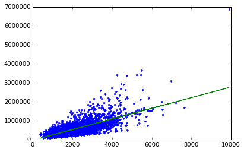
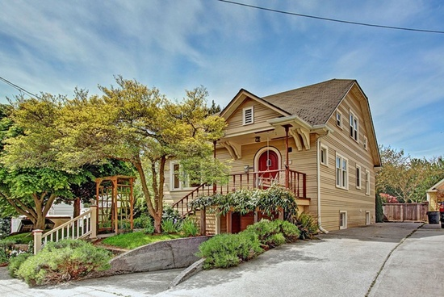

#Fire up graphlab create

    import graphlab

#Load some house sales data

    sales = graphlab.SFrame('data/home_data.gl/')

    sales

<table frame="box" rules="cols">
    <tr>
        <th style="padding-left: 1em; padding-right: 1em; text-align: center">id</th>
        <th style="padding-left: 1em; padding-right: 1em; text-align: center">date</th>
        <th style="padding-left: 1em; padding-right: 1em; text-align: center">price</th>
        <th style="padding-left: 1em; padding-right: 1em; text-align: center">bedrooms</th>
        <th style="padding-left: 1em; padding-right: 1em; text-align: center">bathrooms</th>
        <th style="padding-left: 1em; padding-right: 1em; text-align: center">sqft_living</th>
        <th style="padding-left: 1em; padding-right: 1em; text-align: center">sqft_lot</th>
        <th style="padding-left: 1em; padding-right: 1em; text-align: center">floors</th>
        <th style="padding-left: 1em; padding-right: 1em; text-align: center">waterfront</th>
    </tr>
    <tr>
        <td style="padding-left: 1em; padding-right: 1em; text-align: center; vertical-align: top">7129300520</td>
        <td style="padding-left: 1em; padding-right: 1em; text-align: center; vertical-align: top">2014-10-13 00:00:00+00:00</td>
        <td style="padding-left: 1em; padding-right: 1em; text-align: center; vertical-align: top">221900</td>
        <td style="padding-left: 1em; padding-right: 1em; text-align: center; vertical-align: top">3</td>
        <td style="padding-left: 1em; padding-right: 1em; text-align: center; vertical-align: top">1</td>
        <td style="padding-left: 1em; padding-right: 1em; text-align: center; vertical-align: top">1180</td>
        <td style="padding-left: 1em; padding-right: 1em; text-align: center; vertical-align: top">5650</td>
        <td style="padding-left: 1em; padding-right: 1em; text-align: center; vertical-align: top">1</td>
        <td style="padding-left: 1em; padding-right: 1em; text-align: center; vertical-align: top">0</td>
    </tr>
    <tr>
        <td style="padding-left: 1em; padding-right: 1em; text-align: center; vertical-align: top">6414100192</td>
        <td style="padding-left: 1em; padding-right: 1em; text-align: center; vertical-align: top">2014-12-09 00:00:00+00:00</td>
        <td style="padding-left: 1em; padding-right: 1em; text-align: center; vertical-align: top">538000</td>
        <td style="padding-left: 1em; padding-right: 1em; text-align: center; vertical-align: top">3</td>
        <td style="padding-left: 1em; padding-right: 1em; text-align: center; vertical-align: top">2.25</td>
        <td style="padding-left: 1em; padding-right: 1em; text-align: center; vertical-align: top">2570</td>
        <td style="padding-left: 1em; padding-right: 1em; text-align: center; vertical-align: top">7242</td>
        <td style="padding-left: 1em; padding-right: 1em; text-align: center; vertical-align: top">2</td>
        <td style="padding-left: 1em; padding-right: 1em; text-align: center; vertical-align: top">0</td>
    </tr>
    <tr>
        <td style="padding-left: 1em; padding-right: 1em; text-align: center; vertical-align: top">5631500400</td>
        <td style="padding-left: 1em; padding-right: 1em; text-align: center; vertical-align: top">2015-02-25 00:00:00+00:00</td>
        <td style="padding-left: 1em; padding-right: 1em; text-align: center; vertical-align: top">180000</td>
        <td style="padding-left: 1em; padding-right: 1em; text-align: center; vertical-align: top">2</td>
        <td style="padding-left: 1em; padding-right: 1em; text-align: center; vertical-align: top">1</td>
        <td style="padding-left: 1em; padding-right: 1em; text-align: center; vertical-align: top">770</td>
        <td style="padding-left: 1em; padding-right: 1em; text-align: center; vertical-align: top">10000</td>
        <td style="padding-left: 1em; padding-right: 1em; text-align: center; vertical-align: top">1</td>
        <td style="padding-left: 1em; padding-right: 1em; text-align: center; vertical-align: top">0</td>
    </tr>
    <tr>
        <td style="padding-left: 1em; padding-right: 1em; text-align: center; vertical-align: top">2487200875</td>
        <td style="padding-left: 1em; padding-right: 1em; text-align: center; vertical-align: top">2014-12-09 00:00:00+00:00</td>
        <td style="padding-left: 1em; padding-right: 1em; text-align: center; vertical-align: top">604000</td>
        <td style="padding-left: 1em; padding-right: 1em; text-align: center; vertical-align: top">4</td>
        <td style="padding-left: 1em; padding-right: 1em; text-align: center; vertical-align: top">3</td>
        <td style="padding-left: 1em; padding-right: 1em; text-align: center; vertical-align: top">1960</td>
        <td style="padding-left: 1em; padding-right: 1em; text-align: center; vertical-align: top">5000</td>
        <td style="padding-left: 1em; padding-right: 1em; text-align: center; vertical-align: top">1</td>
        <td style="padding-left: 1em; padding-right: 1em; text-align: center; vertical-align: top">0</td>
    </tr>
    <tr>
        <td style="padding-left: 1em; padding-right: 1em; text-align: center; vertical-align: top">1954400510</td>
        <td style="padding-left: 1em; padding-right: 1em; text-align: center; vertical-align: top">2015-02-18 00:00:00+00:00</td>
        <td style="padding-left: 1em; padding-right: 1em; text-align: center; vertical-align: top">510000</td>
        <td style="padding-left: 1em; padding-right: 1em; text-align: center; vertical-align: top">3</td>
        <td style="padding-left: 1em; padding-right: 1em; text-align: center; vertical-align: top">2</td>
        <td style="padding-left: 1em; padding-right: 1em; text-align: center; vertical-align: top">1680</td>
        <td style="padding-left: 1em; padding-right: 1em; text-align: center; vertical-align: top">8080</td>
        <td style="padding-left: 1em; padding-right: 1em; text-align: center; vertical-align: top">1</td>
        <td style="padding-left: 1em; padding-right: 1em; text-align: center; vertical-align: top">0</td>
    </tr>
    <tr>
        <td style="padding-left: 1em; padding-right: 1em; text-align: center; vertical-align: top">7237550310</td>
        <td style="padding-left: 1em; padding-right: 1em; text-align: center; vertical-align: top">2014-05-12 00:00:00+00:00</td>
        <td style="padding-left: 1em; padding-right: 1em; text-align: center; vertical-align: top">1225000</td>
        <td style="padding-left: 1em; padding-right: 1em; text-align: center; vertical-align: top">4</td>
        <td style="padding-left: 1em; padding-right: 1em; text-align: center; vertical-align: top">4.5</td>
        <td style="padding-left: 1em; padding-right: 1em; text-align: center; vertical-align: top">5420</td>
        <td style="padding-left: 1em; padding-right: 1em; text-align: center; vertical-align: top">101930</td>
        <td style="padding-left: 1em; padding-right: 1em; text-align: center; vertical-align: top">1</td>
        <td style="padding-left: 1em; padding-right: 1em; text-align: center; vertical-align: top">0</td>
    </tr>
    <tr>
        <td style="padding-left: 1em; padding-right: 1em; text-align: center; vertical-align: top">1321400060</td>
        <td style="padding-left: 1em; padding-right: 1em; text-align: center; vertical-align: top">2014-06-27 00:00:00+00:00</td>
        <td style="padding-left: 1em; padding-right: 1em; text-align: center; vertical-align: top">257500</td>
        <td style="padding-left: 1em; padding-right: 1em; text-align: center; vertical-align: top">3</td>
        <td style="padding-left: 1em; padding-right: 1em; text-align: center; vertical-align: top">2.25</td>
        <td style="padding-left: 1em; padding-right: 1em; text-align: center; vertical-align: top">1715</td>
        <td style="padding-left: 1em; padding-right: 1em; text-align: center; vertical-align: top">6819</td>
        <td style="padding-left: 1em; padding-right: 1em; text-align: center; vertical-align: top">2</td>
        <td style="padding-left: 1em; padding-right: 1em; text-align: center; vertical-align: top">0</td>
    </tr>
    <tr>
        <td style="padding-left: 1em; padding-right: 1em; text-align: center; vertical-align: top">2008000270</td>
        <td style="padding-left: 1em; padding-right: 1em; text-align: center; vertical-align: top">2015-01-15 00:00:00+00:00</td>
        <td style="padding-left: 1em; padding-right: 1em; text-align: center; vertical-align: top">291850</td>
        <td style="padding-left: 1em; padding-right: 1em; text-align: center; vertical-align: top">3</td>
        <td style="padding-left: 1em; padding-right: 1em; text-align: center; vertical-align: top">1.5</td>
        <td style="padding-left: 1em; padding-right: 1em; text-align: center; vertical-align: top">1060</td>
        <td style="padding-left: 1em; padding-right: 1em; text-align: center; vertical-align: top">9711</td>
        <td style="padding-left: 1em; padding-right: 1em; text-align: center; vertical-align: top">1</td>
        <td style="padding-left: 1em; padding-right: 1em; text-align: center; vertical-align: top">0</td>
    </tr>
    <tr>
        <td style="padding-left: 1em; padding-right: 1em; text-align: center; vertical-align: top">2414600126</td>
        <td style="padding-left: 1em; padding-right: 1em; text-align: center; vertical-align: top">2015-04-15 00:00:00+00:00</td>
        <td style="padding-left: 1em; padding-right: 1em; text-align: center; vertical-align: top">229500</td>
        <td style="padding-left: 1em; padding-right: 1em; text-align: center; vertical-align: top">3</td>
        <td style="padding-left: 1em; padding-right: 1em; text-align: center; vertical-align: top">1</td>
        <td style="padding-left: 1em; padding-right: 1em; text-align: center; vertical-align: top">1780</td>
        <td style="padding-left: 1em; padding-right: 1em; text-align: center; vertical-align: top">7470</td>
        <td style="padding-left: 1em; padding-right: 1em; text-align: center; vertical-align: top">1</td>
        <td style="padding-left: 1em; padding-right: 1em; text-align: center; vertical-align: top">0</td>
    </tr>
    <tr>
        <td style="padding-left: 1em; padding-right: 1em; text-align: center; vertical-align: top">3793500160</td>
        <td style="padding-left: 1em; padding-right: 1em; text-align: center; vertical-align: top">2015-03-12 00:00:00+00:00</td>
        <td style="padding-left: 1em; padding-right: 1em; text-align: center; vertical-align: top">323000</td>
        <td style="padding-left: 1em; padding-right: 1em; text-align: center; vertical-align: top">3</td>
        <td style="padding-left: 1em; padding-right: 1em; text-align: center; vertical-align: top">2.5</td>
        <td style="padding-left: 1em; padding-right: 1em; text-align: center; vertical-align: top">1890</td>
        <td style="padding-left: 1em; padding-right: 1em; text-align: center; vertical-align: top">6560</td>
        <td style="padding-left: 1em; padding-right: 1em; text-align: center; vertical-align: top">2</td>
        <td style="padding-left: 1em; padding-right: 1em; text-align: center; vertical-align: top">0</td>
    </tr>
</table>
<table frame="box" rules="cols">
    <tr>
        <th style="padding-left: 1em; padding-right: 1em; text-align: center">view</th>
        <th style="padding-left: 1em; padding-right: 1em; text-align: center">condition</th>
        <th style="padding-left: 1em; padding-right: 1em; text-align: center">grade</th>
        <th style="padding-left: 1em; padding-right: 1em; text-align: center">sqft_above</th>
        <th style="padding-left: 1em; padding-right: 1em; text-align: center">sqft_basement</th>
        <th style="padding-left: 1em; padding-right: 1em; text-align: center">yr_built</th>
        <th style="padding-left: 1em; padding-right: 1em; text-align: center">yr_renovated</th>
        <th style="padding-left: 1em; padding-right: 1em; text-align: center">zipcode</th>
        <th style="padding-left: 1em; padding-right: 1em; text-align: center">lat</th>
    </tr>
    <tr>
        <td style="padding-left: 1em; padding-right: 1em; text-align: center; vertical-align: top">0</td>
        <td style="padding-left: 1em; padding-right: 1em; text-align: center; vertical-align: top">3</td>
        <td style="padding-left: 1em; padding-right: 1em; text-align: center; vertical-align: top">7</td>
        <td style="padding-left: 1em; padding-right: 1em; text-align: center; vertical-align: top">1180</td>
        <td style="padding-left: 1em; padding-right: 1em; text-align: center; vertical-align: top">0</td>
        <td style="padding-left: 1em; padding-right: 1em; text-align: center; vertical-align: top">1955</td>
        <td style="padding-left: 1em; padding-right: 1em; text-align: center; vertical-align: top">0</td>
        <td style="padding-left: 1em; padding-right: 1em; text-align: center; vertical-align: top">98178</td>
        <td style="padding-left: 1em; padding-right: 1em; text-align: center; vertical-align: top">47.51123398</td>
    </tr>
    <tr>
        <td style="padding-left: 1em; padding-right: 1em; text-align: center; vertical-align: top">0</td>
        <td style="padding-left: 1em; padding-right: 1em; text-align: center; vertical-align: top">3</td>
        <td style="padding-left: 1em; padding-right: 1em; text-align: center; vertical-align: top">7</td>
        <td style="padding-left: 1em; padding-right: 1em; text-align: center; vertical-align: top">2170</td>
        <td style="padding-left: 1em; padding-right: 1em; text-align: center; vertical-align: top">400</td>
        <td style="padding-left: 1em; padding-right: 1em; text-align: center; vertical-align: top">1951</td>
        <td style="padding-left: 1em; padding-right: 1em; text-align: center; vertical-align: top">1991</td>
        <td style="padding-left: 1em; padding-right: 1em; text-align: center; vertical-align: top">98125</td>
        <td style="padding-left: 1em; padding-right: 1em; text-align: center; vertical-align: top">47.72102274</td>
    </tr>
    <tr>
        <td style="padding-left: 1em; padding-right: 1em; text-align: center; vertical-align: top">0</td>
        <td style="padding-left: 1em; padding-right: 1em; text-align: center; vertical-align: top">3</td>
        <td style="padding-left: 1em; padding-right: 1em; text-align: center; vertical-align: top">6</td>
        <td style="padding-left: 1em; padding-right: 1em; text-align: center; vertical-align: top">770</td>
        <td style="padding-left: 1em; padding-right: 1em; text-align: center; vertical-align: top">0</td>
        <td style="padding-left: 1em; padding-right: 1em; text-align: center; vertical-align: top">1933</td>
        <td style="padding-left: 1em; padding-right: 1em; text-align: center; vertical-align: top">0</td>
        <td style="padding-left: 1em; padding-right: 1em; text-align: center; vertical-align: top">98028</td>
        <td style="padding-left: 1em; padding-right: 1em; text-align: center; vertical-align: top">47.73792661</td>
    </tr>
    <tr>
        <td style="padding-left: 1em; padding-right: 1em; text-align: center; vertical-align: top">0</td>
        <td style="padding-left: 1em; padding-right: 1em; text-align: center; vertical-align: top">5</td>
        <td style="padding-left: 1em; padding-right: 1em; text-align: center; vertical-align: top">7</td>
        <td style="padding-left: 1em; padding-right: 1em; text-align: center; vertical-align: top">1050</td>
        <td style="padding-left: 1em; padding-right: 1em; text-align: center; vertical-align: top">910</td>
        <td style="padding-left: 1em; padding-right: 1em; text-align: center; vertical-align: top">1965</td>
        <td style="padding-left: 1em; padding-right: 1em; text-align: center; vertical-align: top">0</td>
        <td style="padding-left: 1em; padding-right: 1em; text-align: center; vertical-align: top">98136</td>
        <td style="padding-left: 1em; padding-right: 1em; text-align: center; vertical-align: top">47.52082</td>
    </tr>
    <tr>
        <td style="padding-left: 1em; padding-right: 1em; text-align: center; vertical-align: top">0</td>
        <td style="padding-left: 1em; padding-right: 1em; text-align: center; vertical-align: top">3</td>
        <td style="padding-left: 1em; padding-right: 1em; text-align: center; vertical-align: top">8</td>
        <td style="padding-left: 1em; padding-right: 1em; text-align: center; vertical-align: top">1680</td>
        <td style="padding-left: 1em; padding-right: 1em; text-align: center; vertical-align: top">0</td>
        <td style="padding-left: 1em; padding-right: 1em; text-align: center; vertical-align: top">1987</td>
        <td style="padding-left: 1em; padding-right: 1em; text-align: center; vertical-align: top">0</td>
        <td style="padding-left: 1em; padding-right: 1em; text-align: center; vertical-align: top">98074</td>
        <td style="padding-left: 1em; padding-right: 1em; text-align: center; vertical-align: top">47.61681228</td>
    </tr>
    <tr>
        <td style="padding-left: 1em; padding-right: 1em; text-align: center; vertical-align: top">0</td>
        <td style="padding-left: 1em; padding-right: 1em; text-align: center; vertical-align: top">3</td>
        <td style="padding-left: 1em; padding-right: 1em; text-align: center; vertical-align: top">11</td>
        <td style="padding-left: 1em; padding-right: 1em; text-align: center; vertical-align: top">3890</td>
        <td style="padding-left: 1em; padding-right: 1em; text-align: center; vertical-align: top">1530</td>
        <td style="padding-left: 1em; padding-right: 1em; text-align: center; vertical-align: top">2001</td>
        <td style="padding-left: 1em; padding-right: 1em; text-align: center; vertical-align: top">0</td>
        <td style="padding-left: 1em; padding-right: 1em; text-align: center; vertical-align: top">98053</td>
        <td style="padding-left: 1em; padding-right: 1em; text-align: center; vertical-align: top">47.65611835</td>
    </tr>
    <tr>
        <td style="padding-left: 1em; padding-right: 1em; text-align: center; vertical-align: top">0</td>
        <td style="padding-left: 1em; padding-right: 1em; text-align: center; vertical-align: top">3</td>
        <td style="padding-left: 1em; padding-right: 1em; text-align: center; vertical-align: top">7</td>
        <td style="padding-left: 1em; padding-right: 1em; text-align: center; vertical-align: top">1715</td>
        <td style="padding-left: 1em; padding-right: 1em; text-align: center; vertical-align: top">0</td>
        <td style="padding-left: 1em; padding-right: 1em; text-align: center; vertical-align: top">1995</td>
        <td style="padding-left: 1em; padding-right: 1em; text-align: center; vertical-align: top">0</td>
        <td style="padding-left: 1em; padding-right: 1em; text-align: center; vertical-align: top">98003</td>
        <td style="padding-left: 1em; padding-right: 1em; text-align: center; vertical-align: top">47.30972002</td>
    </tr>
    <tr>
        <td style="padding-left: 1em; padding-right: 1em; text-align: center; vertical-align: top">0</td>
        <td style="padding-left: 1em; padding-right: 1em; text-align: center; vertical-align: top">3</td>
        <td style="padding-left: 1em; padding-right: 1em; text-align: center; vertical-align: top">7</td>
        <td style="padding-left: 1em; padding-right: 1em; text-align: center; vertical-align: top">1060</td>
        <td style="padding-left: 1em; padding-right: 1em; text-align: center; vertical-align: top">0</td>
        <td style="padding-left: 1em; padding-right: 1em; text-align: center; vertical-align: top">1963</td>
        <td style="padding-left: 1em; padding-right: 1em; text-align: center; vertical-align: top">0</td>
        <td style="padding-left: 1em; padding-right: 1em; text-align: center; vertical-align: top">98198</td>
        <td style="padding-left: 1em; padding-right: 1em; text-align: center; vertical-align: top">47.40949984</td>
    </tr>
    <tr>
        <td style="padding-left: 1em; padding-right: 1em; text-align: center; vertical-align: top">0</td>
        <td style="padding-left: 1em; padding-right: 1em; text-align: center; vertical-align: top">3</td>
        <td style="padding-left: 1em; padding-right: 1em; text-align: center; vertical-align: top">7</td>
        <td style="padding-left: 1em; padding-right: 1em; text-align: center; vertical-align: top">1050</td>
        <td style="padding-left: 1em; padding-right: 1em; text-align: center; vertical-align: top">730</td>
        <td style="padding-left: 1em; padding-right: 1em; text-align: center; vertical-align: top">1960</td>
        <td style="padding-left: 1em; padding-right: 1em; text-align: center; vertical-align: top">0</td>
        <td style="padding-left: 1em; padding-right: 1em; text-align: center; vertical-align: top">98146</td>
        <td style="padding-left: 1em; padding-right: 1em; text-align: center; vertical-align: top">47.51229381</td>
    </tr>
    <tr>
        <td style="padding-left: 1em; padding-right: 1em; text-align: center; vertical-align: top">0</td>
        <td style="padding-left: 1em; padding-right: 1em; text-align: center; vertical-align: top">3</td>
        <td style="padding-left: 1em; padding-right: 1em; text-align: center; vertical-align: top">7</td>
        <td style="padding-left: 1em; padding-right: 1em; text-align: center; vertical-align: top">1890</td>
        <td style="padding-left: 1em; padding-right: 1em; text-align: center; vertical-align: top">0</td>
        <td style="padding-left: 1em; padding-right: 1em; text-align: center; vertical-align: top">2003</td>
        <td style="padding-left: 1em; padding-right: 1em; text-align: center; vertical-align: top">0</td>
        <td style="padding-left: 1em; padding-right: 1em; text-align: center; vertical-align: top">98038</td>
        <td style="padding-left: 1em; padding-right: 1em; text-align: center; vertical-align: top">47.36840673</td>
    </tr>
</table>
<table frame="box" rules="cols">
    <tr>
        <th style="padding-left: 1em; padding-right: 1em; text-align: center">long</th>
        <th style="padding-left: 1em; padding-right: 1em; text-align: center">sqft_living15</th>
        <th style="padding-left: 1em; padding-right: 1em; text-align: center">sqft_lot15</th>
    </tr>
    <tr>
        <td style="padding-left: 1em; padding-right: 1em; text-align: center; vertical-align: top">-122.25677536</td>
        <td style="padding-left: 1em; padding-right: 1em; text-align: center; vertical-align: top">1340.0</td>
        <td style="padding-left: 1em; padding-right: 1em; text-align: center; vertical-align: top">5650.0</td>
    </tr>
    <tr>
        <td style="padding-left: 1em; padding-right: 1em; text-align: center; vertical-align: top">-122.3188624</td>
        <td style="padding-left: 1em; padding-right: 1em; text-align: center; vertical-align: top">1690.0</td>
        <td style="padding-left: 1em; padding-right: 1em; text-align: center; vertical-align: top">7639.0</td>
    </tr>
    <tr>
        <td style="padding-left: 1em; padding-right: 1em; text-align: center; vertical-align: top">-122.23319601</td>
        <td style="padding-left: 1em; padding-right: 1em; text-align: center; vertical-align: top">2720.0</td>
        <td style="padding-left: 1em; padding-right: 1em; text-align: center; vertical-align: top">8062.0</td>
    </tr>
    <tr>
        <td style="padding-left: 1em; padding-right: 1em; text-align: center; vertical-align: top">-122.39318505</td>
        <td style="padding-left: 1em; padding-right: 1em; text-align: center; vertical-align: top">1360.0</td>
        <td style="padding-left: 1em; padding-right: 1em; text-align: center; vertical-align: top">5000.0</td>
    </tr>
    <tr>
        <td style="padding-left: 1em; padding-right: 1em; text-align: center; vertical-align: top">-122.04490059</td>
        <td style="padding-left: 1em; padding-right: 1em; text-align: center; vertical-align: top">1800.0</td>
        <td style="padding-left: 1em; padding-right: 1em; text-align: center; vertical-align: top">7503.0</td>
    </tr>
    <tr>
        <td style="padding-left: 1em; padding-right: 1em; text-align: center; vertical-align: top">-122.00528655</td>
        <td style="padding-left: 1em; padding-right: 1em; text-align: center; vertical-align: top">4760.0</td>
        <td style="padding-left: 1em; padding-right: 1em; text-align: center; vertical-align: top">101930.0</td>
    </tr>
    <tr>
        <td style="padding-left: 1em; padding-right: 1em; text-align: center; vertical-align: top">-122.32704857</td>
        <td style="padding-left: 1em; padding-right: 1em; text-align: center; vertical-align: top">2238.0</td>
        <td style="padding-left: 1em; padding-right: 1em; text-align: center; vertical-align: top">6819.0</td>
    </tr>
    <tr>
        <td style="padding-left: 1em; padding-right: 1em; text-align: center; vertical-align: top">-122.31457273</td>
        <td style="padding-left: 1em; padding-right: 1em; text-align: center; vertical-align: top">1650.0</td>
        <td style="padding-left: 1em; padding-right: 1em; text-align: center; vertical-align: top">9711.0</td>
    </tr>
    <tr>
        <td style="padding-left: 1em; padding-right: 1em; text-align: center; vertical-align: top">-122.33659507</td>
        <td style="padding-left: 1em; padding-right: 1em; text-align: center; vertical-align: top">1780.0</td>
        <td style="padding-left: 1em; padding-right: 1em; text-align: center; vertical-align: top">8113.0</td>
    </tr>
    <tr>
        <td style="padding-left: 1em; padding-right: 1em; text-align: center; vertical-align: top">-122.0308176</td>
        <td style="padding-left: 1em; padding-right: 1em; text-align: center; vertical-align: top">2390.0</td>
        <td style="padding-left: 1em; padding-right: 1em; text-align: center; vertical-align: top">7570.0</td>
    </tr>
</table>
[21613 rows x 21 columns] Note: Only the head of the SFrame is printed. You can use print_rows(num_rows=m, num_columns=n) to print more rows and columns.

#Exploring the data for housing sales

    graphlab.canvas.set_target('ipynb')
    sales.show(view="Scatter Plot", x="sqft_living",y="price")

#Create a simple regression model of sqft_living to price

    train_data, test_data = sales.random_split(.8,seed=0)

#Build the regression model

    sqft_model = graphlab.linear_regression.create(train_data, target='price', features=['sqft_living'])

    PROGRESS: Creating a validation set from 5 percent of training data. This may take a while.
              You can set ``validation_set=None`` to disable validation tracking.
    
    PROGRESS: Linear regression:
    PROGRESS: --------------------------------------------------------
    PROGRESS: Number of examples          : 16439
    PROGRESS: Number of features          : 1
    PROGRESS: Number of unpacked features : 1
    PROGRESS: Number of coefficients    : 2
    PROGRESS: Starting Newton Method
    PROGRESS: --------------------------------------------------------
    PROGRESS: +-----------+----------+--------------+--------------------+----------------------+---------------+-----------------+
    PROGRESS: | Iteration | Passes   | Elapsed Time | Training-max_error | Validation-max_error | Training-rmse | Validation-rmse |
    PROGRESS: +-----------+----------+--------------+--------------------+----------------------+---------------+-----------------+
    PROGRESS: | 1         | 2        | 1.024809     | 4349265.021884     | 1423319.608182       | 264493.009388 | 234362.214569   |
    PROGRESS: +-----------+----------+--------------+--------------------+----------------------+---------------+-----------------+
    PROGRESS: SUCCESS: Optimal solution found.
    PROGRESS:

#Evaluate the simple model

    print test_data['price'].mean()

    543054.042563

    sqft_model.evaluate(test_data)

    {'max_error': 4143273.66463053, 'rmse': 255185.73365182106}

#Let's show what our predictions look like

    import matplotlib.pyplot as plt
    %matplotlib inline

    plt.plot(test_data['sqft_living'],test_data['price'],'.',
            test_data['sqft_living'],sqft_model.predict(test_data),'-')

    [<matplotlib.lines.Line2D at 0x115e78910>,
     <matplotlib.lines.Line2D at 0x115e78b90>]

    sqft_model.get('coefficients')

<table frame="box" rules="cols">
    <tr>
        <th style="padding-left: 1em; padding-right: 1em; text-align: center">name</th>
        <th style="padding-left: 1em; padding-right: 1em; text-align: center">index</th>
        <th style="padding-left: 1em; padding-right: 1em; text-align: center">value</th>
    </tr>
    <tr>
        <td style="padding-left: 1em; padding-right: 1em; text-align: center; vertical-align: top">(intercept)</td>
        <td style="padding-left: 1em; padding-right: 1em; text-align: center; vertical-align: top">None</td>
        <td style="padding-left: 1em; padding-right: 1em; text-align: center; vertical-align: top">-46743.792763</td>
    </tr>
    <tr>
        <td style="padding-left: 1em; padding-right: 1em; text-align: center; vertical-align: top">sqft_living</td>
        <td style="padding-left: 1em; padding-right: 1em; text-align: center; vertical-align: top">None</td>
        <td style="padding-left: 1em; padding-right: 1em; text-align: center; vertical-align: top">281.948445716</td>
    </tr>
</table>
[2 rows x 3 columns] 

#Explore other features in the data

    my_features = ['bedrooms','bathrooms','sqft_living','sqft_lot','floors','zipcode']

    sales[my_features].show()

    sales.show(view='BoxWhisker Plot',x='zipcode',y='price')

#Build a regression model with more features

    my_features_model = graphlab.linear_regression.create(train_data,target='price',features=my_features)

    PROGRESS: Creating a validation set from 5 percent of training data. This may take a while.
              You can set ``validation_set=None`` to disable validation tracking.
    
    PROGRESS: Linear regression:
    PROGRESS: --------------------------------------------------------
    PROGRESS: Number of examples          : 16443
    PROGRESS: Number of features          : 6
    PROGRESS: Number of unpacked features : 6
    PROGRESS: Number of coefficients    : 115
    PROGRESS: Starting Newton Method
    PROGRESS: --------------------------------------------------------
    PROGRESS: +-----------+----------+--------------+--------------------+----------------------+---------------+-----------------+
    PROGRESS: | Iteration | Passes   | Elapsed Time | Training-max_error | Validation-max_error | Training-rmse | Validation-rmse |
    PROGRESS: +-----------+----------+--------------+--------------------+----------------------+---------------+-----------------+
    PROGRESS: | 1         | 2        | 0.044907     | 3763418.904735     | 2639229.990132       | 181606.713238 | 197948.641724   |
    PROGRESS: +-----------+----------+--------------+--------------------+----------------------+---------------+-----------------+
    PROGRESS: SUCCESS: Optimal solution found.
    PROGRESS:

    print my_features

    ['bedrooms', 'bathrooms', 'sqft_living', 'sqft_lot', 'floors', 'zipcode']

    print sqft_model.evaluate(test_data)
    print my_features_model.evaluate(test_data)

    {'max_error': 4143273.66463053, 'rmse': 255185.73365182106}
    {'max_error': 3499673.5204619416, 'rmse': 179704.32137498935}

#Apply learned models to predict prices of 3 hourses

    house1 = sales[sales['id']=='5309101200']

    house1

<table frame="box" rules="cols">
    <tr>
        <th style="padding-left: 1em; padding-right: 1em; text-align: center">id</th>
        <th style="padding-left: 1em; padding-right: 1em; text-align: center">date</th>
        <th style="padding-left: 1em; padding-right: 1em; text-align: center">price</th>
        <th style="padding-left: 1em; padding-right: 1em; text-align: center">bedrooms</th>
        <th style="padding-left: 1em; padding-right: 1em; text-align: center">bathrooms</th>
        <th style="padding-left: 1em; padding-right: 1em; text-align: center">sqft_living</th>
        <th style="padding-left: 1em; padding-right: 1em; text-align: center">sqft_lot</th>
        <th style="padding-left: 1em; padding-right: 1em; text-align: center">floors</th>
        <th style="padding-left: 1em; padding-right: 1em; text-align: center">waterfront</th>
    </tr>
    <tr>
        <td style="padding-left: 1em; padding-right: 1em; text-align: center; vertical-align: top">5309101200</td>
        <td style="padding-left: 1em; padding-right: 1em; text-align: center; vertical-align: top">2014-06-05 00:00:00+00:00</td>
        <td style="padding-left: 1em; padding-right: 1em; text-align: center; vertical-align: top">620000</td>
        <td style="padding-left: 1em; padding-right: 1em; text-align: center; vertical-align: top">4</td>
        <td style="padding-left: 1em; padding-right: 1em; text-align: center; vertical-align: top">2.25</td>
        <td style="padding-left: 1em; padding-right: 1em; text-align: center; vertical-align: top">2400</td>
        <td style="padding-left: 1em; padding-right: 1em; text-align: center; vertical-align: top">5350</td>
        <td style="padding-left: 1em; padding-right: 1em; text-align: center; vertical-align: top">1.5</td>
        <td style="padding-left: 1em; padding-right: 1em; text-align: center; vertical-align: top">0</td>
    </tr>
</table>
<table frame="box" rules="cols">
    <tr>
        <th style="padding-left: 1em; padding-right: 1em; text-align: center">view</th>
        <th style="padding-left: 1em; padding-right: 1em; text-align: center">condition</th>
        <th style="padding-left: 1em; padding-right: 1em; text-align: center">grade</th>
        <th style="padding-left: 1em; padding-right: 1em; text-align: center">sqft_above</th>
        <th style="padding-left: 1em; padding-right: 1em; text-align: center">sqft_basement</th>
        <th style="padding-left: 1em; padding-right: 1em; text-align: center">yr_built</th>
        <th style="padding-left: 1em; padding-right: 1em; text-align: center">yr_renovated</th>
        <th style="padding-left: 1em; padding-right: 1em; text-align: center">zipcode</th>
        <th style="padding-left: 1em; padding-right: 1em; text-align: center">lat</th>
    </tr>
    <tr>
        <td style="padding-left: 1em; padding-right: 1em; text-align: center; vertical-align: top">0</td>
        <td style="padding-left: 1em; padding-right: 1em; text-align: center; vertical-align: top">4</td>
        <td style="padding-left: 1em; padding-right: 1em; text-align: center; vertical-align: top">7</td>
        <td style="padding-left: 1em; padding-right: 1em; text-align: center; vertical-align: top">1460</td>
        <td style="padding-left: 1em; padding-right: 1em; text-align: center; vertical-align: top">940</td>
        <td style="padding-left: 1em; padding-right: 1em; text-align: center; vertical-align: top">1929</td>
        <td style="padding-left: 1em; padding-right: 1em; text-align: center; vertical-align: top">0</td>
        <td style="padding-left: 1em; padding-right: 1em; text-align: center; vertical-align: top">98117</td>
        <td style="padding-left: 1em; padding-right: 1em; text-align: center; vertical-align: top">47.67632376</td>
    </tr>
</table>
<table frame="box" rules="cols">
    <tr>
        <th style="padding-left: 1em; padding-right: 1em; text-align: center">long</th>
        <th style="padding-left: 1em; padding-right: 1em; text-align: center">sqft_living15</th>
        <th style="padding-left: 1em; padding-right: 1em; text-align: center">sqft_lot15</th>
    </tr>
    <tr>
        <td style="padding-left: 1em; padding-right: 1em; text-align: center; vertical-align: top">-122.37010126</td>
        <td style="padding-left: 1em; padding-right: 1em; text-align: center; vertical-align: top">1250.0</td>
        <td style="padding-left: 1em; padding-right: 1em; text-align: center; vertical-align: top">4880.0</td>
    </tr>
</table>
[? rows x 21 columns] Note: Only the head of the SFrame is printed. This SFrame is lazily evaluated. You can use len(sf) to force materialization.

    house1['price']

    dtype: int
    Rows: ?
    [620000, ... ]

    print sqft_model.predict(house1)

    [629932.4769556852]

    print my_features_model.predict(house1)

    [719440.8224637111]

##Prediction for a second, fancier house

    house2 = sales[sales['id']=='1925069082']

    house2

<table frame="box" rules="cols">
    <tr>
        <th style="padding-left: 1em; padding-right: 1em; text-align: center">id</th>
        <th style="padding-left: 1em; padding-right: 1em; text-align: center">date</th>
        <th style="padding-left: 1em; padding-right: 1em; text-align: center">price</th>
        <th style="padding-left: 1em; padding-right: 1em; text-align: center">bedrooms</th>
        <th style="padding-left: 1em; padding-right: 1em; text-align: center">bathrooms</th>
        <th style="padding-left: 1em; padding-right: 1em; text-align: center">sqft_living</th>
        <th style="padding-left: 1em; padding-right: 1em; text-align: center">sqft_lot</th>
        <th style="padding-left: 1em; padding-right: 1em; text-align: center">floors</th>
        <th style="padding-left: 1em; padding-right: 1em; text-align: center">waterfront</th>
    </tr>
    <tr>
        <td style="padding-left: 1em; padding-right: 1em; text-align: center; vertical-align: top">1925069082</td>
        <td style="padding-left: 1em; padding-right: 1em; text-align: center; vertical-align: top">2015-05-11 00:00:00+00:00</td>
        <td style="padding-left: 1em; padding-right: 1em; text-align: center; vertical-align: top">2200000</td>
        <td style="padding-left: 1em; padding-right: 1em; text-align: center; vertical-align: top">5</td>
        <td style="padding-left: 1em; padding-right: 1em; text-align: center; vertical-align: top">4.25</td>
        <td style="padding-left: 1em; padding-right: 1em; text-align: center; vertical-align: top">4640</td>
        <td style="padding-left: 1em; padding-right: 1em; text-align: center; vertical-align: top">22703</td>
        <td style="padding-left: 1em; padding-right: 1em; text-align: center; vertical-align: top">2</td>
        <td style="padding-left: 1em; padding-right: 1em; text-align: center; vertical-align: top">1</td>
    </tr>
</table>
<table frame="box" rules="cols">
    <tr>
        <th style="padding-left: 1em; padding-right: 1em; text-align: center">view</th>
        <th style="padding-left: 1em; padding-right: 1em; text-align: center">condition</th>
        <th style="padding-left: 1em; padding-right: 1em; text-align: center">grade</th>
        <th style="padding-left: 1em; padding-right: 1em; text-align: center">sqft_above</th>
        <th style="padding-left: 1em; padding-right: 1em; text-align: center">sqft_basement</th>
        <th style="padding-left: 1em; padding-right: 1em; text-align: center">yr_built</th>
        <th style="padding-left: 1em; padding-right: 1em; text-align: center">yr_renovated</th>
        <th style="padding-left: 1em; padding-right: 1em; text-align: center">zipcode</th>
        <th style="padding-left: 1em; padding-right: 1em; text-align: center">lat</th>
    </tr>
    <tr>
        <td style="padding-left: 1em; padding-right: 1em; text-align: center; vertical-align: top">4</td>
        <td style="padding-left: 1em; padding-right: 1em; text-align: center; vertical-align: top">5</td>
        <td style="padding-left: 1em; padding-right: 1em; text-align: center; vertical-align: top">8</td>
        <td style="padding-left: 1em; padding-right: 1em; text-align: center; vertical-align: top">2860</td>
        <td style="padding-left: 1em; padding-right: 1em; text-align: center; vertical-align: top">1780</td>
        <td style="padding-left: 1em; padding-right: 1em; text-align: center; vertical-align: top">1952</td>
        <td style="padding-left: 1em; padding-right: 1em; text-align: center; vertical-align: top">0</td>
        <td style="padding-left: 1em; padding-right: 1em; text-align: center; vertical-align: top">98052</td>
        <td style="padding-left: 1em; padding-right: 1em; text-align: center; vertical-align: top">47.63925783</td>
    </tr>
</table>
<table frame="box" rules="cols">
    <tr>
        <th style="padding-left: 1em; padding-right: 1em; text-align: center">long</th>
        <th style="padding-left: 1em; padding-right: 1em; text-align: center">sqft_living15</th>
        <th style="padding-left: 1em; padding-right: 1em; text-align: center">sqft_lot15</th>
    </tr>
    <tr>
        <td style="padding-left: 1em; padding-right: 1em; text-align: center; vertical-align: top">-122.09722322</td>
        <td style="padding-left: 1em; padding-right: 1em; text-align: center; vertical-align: top">3140.0</td>
        <td style="padding-left: 1em; padding-right: 1em; text-align: center; vertical-align: top">14200.0</td>
    </tr>
</table>
[? rows x 21 columns] Note: Only the head of the SFrame is printed. This SFrame is lazily evaluated. You can use len(sf) to force materialization.

    print sqft_model.predict(house2)

    [1261496.995359808]

    print my_features_model.predict(house2)

    [1443131.8859794717]

    house2['price']

    dtype: int
    Rows: 1
    [2200000]

##Last house, super fancy

    bill_gates = {'bedrooms':[8],
                      'bathrooms':[25], 
                      'sqft_living':[50000],
                      'sqft_lot':[225000],
                      'floors':[4],
                      'zipcode':['98039'],
                      'condition':[10],
                      'grade':[10],
                      'waterfront':[1],
                      'view':[4],
                      'sqft_above':[37500],
                      'sqft_basement':[12500],
                      'yr_built':[1994],
                      'yr_renovated':[2010],
                      'lat':[47.627606],
                      'long':[-122.242054],
                      'sqft_living15':[5000],
                      'sqft_lot15':[40000]}

    print my_features_model.predict(graphlab.SFrame(bill_gates))

    [13702822.643298045]

    houses = sales[sales['zipcode']=='98039']

    houses['price'].mean()

    2160606.5999999996

    houses['price'].max()

    6885000

    houses_sqft_living = sales[sales['sqft_living'] > 2000]

    houses_sqft_living = houses_sqft_living[houses_sqft_living['sqft_living'] <= 4000]

    advanced_features = [
    'bedrooms', 'bathrooms', 'sqft_living', 'sqft_lot', 'floors', 'zipcode',
    'condition', # condition of house				
    'grade', # measure of quality of construction				
    'waterfront', # waterfront property				
    'view', # type of view				
    'sqft_above', # square feet above ground				
    'sqft_basement', # square feet in basement				
    'yr_built', # the year built				
    'yr_renovated', # the year renovated				
    'lat', 'long', # the lat-long of the parcel				
    'sqft_living15', # average sq.ft. of 15 nearest neighbors 				
    'sqft_lot15', # average lot size of 15 nearest neighbors 
    ]

    advanced_features_model = graphlab.linear_regression.create(train_data,target='price',features=advanced_features, validation_set=None)

    PROGRESS: Linear regression:
    PROGRESS: --------------------------------------------------------
    PROGRESS: Number of examples          : 17384
    PROGRESS: Number of features          : 18
    PROGRESS: Number of unpacked features : 18
    PROGRESS: Number of coefficients    : 127
    PROGRESS: Starting Newton Method
    PROGRESS: --------------------------------------------------------
    PROGRESS: +-----------+----------+--------------+--------------------+---------------+
    PROGRESS: | Iteration | Passes   | Elapsed Time | Training-max_error | Training-rmse |
    PROGRESS: +-----------+----------+--------------+--------------------+---------------+
    PROGRESS: | 1         | 2        | 0.036411     | 3469012.450663     | 154580.940735 |
    PROGRESS: +-----------+----------+--------------+--------------------+---------------+
    PROGRESS: SUCCESS: Optimal solution found.
    PROGRESS:

    print my_features_model.evaluate(test_data)
    print advanced_features_model.evaluate(test_data)

    {'max_error': 3499673.5204619416, 'rmse': 179704.32137498935}
    {'max_error': 3556849.413848093, 'rmse': 156831.11680191013}

    len(houses_sqft_living)

    9118

    len(sales)

    21613

    len(houses_sqft_living)*1.0 / len(sales)

    0.42187572294452413

    houses_sqft_living

<table frame="box" rules="cols">
    <tr>
        <th style="padding-left: 1em; padding-right: 1em; text-align: center">id</th>
        <th style="padding-left: 1em; padding-right: 1em; text-align: center">date</th>
        <th style="padding-left: 1em; padding-right: 1em; text-align: center">price</th>
        <th style="padding-left: 1em; padding-right: 1em; text-align: center">bedrooms</th>
        <th style="padding-left: 1em; padding-right: 1em; text-align: center">bathrooms</th>
        <th style="padding-left: 1em; padding-right: 1em; text-align: center">sqft_living</th>
        <th style="padding-left: 1em; padding-right: 1em; text-align: center">sqft_lot</th>
        <th style="padding-left: 1em; padding-right: 1em; text-align: center">floors</th>
        <th style="padding-left: 1em; padding-right: 1em; text-align: center">waterfront</th>
    </tr>
    <tr>
        <td style="padding-left: 1em; padding-right: 1em; text-align: center; vertical-align: top">6414100192</td>
        <td style="padding-left: 1em; padding-right: 1em; text-align: center; vertical-align: top">2014-12-09 00:00:00+00:00</td>
        <td style="padding-left: 1em; padding-right: 1em; text-align: center; vertical-align: top">538000</td>
        <td style="padding-left: 1em; padding-right: 1em; text-align: center; vertical-align: top">3</td>
        <td style="padding-left: 1em; padding-right: 1em; text-align: center; vertical-align: top">2.25</td>
        <td style="padding-left: 1em; padding-right: 1em; text-align: center; vertical-align: top">2570</td>
        <td style="padding-left: 1em; padding-right: 1em; text-align: center; vertical-align: top">7242</td>
        <td style="padding-left: 1em; padding-right: 1em; text-align: center; vertical-align: top">2</td>
        <td style="padding-left: 1em; padding-right: 1em; text-align: center; vertical-align: top">0</td>
    </tr>
    <tr>
        <td style="padding-left: 1em; padding-right: 1em; text-align: center; vertical-align: top">1736800520</td>
        <td style="padding-left: 1em; padding-right: 1em; text-align: center; vertical-align: top">2015-04-03 00:00:00+00:00</td>
        <td style="padding-left: 1em; padding-right: 1em; text-align: center; vertical-align: top">662500</td>
        <td style="padding-left: 1em; padding-right: 1em; text-align: center; vertical-align: top">3</td>
        <td style="padding-left: 1em; padding-right: 1em; text-align: center; vertical-align: top">2.5</td>
        <td style="padding-left: 1em; padding-right: 1em; text-align: center; vertical-align: top">3560</td>
        <td style="padding-left: 1em; padding-right: 1em; text-align: center; vertical-align: top">9796</td>
        <td style="padding-left: 1em; padding-right: 1em; text-align: center; vertical-align: top">1</td>
        <td style="padding-left: 1em; padding-right: 1em; text-align: center; vertical-align: top">0</td>
    </tr>
    <tr>
        <td style="padding-left: 1em; padding-right: 1em; text-align: center; vertical-align: top">9297300055</td>
        <td style="padding-left: 1em; padding-right: 1em; text-align: center; vertical-align: top">2015-01-24 00:00:00+00:00</td>
        <td style="padding-left: 1em; padding-right: 1em; text-align: center; vertical-align: top">650000</td>
        <td style="padding-left: 1em; padding-right: 1em; text-align: center; vertical-align: top">4</td>
        <td style="padding-left: 1em; padding-right: 1em; text-align: center; vertical-align: top">3</td>
        <td style="padding-left: 1em; padding-right: 1em; text-align: center; vertical-align: top">2950</td>
        <td style="padding-left: 1em; padding-right: 1em; text-align: center; vertical-align: top">5000</td>
        <td style="padding-left: 1em; padding-right: 1em; text-align: center; vertical-align: top">2</td>
        <td style="padding-left: 1em; padding-right: 1em; text-align: center; vertical-align: top">0</td>
    </tr>
    <tr>
        <td style="padding-left: 1em; padding-right: 1em; text-align: center; vertical-align: top">2524049179</td>
        <td style="padding-left: 1em; padding-right: 1em; text-align: center; vertical-align: top">2014-08-26 00:00:00+00:00</td>
        <td style="padding-left: 1em; padding-right: 1em; text-align: center; vertical-align: top">2000000</td>
        <td style="padding-left: 1em; padding-right: 1em; text-align: center; vertical-align: top">3</td>
        <td style="padding-left: 1em; padding-right: 1em; text-align: center; vertical-align: top">2.75</td>
        <td style="padding-left: 1em; padding-right: 1em; text-align: center; vertical-align: top">3050</td>
        <td style="padding-left: 1em; padding-right: 1em; text-align: center; vertical-align: top">44867</td>
        <td style="padding-left: 1em; padding-right: 1em; text-align: center; vertical-align: top">1</td>
        <td style="padding-left: 1em; padding-right: 1em; text-align: center; vertical-align: top">0</td>
    </tr>
    <tr>
        <td style="padding-left: 1em; padding-right: 1em; text-align: center; vertical-align: top">7137970340</td>
        <td style="padding-left: 1em; padding-right: 1em; text-align: center; vertical-align: top">2014-07-03 00:00:00+00:00</td>
        <td style="padding-left: 1em; padding-right: 1em; text-align: center; vertical-align: top">285000</td>
        <td style="padding-left: 1em; padding-right: 1em; text-align: center; vertical-align: top">5</td>
        <td style="padding-left: 1em; padding-right: 1em; text-align: center; vertical-align: top">2.5</td>
        <td style="padding-left: 1em; padding-right: 1em; text-align: center; vertical-align: top">2270</td>
        <td style="padding-left: 1em; padding-right: 1em; text-align: center; vertical-align: top">6300</td>
        <td style="padding-left: 1em; padding-right: 1em; text-align: center; vertical-align: top">2</td>
        <td style="padding-left: 1em; padding-right: 1em; text-align: center; vertical-align: top">0</td>
    </tr>
    <tr>
        <td style="padding-left: 1em; padding-right: 1em; text-align: center; vertical-align: top">3814700200</td>
        <td style="padding-left: 1em; padding-right: 1em; text-align: center; vertical-align: top">2014-11-20 00:00:00+00:00</td>
        <td style="padding-left: 1em; padding-right: 1em; text-align: center; vertical-align: top">329000</td>
        <td style="padding-left: 1em; padding-right: 1em; text-align: center; vertical-align: top">3</td>
        <td style="padding-left: 1em; padding-right: 1em; text-align: center; vertical-align: top">2.25</td>
        <td style="padding-left: 1em; padding-right: 1em; text-align: center; vertical-align: top">2450</td>
        <td style="padding-left: 1em; padding-right: 1em; text-align: center; vertical-align: top">6500</td>
        <td style="padding-left: 1em; padding-right: 1em; text-align: center; vertical-align: top">2</td>
        <td style="padding-left: 1em; padding-right: 1em; text-align: center; vertical-align: top">0</td>
    </tr>
    <tr>
        <td style="padding-left: 1em; padding-right: 1em; text-align: center; vertical-align: top">1794500383</td>
        <td style="padding-left: 1em; padding-right: 1em; text-align: center; vertical-align: top">2014-06-26 00:00:00+00:00</td>
        <td style="padding-left: 1em; padding-right: 1em; text-align: center; vertical-align: top">937000</td>
        <td style="padding-left: 1em; padding-right: 1em; text-align: center; vertical-align: top">3</td>
        <td style="padding-left: 1em; padding-right: 1em; text-align: center; vertical-align: top">1.75</td>
        <td style="padding-left: 1em; padding-right: 1em; text-align: center; vertical-align: top">2450</td>
        <td style="padding-left: 1em; padding-right: 1em; text-align: center; vertical-align: top">2691</td>
        <td style="padding-left: 1em; padding-right: 1em; text-align: center; vertical-align: top">2</td>
        <td style="padding-left: 1em; padding-right: 1em; text-align: center; vertical-align: top">0</td>
    </tr>
    <tr>
        <td style="padding-left: 1em; padding-right: 1em; text-align: center; vertical-align: top">1873100390</td>
        <td style="padding-left: 1em; padding-right: 1em; text-align: center; vertical-align: top">2015-03-02 00:00:00+00:00</td>
        <td style="padding-left: 1em; padding-right: 1em; text-align: center; vertical-align: top">719000</td>
        <td style="padding-left: 1em; padding-right: 1em; text-align: center; vertical-align: top">4</td>
        <td style="padding-left: 1em; padding-right: 1em; text-align: center; vertical-align: top">2.5</td>
        <td style="padding-left: 1em; padding-right: 1em; text-align: center; vertical-align: top">2570</td>
        <td style="padding-left: 1em; padding-right: 1em; text-align: center; vertical-align: top">7173</td>
        <td style="padding-left: 1em; padding-right: 1em; text-align: center; vertical-align: top">2</td>
        <td style="padding-left: 1em; padding-right: 1em; text-align: center; vertical-align: top">0</td>
    </tr>
    <tr>
        <td style="padding-left: 1em; padding-right: 1em; text-align: center; vertical-align: top">8562750320</td>
        <td style="padding-left: 1em; padding-right: 1em; text-align: center; vertical-align: top">2014-11-10 00:00:00+00:00</td>
        <td style="padding-left: 1em; padding-right: 1em; text-align: center; vertical-align: top">580500</td>
        <td style="padding-left: 1em; padding-right: 1em; text-align: center; vertical-align: top">3</td>
        <td style="padding-left: 1em; padding-right: 1em; text-align: center; vertical-align: top">2.5</td>
        <td style="padding-left: 1em; padding-right: 1em; text-align: center; vertical-align: top">2320</td>
        <td style="padding-left: 1em; padding-right: 1em; text-align: center; vertical-align: top">3980</td>
        <td style="padding-left: 1em; padding-right: 1em; text-align: center; vertical-align: top">2</td>
        <td style="padding-left: 1em; padding-right: 1em; text-align: center; vertical-align: top">0</td>
    </tr>
    <tr>
        <td style="padding-left: 1em; padding-right: 1em; text-align: center; vertical-align: top">0461000390</td>
        <td style="padding-left: 1em; padding-right: 1em; text-align: center; vertical-align: top">2014-06-24 00:00:00+00:00</td>
        <td style="padding-left: 1em; padding-right: 1em; text-align: center; vertical-align: top">687500</td>
        <td style="padding-left: 1em; padding-right: 1em; text-align: center; vertical-align: top">4</td>
        <td style="padding-left: 1em; padding-right: 1em; text-align: center; vertical-align: top">1.75</td>
        <td style="padding-left: 1em; padding-right: 1em; text-align: center; vertical-align: top">2330</td>
        <td style="padding-left: 1em; padding-right: 1em; text-align: center; vertical-align: top">5000</td>
        <td style="padding-left: 1em; padding-right: 1em; text-align: center; vertical-align: top">1.5</td>
        <td style="padding-left: 1em; padding-right: 1em; text-align: center; vertical-align: top">0</td>
    </tr>
</table>
<table frame="box" rules="cols">
    <tr>
        <th style="padding-left: 1em; padding-right: 1em; text-align: center">view</th>
        <th style="padding-left: 1em; padding-right: 1em; text-align: center">condition</th>
        <th style="padding-left: 1em; padding-right: 1em; text-align: center">grade</th>
        <th style="padding-left: 1em; padding-right: 1em; text-align: center">sqft_above</th>
        <th style="padding-left: 1em; padding-right: 1em; text-align: center">sqft_basement</th>
        <th style="padding-left: 1em; padding-right: 1em; text-align: center">yr_built</th>
        <th style="padding-left: 1em; padding-right: 1em; text-align: center">yr_renovated</th>
        <th style="padding-left: 1em; padding-right: 1em; text-align: center">zipcode</th>
        <th style="padding-left: 1em; padding-right: 1em; text-align: center">lat</th>
    </tr>
    <tr>
        <td style="padding-left: 1em; padding-right: 1em; text-align: center; vertical-align: top">0</td>
        <td style="padding-left: 1em; padding-right: 1em; text-align: center; vertical-align: top">3</td>
        <td style="padding-left: 1em; padding-right: 1em; text-align: center; vertical-align: top">7</td>
        <td style="padding-left: 1em; padding-right: 1em; text-align: center; vertical-align: top">2170</td>
        <td style="padding-left: 1em; padding-right: 1em; text-align: center; vertical-align: top">400</td>
        <td style="padding-left: 1em; padding-right: 1em; text-align: center; vertical-align: top">1951</td>
        <td style="padding-left: 1em; padding-right: 1em; text-align: center; vertical-align: top">1991</td>
        <td style="padding-left: 1em; padding-right: 1em; text-align: center; vertical-align: top">98125</td>
        <td style="padding-left: 1em; padding-right: 1em; text-align: center; vertical-align: top">47.72102274</td>
    </tr>
    <tr>
        <td style="padding-left: 1em; padding-right: 1em; text-align: center; vertical-align: top">0</td>
        <td style="padding-left: 1em; padding-right: 1em; text-align: center; vertical-align: top">3</td>
        <td style="padding-left: 1em; padding-right: 1em; text-align: center; vertical-align: top">8</td>
        <td style="padding-left: 1em; padding-right: 1em; text-align: center; vertical-align: top">1860</td>
        <td style="padding-left: 1em; padding-right: 1em; text-align: center; vertical-align: top">1700</td>
        <td style="padding-left: 1em; padding-right: 1em; text-align: center; vertical-align: top">1965</td>
        <td style="padding-left: 1em; padding-right: 1em; text-align: center; vertical-align: top">0</td>
        <td style="padding-left: 1em; padding-right: 1em; text-align: center; vertical-align: top">98007</td>
        <td style="padding-left: 1em; padding-right: 1em; text-align: center; vertical-align: top">47.60065993</td>
    </tr>
    <tr>
        <td style="padding-left: 1em; padding-right: 1em; text-align: center; vertical-align: top">3</td>
        <td style="padding-left: 1em; padding-right: 1em; text-align: center; vertical-align: top">3</td>
        <td style="padding-left: 1em; padding-right: 1em; text-align: center; vertical-align: top">9</td>
        <td style="padding-left: 1em; padding-right: 1em; text-align: center; vertical-align: top">1980</td>
        <td style="padding-left: 1em; padding-right: 1em; text-align: center; vertical-align: top">970</td>
        <td style="padding-left: 1em; padding-right: 1em; text-align: center; vertical-align: top">1979</td>
        <td style="padding-left: 1em; padding-right: 1em; text-align: center; vertical-align: top">0</td>
        <td style="padding-left: 1em; padding-right: 1em; text-align: center; vertical-align: top">98126</td>
        <td style="padding-left: 1em; padding-right: 1em; text-align: center; vertical-align: top">47.57136955</td>
    </tr>
    <tr>
        <td style="padding-left: 1em; padding-right: 1em; text-align: center; vertical-align: top">4</td>
        <td style="padding-left: 1em; padding-right: 1em; text-align: center; vertical-align: top">3</td>
        <td style="padding-left: 1em; padding-right: 1em; text-align: center; vertical-align: top">9</td>
        <td style="padding-left: 1em; padding-right: 1em; text-align: center; vertical-align: top">2330</td>
        <td style="padding-left: 1em; padding-right: 1em; text-align: center; vertical-align: top">720</td>
        <td style="padding-left: 1em; padding-right: 1em; text-align: center; vertical-align: top">1968</td>
        <td style="padding-left: 1em; padding-right: 1em; text-align: center; vertical-align: top">0</td>
        <td style="padding-left: 1em; padding-right: 1em; text-align: center; vertical-align: top">98040</td>
        <td style="padding-left: 1em; padding-right: 1em; text-align: center; vertical-align: top">47.53164379</td>
    </tr>
    <tr>
        <td style="padding-left: 1em; padding-right: 1em; text-align: center; vertical-align: top">0</td>
        <td style="padding-left: 1em; padding-right: 1em; text-align: center; vertical-align: top">3</td>
        <td style="padding-left: 1em; padding-right: 1em; text-align: center; vertical-align: top">8</td>
        <td style="padding-left: 1em; padding-right: 1em; text-align: center; vertical-align: top">2270</td>
        <td style="padding-left: 1em; padding-right: 1em; text-align: center; vertical-align: top">0</td>
        <td style="padding-left: 1em; padding-right: 1em; text-align: center; vertical-align: top">1995</td>
        <td style="padding-left: 1em; padding-right: 1em; text-align: center; vertical-align: top">0</td>
        <td style="padding-left: 1em; padding-right: 1em; text-align: center; vertical-align: top">98092</td>
        <td style="padding-left: 1em; padding-right: 1em; text-align: center; vertical-align: top">47.32658071</td>
    </tr>
    <tr>
        <td style="padding-left: 1em; padding-right: 1em; text-align: center; vertical-align: top">0</td>
        <td style="padding-left: 1em; padding-right: 1em; text-align: center; vertical-align: top">4</td>
        <td style="padding-left: 1em; padding-right: 1em; text-align: center; vertical-align: top">8</td>
        <td style="padding-left: 1em; padding-right: 1em; text-align: center; vertical-align: top">2450</td>
        <td style="padding-left: 1em; padding-right: 1em; text-align: center; vertical-align: top">0</td>
        <td style="padding-left: 1em; padding-right: 1em; text-align: center; vertical-align: top">1985</td>
        <td style="padding-left: 1em; padding-right: 1em; text-align: center; vertical-align: top">0</td>
        <td style="padding-left: 1em; padding-right: 1em; text-align: center; vertical-align: top">98030</td>
        <td style="padding-left: 1em; padding-right: 1em; text-align: center; vertical-align: top">47.37386303</td>
    </tr>
    <tr>
        <td style="padding-left: 1em; padding-right: 1em; text-align: center; vertical-align: top">0</td>
        <td style="padding-left: 1em; padding-right: 1em; text-align: center; vertical-align: top">3</td>
        <td style="padding-left: 1em; padding-right: 1em; text-align: center; vertical-align: top">8</td>
        <td style="padding-left: 1em; padding-right: 1em; text-align: center; vertical-align: top">1750</td>
        <td style="padding-left: 1em; padding-right: 1em; text-align: center; vertical-align: top">700</td>
        <td style="padding-left: 1em; padding-right: 1em; text-align: center; vertical-align: top">1915</td>
        <td style="padding-left: 1em; padding-right: 1em; text-align: center; vertical-align: top">0</td>
        <td style="padding-left: 1em; padding-right: 1em; text-align: center; vertical-align: top">98119</td>
        <td style="padding-left: 1em; padding-right: 1em; text-align: center; vertical-align: top">47.63855772</td>
    </tr>
    <tr>
        <td style="padding-left: 1em; padding-right: 1em; text-align: center; vertical-align: top">0</td>
        <td style="padding-left: 1em; padding-right: 1em; text-align: center; vertical-align: top">3</td>
        <td style="padding-left: 1em; padding-right: 1em; text-align: center; vertical-align: top">8</td>
        <td style="padding-left: 1em; padding-right: 1em; text-align: center; vertical-align: top">2570</td>
        <td style="padding-left: 1em; padding-right: 1em; text-align: center; vertical-align: top">0</td>
        <td style="padding-left: 1em; padding-right: 1em; text-align: center; vertical-align: top">2005</td>
        <td style="padding-left: 1em; padding-right: 1em; text-align: center; vertical-align: top">0</td>
        <td style="padding-left: 1em; padding-right: 1em; text-align: center; vertical-align: top">98052</td>
        <td style="padding-left: 1em; padding-right: 1em; text-align: center; vertical-align: top">47.70732168</td>
    </tr>
    <tr>
        <td style="padding-left: 1em; padding-right: 1em; text-align: center; vertical-align: top">0</td>
        <td style="padding-left: 1em; padding-right: 1em; text-align: center; vertical-align: top">3</td>
        <td style="padding-left: 1em; padding-right: 1em; text-align: center; vertical-align: top">8</td>
        <td style="padding-left: 1em; padding-right: 1em; text-align: center; vertical-align: top">2320</td>
        <td style="padding-left: 1em; padding-right: 1em; text-align: center; vertical-align: top">0</td>
        <td style="padding-left: 1em; padding-right: 1em; text-align: center; vertical-align: top">2003</td>
        <td style="padding-left: 1em; padding-right: 1em; text-align: center; vertical-align: top">0</td>
        <td style="padding-left: 1em; padding-right: 1em; text-align: center; vertical-align: top">98027</td>
        <td style="padding-left: 1em; padding-right: 1em; text-align: center; vertical-align: top">47.5391103</td>
    </tr>
    <tr>
        <td style="padding-left: 1em; padding-right: 1em; text-align: center; vertical-align: top">0</td>
        <td style="padding-left: 1em; padding-right: 1em; text-align: center; vertical-align: top">4</td>
        <td style="padding-left: 1em; padding-right: 1em; text-align: center; vertical-align: top">7</td>
        <td style="padding-left: 1em; padding-right: 1em; text-align: center; vertical-align: top">1510</td>
        <td style="padding-left: 1em; padding-right: 1em; text-align: center; vertical-align: top">820</td>
        <td style="padding-left: 1em; padding-right: 1em; text-align: center; vertical-align: top">1929</td>
        <td style="padding-left: 1em; padding-right: 1em; text-align: center; vertical-align: top">0</td>
        <td style="padding-left: 1em; padding-right: 1em; text-align: center; vertical-align: top">98117</td>
        <td style="padding-left: 1em; padding-right: 1em; text-align: center; vertical-align: top">47.68228235</td>
    </tr>
</table>
<table frame="box" rules="cols">
    <tr>
        <th style="padding-left: 1em; padding-right: 1em; text-align: center">long</th>
        <th style="padding-left: 1em; padding-right: 1em; text-align: center">sqft_living15</th>
        <th style="padding-left: 1em; padding-right: 1em; text-align: center">sqft_lot15</th>
    </tr>
    <tr>
        <td style="padding-left: 1em; padding-right: 1em; text-align: center; vertical-align: top">-122.3188624</td>
        <td style="padding-left: 1em; padding-right: 1em; text-align: center; vertical-align: top">1690.0</td>
        <td style="padding-left: 1em; padding-right: 1em; text-align: center; vertical-align: top">7639.0</td>
    </tr>
    <tr>
        <td style="padding-left: 1em; padding-right: 1em; text-align: center; vertical-align: top">-122.14529566</td>
        <td style="padding-left: 1em; padding-right: 1em; text-align: center; vertical-align: top">2210.0</td>
        <td style="padding-left: 1em; padding-right: 1em; text-align: center; vertical-align: top">8925.0</td>
    </tr>
    <tr>
        <td style="padding-left: 1em; padding-right: 1em; text-align: center; vertical-align: top">-122.37541218</td>
        <td style="padding-left: 1em; padding-right: 1em; text-align: center; vertical-align: top">2140.0</td>
        <td style="padding-left: 1em; padding-right: 1em; text-align: center; vertical-align: top">4000.0</td>
    </tr>
    <tr>
        <td style="padding-left: 1em; padding-right: 1em; text-align: center; vertical-align: top">-122.23345881</td>
        <td style="padding-left: 1em; padding-right: 1em; text-align: center; vertical-align: top">4110.0</td>
        <td style="padding-left: 1em; padding-right: 1em; text-align: center; vertical-align: top">20336.0</td>
    </tr>
    <tr>
        <td style="padding-left: 1em; padding-right: 1em; text-align: center; vertical-align: top">-122.16892624</td>
        <td style="padding-left: 1em; padding-right: 1em; text-align: center; vertical-align: top">2240.0</td>
        <td style="padding-left: 1em; padding-right: 1em; text-align: center; vertical-align: top">7005.0</td>
    </tr>
    <tr>
        <td style="padding-left: 1em; padding-right: 1em; text-align: center; vertical-align: top">-122.17228981</td>
        <td style="padding-left: 1em; padding-right: 1em; text-align: center; vertical-align: top">2200.0</td>
        <td style="padding-left: 1em; padding-right: 1em; text-align: center; vertical-align: top">6865.0</td>
    </tr>
    <tr>
        <td style="padding-left: 1em; padding-right: 1em; text-align: center; vertical-align: top">-122.35985573</td>
        <td style="padding-left: 1em; padding-right: 1em; text-align: center; vertical-align: top">1760.0</td>
        <td style="padding-left: 1em; padding-right: 1em; text-align: center; vertical-align: top">3573.0</td>
    </tr>
    <tr>
        <td style="padding-left: 1em; padding-right: 1em; text-align: center; vertical-align: top">-122.11029785</td>
        <td style="padding-left: 1em; padding-right: 1em; text-align: center; vertical-align: top">2630.0</td>
        <td style="padding-left: 1em; padding-right: 1em; text-align: center; vertical-align: top">6026.0</td>
    </tr>
    <tr>
        <td style="padding-left: 1em; padding-right: 1em; text-align: center; vertical-align: top">-122.06971484</td>
        <td style="padding-left: 1em; padding-right: 1em; text-align: center; vertical-align: top">2580.0</td>
        <td style="padding-left: 1em; padding-right: 1em; text-align: center; vertical-align: top">3980.0</td>
    </tr>
    <tr>
        <td style="padding-left: 1em; padding-right: 1em; text-align: center; vertical-align: top">-122.36760203</td>
        <td style="padding-left: 1em; padding-right: 1em; text-align: center; vertical-align: top">1460.0</td>
        <td style="padding-left: 1em; padding-right: 1em; text-align: center; vertical-align: top">5000.0</td>
    </tr>
</table>
[? rows x 21 columns] Note: Only the head of the SFrame is printed. This SFrame is lazily evaluated. You can use len(sf) to force materialization.

    
