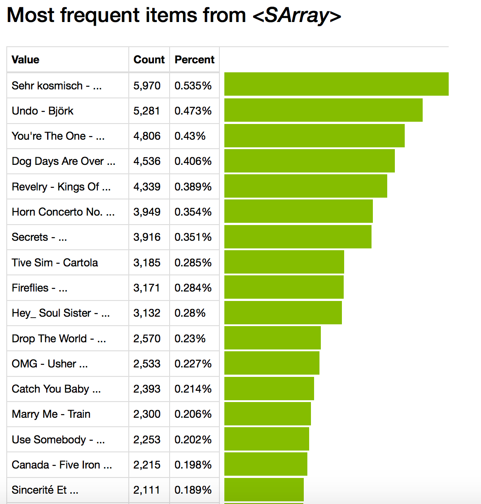

    import graphlab

    A newer version of GraphLab Create (v1.8) is available! Your current version is v1.7.1.
    
    You can use pip to upgrade the graphlab-create package. For more information see https://dato.com/products/create/upgrade.

#Load music data

    song_data = graphlab.SFrame('data/song_data.gl/')

#Explore data

    song_data.head()

<table frame="box" rules="cols">
    <tr>
        <th style="padding-left: 1em; padding-right: 1em; text-align: center">user_id</th>
        <th style="padding-left: 1em; padding-right: 1em; text-align: center">song_id</th>
        <th style="padding-left: 1em; padding-right: 1em; text-align: center">listen_count</th>
        <th style="padding-left: 1em; padding-right: 1em; text-align: center">title</th>
        <th style="padding-left: 1em; padding-right: 1em; text-align: center">artist</th>
    </tr>
    <tr>
        <td style="padding-left: 1em; padding-right: 1em; text-align: center; vertical-align: top">b80344d063b5ccb3212f76538 f3d9e43d87dca9e ...</td>
        <td style="padding-left: 1em; padding-right: 1em; text-align: center; vertical-align: top">SOAKIMP12A8C130995</td>
        <td style="padding-left: 1em; padding-right: 1em; text-align: center; vertical-align: top">1</td>
        <td style="padding-left: 1em; padding-right: 1em; text-align: center; vertical-align: top">The Cove</td>
        <td style="padding-left: 1em; padding-right: 1em; text-align: center; vertical-align: top">Jack Johnson</td>
    </tr>
    <tr>
        <td style="padding-left: 1em; padding-right: 1em; text-align: center; vertical-align: top">b80344d063b5ccb3212f76538 f3d9e43d87dca9e ...</td>
        <td style="padding-left: 1em; padding-right: 1em; text-align: center; vertical-align: top">SOBBMDR12A8C13253B</td>
        <td style="padding-left: 1em; padding-right: 1em; text-align: center; vertical-align: top">2</td>
        <td style="padding-left: 1em; padding-right: 1em; text-align: center; vertical-align: top">Entre Dos Aguas</td>
        <td style="padding-left: 1em; padding-right: 1em; text-align: center; vertical-align: top">Paco De Lucia</td>
    </tr>
    <tr>
        <td style="padding-left: 1em; padding-right: 1em; text-align: center; vertical-align: top">b80344d063b5ccb3212f76538 f3d9e43d87dca9e ...</td>
        <td style="padding-left: 1em; padding-right: 1em; text-align: center; vertical-align: top">SOBXHDL12A81C204C0</td>
        <td style="padding-left: 1em; padding-right: 1em; text-align: center; vertical-align: top">1</td>
        <td style="padding-left: 1em; padding-right: 1em; text-align: center; vertical-align: top">Stronger</td>
        <td style="padding-left: 1em; padding-right: 1em; text-align: center; vertical-align: top">Kanye West</td>
    </tr>
    <tr>
        <td style="padding-left: 1em; padding-right: 1em; text-align: center; vertical-align: top">b80344d063b5ccb3212f76538 f3d9e43d87dca9e ...</td>
        <td style="padding-left: 1em; padding-right: 1em; text-align: center; vertical-align: top">SOBYHAJ12A6701BF1D</td>
        <td style="padding-left: 1em; padding-right: 1em; text-align: center; vertical-align: top">1</td>
        <td style="padding-left: 1em; padding-right: 1em; text-align: center; vertical-align: top">Constellations</td>
        <td style="padding-left: 1em; padding-right: 1em; text-align: center; vertical-align: top">Jack Johnson</td>
    </tr>
    <tr>
        <td style="padding-left: 1em; padding-right: 1em; text-align: center; vertical-align: top">b80344d063b5ccb3212f76538 f3d9e43d87dca9e ...</td>
        <td style="padding-left: 1em; padding-right: 1em; text-align: center; vertical-align: top">SODACBL12A8C13C273</td>
        <td style="padding-left: 1em; padding-right: 1em; text-align: center; vertical-align: top">1</td>
        <td style="padding-left: 1em; padding-right: 1em; text-align: center; vertical-align: top">Learn To Fly</td>
        <td style="padding-left: 1em; padding-right: 1em; text-align: center; vertical-align: top">Foo Fighters</td>
    </tr>
    <tr>
        <td style="padding-left: 1em; padding-right: 1em; text-align: center; vertical-align: top">b80344d063b5ccb3212f76538 f3d9e43d87dca9e ...</td>
        <td style="padding-left: 1em; padding-right: 1em; text-align: center; vertical-align: top">SODDNQT12A6D4F5F7E</td>
        <td style="padding-left: 1em; padding-right: 1em; text-align: center; vertical-align: top">5</td>
        <td style="padding-left: 1em; padding-right: 1em; text-align: center; vertical-align: top">Apuesta Por El Rock 'N' Roll ...</td>
        <td style="padding-left: 1em; padding-right: 1em; text-align: center; vertical-align: top">Héroes del Silencio</td>
    </tr>
    <tr>
        <td style="padding-left: 1em; padding-right: 1em; text-align: center; vertical-align: top">b80344d063b5ccb3212f76538 f3d9e43d87dca9e ...</td>
        <td style="padding-left: 1em; padding-right: 1em; text-align: center; vertical-align: top">SODXRTY12AB0180F3B</td>
        <td style="padding-left: 1em; padding-right: 1em; text-align: center; vertical-align: top">1</td>
        <td style="padding-left: 1em; padding-right: 1em; text-align: center; vertical-align: top">Paper Gangsta</td>
        <td style="padding-left: 1em; padding-right: 1em; text-align: center; vertical-align: top">Lady GaGa</td>
    </tr>
    <tr>
        <td style="padding-left: 1em; padding-right: 1em; text-align: center; vertical-align: top">b80344d063b5ccb3212f76538 f3d9e43d87dca9e ...</td>
        <td style="padding-left: 1em; padding-right: 1em; text-align: center; vertical-align: top">SOFGUAY12AB017B0A8</td>
        <td style="padding-left: 1em; padding-right: 1em; text-align: center; vertical-align: top">1</td>
        <td style="padding-left: 1em; padding-right: 1em; text-align: center; vertical-align: top">Stacked Actors</td>
        <td style="padding-left: 1em; padding-right: 1em; text-align: center; vertical-align: top">Foo Fighters</td>
    </tr>
    <tr>
        <td style="padding-left: 1em; padding-right: 1em; text-align: center; vertical-align: top">b80344d063b5ccb3212f76538 f3d9e43d87dca9e ...</td>
        <td style="padding-left: 1em; padding-right: 1em; text-align: center; vertical-align: top">SOFRQTD12A81C233C0</td>
        <td style="padding-left: 1em; padding-right: 1em; text-align: center; vertical-align: top">1</td>
        <td style="padding-left: 1em; padding-right: 1em; text-align: center; vertical-align: top">Sehr kosmisch</td>
        <td style="padding-left: 1em; padding-right: 1em; text-align: center; vertical-align: top">Harmonia</td>
    </tr>
    <tr>
        <td style="padding-left: 1em; padding-right: 1em; text-align: center; vertical-align: top">b80344d063b5ccb3212f76538 f3d9e43d87dca9e ...</td>
        <td style="padding-left: 1em; padding-right: 1em; text-align: center; vertical-align: top">SOHQWYZ12A6D4FA701</td>
        <td style="padding-left: 1em; padding-right: 1em; text-align: center; vertical-align: top">1</td>
        <td style="padding-left: 1em; padding-right: 1em; text-align: center; vertical-align: top">Heaven's gonna burn your eyes ...</td>
        <td style="padding-left: 1em; padding-right: 1em; text-align: center; vertical-align: top">Thievery Corporation feat. Emiliana Torrini ...</td>
    </tr>
</table>
<table frame="box" rules="cols">
    <tr>
        <th style="padding-left: 1em; padding-right: 1em; text-align: center">song</th>
    </tr>
    <tr>
        <td style="padding-left: 1em; padding-right: 1em; text-align: center; vertical-align: top">The Cove - Jack Johnson</td>
    </tr>
    <tr>
        <td style="padding-left: 1em; padding-right: 1em; text-align: center; vertical-align: top">Entre Dos Aguas - Paco De Lucia ...</td>
    </tr>
    <tr>
        <td style="padding-left: 1em; padding-right: 1em; text-align: center; vertical-align: top">Stronger - Kanye West</td>
    </tr>
    <tr>
        <td style="padding-left: 1em; padding-right: 1em; text-align: center; vertical-align: top">Constellations - Jack Johnson ...</td>
    </tr>
    <tr>
        <td style="padding-left: 1em; padding-right: 1em; text-align: center; vertical-align: top">Learn To Fly - Foo Fighters ...</td>
    </tr>
    <tr>
        <td style="padding-left: 1em; padding-right: 1em; text-align: center; vertical-align: top">Apuesta Por El Rock 'N' Roll - Héroes del ...</td>
    </tr>
    <tr>
        <td style="padding-left: 1em; padding-right: 1em; text-align: center; vertical-align: top">Paper Gangsta - Lady GaGa</td>
    </tr>
    <tr>
        <td style="padding-left: 1em; padding-right: 1em; text-align: center; vertical-align: top">Stacked Actors - Foo Fighters ...</td>
    </tr>
    <tr>
        <td style="padding-left: 1em; padding-right: 1em; text-align: center; vertical-align: top">Sehr kosmisch - Harmonia</td>
    </tr>
    <tr>
        <td style="padding-left: 1em; padding-right: 1em; text-align: center; vertical-align: top">Heaven's gonna burn your eyes - Thievery ...</td>
    </tr>
</table>
[10 rows x 6 columns] 

    graphlab.canvas.set_target('ipynb')

    song_data['song'].show()

    len(song_data)

    1116609

    the_song = song_data[song_data['song_id'] == 'SODDNQT12A6D4F5F7E']

    the_song

<table frame="box" rules="cols">
    <tr>
        <th style="padding-left: 1em; padding-right: 1em; text-align: center">user_id</th>
        <th style="padding-left: 1em; padding-right: 1em; text-align: center">song_id</th>
        <th style="padding-left: 1em; padding-right: 1em; text-align: center">listen_count</th>
        <th style="padding-left: 1em; padding-right: 1em; text-align: center">title</th>
        <th style="padding-left: 1em; padding-right: 1em; text-align: center">artist</th>
    </tr>
    <tr>
        <td style="padding-left: 1em; padding-right: 1em; text-align: center; vertical-align: top">b80344d063b5ccb3212f76538 f3d9e43d87dca9e ...</td>
        <td style="padding-left: 1em; padding-right: 1em; text-align: center; vertical-align: top">SODDNQT12A6D4F5F7E</td>
        <td style="padding-left: 1em; padding-right: 1em; text-align: center; vertical-align: top">5</td>
        <td style="padding-left: 1em; padding-right: 1em; text-align: center; vertical-align: top">Apuesta Por El Rock 'N' Roll ...</td>
        <td style="padding-left: 1em; padding-right: 1em; text-align: center; vertical-align: top">Héroes del Silencio</td>
    </tr>
    <tr>
        <td style="padding-left: 1em; padding-right: 1em; text-align: center; vertical-align: top">e0f31e1222913901ad649b3ef 52f8b43f582fa5b ...</td>
        <td style="padding-left: 1em; padding-right: 1em; text-align: center; vertical-align: top">SODDNQT12A6D4F5F7E</td>
        <td style="padding-left: 1em; padding-right: 1em; text-align: center; vertical-align: top">1</td>
        <td style="padding-left: 1em; padding-right: 1em; text-align: center; vertical-align: top">Apuesta Por El Rock 'N' Roll ...</td>
        <td style="padding-left: 1em; padding-right: 1em; text-align: center; vertical-align: top">Héroes del Silencio</td>
    </tr>
    <tr>
        <td style="padding-left: 1em; padding-right: 1em; text-align: center; vertical-align: top">4fea5a036fbc80d903bc532b1 b7ff3e5261d048d ...</td>
        <td style="padding-left: 1em; padding-right: 1em; text-align: center; vertical-align: top">SODDNQT12A6D4F5F7E</td>
        <td style="padding-left: 1em; padding-right: 1em; text-align: center; vertical-align: top">1</td>
        <td style="padding-left: 1em; padding-right: 1em; text-align: center; vertical-align: top">Apuesta Por El Rock 'N' Roll ...</td>
        <td style="padding-left: 1em; padding-right: 1em; text-align: center; vertical-align: top">Héroes del Silencio</td>
    </tr>
    <tr>
        <td style="padding-left: 1em; padding-right: 1em; text-align: center; vertical-align: top">3ac287c53b903701b878a56c9 c93cbab8216fb5f ...</td>
        <td style="padding-left: 1em; padding-right: 1em; text-align: center; vertical-align: top">SODDNQT12A6D4F5F7E</td>
        <td style="padding-left: 1em; padding-right: 1em; text-align: center; vertical-align: top">23</td>
        <td style="padding-left: 1em; padding-right: 1em; text-align: center; vertical-align: top">Apuesta Por El Rock 'N' Roll ...</td>
        <td style="padding-left: 1em; padding-right: 1em; text-align: center; vertical-align: top">Héroes del Silencio</td>
    </tr>
    <tr>
        <td style="padding-left: 1em; padding-right: 1em; text-align: center; vertical-align: top">e1f5b0130b2805c30951a1938 cbf7aae7b5d93bb ...</td>
        <td style="padding-left: 1em; padding-right: 1em; text-align: center; vertical-align: top">SODDNQT12A6D4F5F7E</td>
        <td style="padding-left: 1em; padding-right: 1em; text-align: center; vertical-align: top">5</td>
        <td style="padding-left: 1em; padding-right: 1em; text-align: center; vertical-align: top">Apuesta Por El Rock 'N' Roll ...</td>
        <td style="padding-left: 1em; padding-right: 1em; text-align: center; vertical-align: top">Héroes del Silencio</td>
    </tr>
    <tr>
        <td style="padding-left: 1em; padding-right: 1em; text-align: center; vertical-align: top">3556349445f8dd4469bbc05c2 79b7179e7eec119 ...</td>
        <td style="padding-left: 1em; padding-right: 1em; text-align: center; vertical-align: top">SODDNQT12A6D4F5F7E</td>
        <td style="padding-left: 1em; padding-right: 1em; text-align: center; vertical-align: top">4</td>
        <td style="padding-left: 1em; padding-right: 1em; text-align: center; vertical-align: top">Apuesta Por El Rock 'N' Roll ...</td>
        <td style="padding-left: 1em; padding-right: 1em; text-align: center; vertical-align: top">Héroes del Silencio</td>
    </tr>
    <tr>
        <td style="padding-left: 1em; padding-right: 1em; text-align: center; vertical-align: top">175ce73cbd16cb5feac71c58e c2ae2b81c6899fc ...</td>
        <td style="padding-left: 1em; padding-right: 1em; text-align: center; vertical-align: top">SODDNQT12A6D4F5F7E</td>
        <td style="padding-left: 1em; padding-right: 1em; text-align: center; vertical-align: top">1</td>
        <td style="padding-left: 1em; padding-right: 1em; text-align: center; vertical-align: top">Apuesta Por El Rock 'N' Roll ...</td>
        <td style="padding-left: 1em; padding-right: 1em; text-align: center; vertical-align: top">Héroes del Silencio</td>
    </tr>
    <tr>
        <td style="padding-left: 1em; padding-right: 1em; text-align: center; vertical-align: top">56eaf2f025153b18f3426efae 0a00484e7ee8dad ...</td>
        <td style="padding-left: 1em; padding-right: 1em; text-align: center; vertical-align: top">SODDNQT12A6D4F5F7E</td>
        <td style="padding-left: 1em; padding-right: 1em; text-align: center; vertical-align: top">1</td>
        <td style="padding-left: 1em; padding-right: 1em; text-align: center; vertical-align: top">Apuesta Por El Rock 'N' Roll ...</td>
        <td style="padding-left: 1em; padding-right: 1em; text-align: center; vertical-align: top">Héroes del Silencio</td>
    </tr>
    <tr>
        <td style="padding-left: 1em; padding-right: 1em; text-align: center; vertical-align: top">d58e346280f7862eea39ed360 cfabe58099a0a79 ...</td>
        <td style="padding-left: 1em; padding-right: 1em; text-align: center; vertical-align: top">SODDNQT12A6D4F5F7E</td>
        <td style="padding-left: 1em; padding-right: 1em; text-align: center; vertical-align: top">1</td>
        <td style="padding-left: 1em; padding-right: 1em; text-align: center; vertical-align: top">Apuesta Por El Rock 'N' Roll ...</td>
        <td style="padding-left: 1em; padding-right: 1em; text-align: center; vertical-align: top">Héroes del Silencio</td>
    </tr>
    <tr>
        <td style="padding-left: 1em; padding-right: 1em; text-align: center; vertical-align: top">ede0a6b9e63057a7af0837ee3 dbd0800ba2dd53f ...</td>
        <td style="padding-left: 1em; padding-right: 1em; text-align: center; vertical-align: top">SODDNQT12A6D4F5F7E</td>
        <td style="padding-left: 1em; padding-right: 1em; text-align: center; vertical-align: top">2</td>
        <td style="padding-left: 1em; padding-right: 1em; text-align: center; vertical-align: top">Apuesta Por El Rock 'N' Roll ...</td>
        <td style="padding-left: 1em; padding-right: 1em; text-align: center; vertical-align: top">Héroes del Silencio</td>
    </tr>
</table>
<table frame="box" rules="cols">
    <tr>
        <th style="padding-left: 1em; padding-right: 1em; text-align: center">song</th>
    </tr>
    <tr>
        <td style="padding-left: 1em; padding-right: 1em; text-align: center; vertical-align: top">Apuesta Por El Rock 'N' Roll - Héroes del ...</td>
    </tr>
    <tr>
        <td style="padding-left: 1em; padding-right: 1em; text-align: center; vertical-align: top">Apuesta Por El Rock 'N' Roll - Héroes del ...</td>
    </tr>
    <tr>
        <td style="padding-left: 1em; padding-right: 1em; text-align: center; vertical-align: top">Apuesta Por El Rock 'N' Roll - Héroes del ...</td>
    </tr>
    <tr>
        <td style="padding-left: 1em; padding-right: 1em; text-align: center; vertical-align: top">Apuesta Por El Rock 'N' Roll - Héroes del ...</td>
    </tr>
    <tr>
        <td style="padding-left: 1em; padding-right: 1em; text-align: center; vertical-align: top">Apuesta Por El Rock 'N' Roll - Héroes del ...</td>
    </tr>
    <tr>
        <td style="padding-left: 1em; padding-right: 1em; text-align: center; vertical-align: top">Apuesta Por El Rock 'N' Roll - Héroes del ...</td>
    </tr>
    <tr>
        <td style="padding-left: 1em; padding-right: 1em; text-align: center; vertical-align: top">Apuesta Por El Rock 'N' Roll - Héroes del ...</td>
    </tr>
    <tr>
        <td style="padding-left: 1em; padding-right: 1em; text-align: center; vertical-align: top">Apuesta Por El Rock 'N' Roll - Héroes del ...</td>
    </tr>
    <tr>
        <td style="padding-left: 1em; padding-right: 1em; text-align: center; vertical-align: top">Apuesta Por El Rock 'N' Roll - Héroes del ...</td>
    </tr>
    <tr>
        <td style="padding-left: 1em; padding-right: 1em; text-align: center; vertical-align: top">Apuesta Por El Rock 'N' Roll - Héroes del ...</td>
    </tr>
</table>
[? rows x 6 columns] Note: Only the head of the SFrame is printed. This SFrame is lazily evaluated. You can use len(sf) to force materialization.

##Count number of users

    users = song_data['user_id'].unique()

    len(users)

    66346

#Create a song recommender

    train_data,test_data = song_data.random_split(0.8, seed=0)

##Simple popularity-based recommender

    popularity_model = graphlab.popularity_recommender.create(train_data,user_id='user_id',item_id='song')

    PROGRESS: Recsys training: model = popularity
    PROGRESS: Warning: Ignoring columns song_id, listen_count, title, artist;
    PROGRESS:     To use one of these as a target column, set target = <column_name>
    PROGRESS:     and use a method that allows the use of a target.
    PROGRESS: Preparing data set.
    PROGRESS:     Data has 893580 observations with 66085 users and 9952 items.
    PROGRESS:     Data prepared in: 0.865267s
    PROGRESS: 893580 observations to process; with 9952 unique items.

###Use the popularity model to make some predictions

    popularity_model.recommend(users=[users[0]])

<table frame="box" rules="cols">
    <tr>
        <th style="padding-left: 1em; padding-right: 1em; text-align: center">user_id</th>
        <th style="padding-left: 1em; padding-right: 1em; text-align: center">song</th>
        <th style="padding-left: 1em; padding-right: 1em; text-align: center">score</th>
        <th style="padding-left: 1em; padding-right: 1em; text-align: center">rank</th>
    </tr>
    <tr>
        <td style="padding-left: 1em; padding-right: 1em; text-align: center; vertical-align: top">279292bb36dbfc7f505e36ebf 038c81eb1d1d63e ...</td>
        <td style="padding-left: 1em; padding-right: 1em; text-align: center; vertical-align: top">Sehr kosmisch - Harmonia</td>
        <td style="padding-left: 1em; padding-right: 1em; text-align: center; vertical-align: top">4754.0</td>
        <td style="padding-left: 1em; padding-right: 1em; text-align: center; vertical-align: top">1</td>
    </tr>
    <tr>
        <td style="padding-left: 1em; padding-right: 1em; text-align: center; vertical-align: top">279292bb36dbfc7f505e36ebf 038c81eb1d1d63e ...</td>
        <td style="padding-left: 1em; padding-right: 1em; text-align: center; vertical-align: top">Undo - Björk</td>
        <td style="padding-left: 1em; padding-right: 1em; text-align: center; vertical-align: top">4227.0</td>
        <td style="padding-left: 1em; padding-right: 1em; text-align: center; vertical-align: top">2</td>
    </tr>
    <tr>
        <td style="padding-left: 1em; padding-right: 1em; text-align: center; vertical-align: top">279292bb36dbfc7f505e36ebf 038c81eb1d1d63e ...</td>
        <td style="padding-left: 1em; padding-right: 1em; text-align: center; vertical-align: top">You're The One - Dwight Yoakam ...</td>
        <td style="padding-left: 1em; padding-right: 1em; text-align: center; vertical-align: top">3781.0</td>
        <td style="padding-left: 1em; padding-right: 1em; text-align: center; vertical-align: top">3</td>
    </tr>
    <tr>
        <td style="padding-left: 1em; padding-right: 1em; text-align: center; vertical-align: top">279292bb36dbfc7f505e36ebf 038c81eb1d1d63e ...</td>
        <td style="padding-left: 1em; padding-right: 1em; text-align: center; vertical-align: top">Dog Days Are Over (Radio Edit) - Florence + The ...</td>
        <td style="padding-left: 1em; padding-right: 1em; text-align: center; vertical-align: top">3633.0</td>
        <td style="padding-left: 1em; padding-right: 1em; text-align: center; vertical-align: top">4</td>
    </tr>
    <tr>
        <td style="padding-left: 1em; padding-right: 1em; text-align: center; vertical-align: top">279292bb36dbfc7f505e36ebf 038c81eb1d1d63e ...</td>
        <td style="padding-left: 1em; padding-right: 1em; text-align: center; vertical-align: top">Revelry - Kings Of Leon</td>
        <td style="padding-left: 1em; padding-right: 1em; text-align: center; vertical-align: top">3527.0</td>
        <td style="padding-left: 1em; padding-right: 1em; text-align: center; vertical-align: top">5</td>
    </tr>
    <tr>
        <td style="padding-left: 1em; padding-right: 1em; text-align: center; vertical-align: top">279292bb36dbfc7f505e36ebf 038c81eb1d1d63e ...</td>
        <td style="padding-left: 1em; padding-right: 1em; text-align: center; vertical-align: top">Horn Concerto No. 4 in E flat K495: II. Romance ...</td>
        <td style="padding-left: 1em; padding-right: 1em; text-align: center; vertical-align: top">3161.0</td>
        <td style="padding-left: 1em; padding-right: 1em; text-align: center; vertical-align: top">6</td>
    </tr>
    <tr>
        <td style="padding-left: 1em; padding-right: 1em; text-align: center; vertical-align: top">279292bb36dbfc7f505e36ebf 038c81eb1d1d63e ...</td>
        <td style="padding-left: 1em; padding-right: 1em; text-align: center; vertical-align: top">Secrets - OneRepublic</td>
        <td style="padding-left: 1em; padding-right: 1em; text-align: center; vertical-align: top">3148.0</td>
        <td style="padding-left: 1em; padding-right: 1em; text-align: center; vertical-align: top">7</td>
    </tr>
    <tr>
        <td style="padding-left: 1em; padding-right: 1em; text-align: center; vertical-align: top">279292bb36dbfc7f505e36ebf 038c81eb1d1d63e ...</td>
        <td style="padding-left: 1em; padding-right: 1em; text-align: center; vertical-align: top">Hey_ Soul Sister - Train</td>
        <td style="padding-left: 1em; padding-right: 1em; text-align: center; vertical-align: top">2538.0</td>
        <td style="padding-left: 1em; padding-right: 1em; text-align: center; vertical-align: top">8</td>
    </tr>
    <tr>
        <td style="padding-left: 1em; padding-right: 1em; text-align: center; vertical-align: top">279292bb36dbfc7f505e36ebf 038c81eb1d1d63e ...</td>
        <td style="padding-left: 1em; padding-right: 1em; text-align: center; vertical-align: top">Fireflies - Charttraxx Karaoke ...</td>
        <td style="padding-left: 1em; padding-right: 1em; text-align: center; vertical-align: top">2532.0</td>
        <td style="padding-left: 1em; padding-right: 1em; text-align: center; vertical-align: top">9</td>
    </tr>
    <tr>
        <td style="padding-left: 1em; padding-right: 1em; text-align: center; vertical-align: top">279292bb36dbfc7f505e36ebf 038c81eb1d1d63e ...</td>
        <td style="padding-left: 1em; padding-right: 1em; text-align: center; vertical-align: top">Tive Sim - Cartola</td>
        <td style="padding-left: 1em; padding-right: 1em; text-align: center; vertical-align: top">2521.0</td>
        <td style="padding-left: 1em; padding-right: 1em; text-align: center; vertical-align: top">10</td>
    </tr>
</table>
[10 rows x 4 columns] 

    popularity_model.recommend(users=[users[1]])

<table frame="box" rules="cols">
    <tr>
        <th style="padding-left: 1em; padding-right: 1em; text-align: center">user_id</th>
        <th style="padding-left: 1em; padding-right: 1em; text-align: center">song</th>
        <th style="padding-left: 1em; padding-right: 1em; text-align: center">score</th>
        <th style="padding-left: 1em; padding-right: 1em; text-align: center">rank</th>
    </tr>
    <tr>
        <td style="padding-left: 1em; padding-right: 1em; text-align: center; vertical-align: top">c067c22072a17d33310d7223d 7b79f819e48cf42 ...</td>
        <td style="padding-left: 1em; padding-right: 1em; text-align: center; vertical-align: top">Sehr kosmisch - Harmonia</td>
        <td style="padding-left: 1em; padding-right: 1em; text-align: center; vertical-align: top">4754.0</td>
        <td style="padding-left: 1em; padding-right: 1em; text-align: center; vertical-align: top">1</td>
    </tr>
    <tr>
        <td style="padding-left: 1em; padding-right: 1em; text-align: center; vertical-align: top">c067c22072a17d33310d7223d 7b79f819e48cf42 ...</td>
        <td style="padding-left: 1em; padding-right: 1em; text-align: center; vertical-align: top">Undo - Björk</td>
        <td style="padding-left: 1em; padding-right: 1em; text-align: center; vertical-align: top">4227.0</td>
        <td style="padding-left: 1em; padding-right: 1em; text-align: center; vertical-align: top">2</td>
    </tr>
    <tr>
        <td style="padding-left: 1em; padding-right: 1em; text-align: center; vertical-align: top">c067c22072a17d33310d7223d 7b79f819e48cf42 ...</td>
        <td style="padding-left: 1em; padding-right: 1em; text-align: center; vertical-align: top">You're The One - Dwight Yoakam ...</td>
        <td style="padding-left: 1em; padding-right: 1em; text-align: center; vertical-align: top">3781.0</td>
        <td style="padding-left: 1em; padding-right: 1em; text-align: center; vertical-align: top">3</td>
    </tr>
    <tr>
        <td style="padding-left: 1em; padding-right: 1em; text-align: center; vertical-align: top">c067c22072a17d33310d7223d 7b79f819e48cf42 ...</td>
        <td style="padding-left: 1em; padding-right: 1em; text-align: center; vertical-align: top">Dog Days Are Over (Radio Edit) - Florence + The ...</td>
        <td style="padding-left: 1em; padding-right: 1em; text-align: center; vertical-align: top">3633.0</td>
        <td style="padding-left: 1em; padding-right: 1em; text-align: center; vertical-align: top">4</td>
    </tr>
    <tr>
        <td style="padding-left: 1em; padding-right: 1em; text-align: center; vertical-align: top">c067c22072a17d33310d7223d 7b79f819e48cf42 ...</td>
        <td style="padding-left: 1em; padding-right: 1em; text-align: center; vertical-align: top">Revelry - Kings Of Leon</td>
        <td style="padding-left: 1em; padding-right: 1em; text-align: center; vertical-align: top">3527.0</td>
        <td style="padding-left: 1em; padding-right: 1em; text-align: center; vertical-align: top">5</td>
    </tr>
    <tr>
        <td style="padding-left: 1em; padding-right: 1em; text-align: center; vertical-align: top">c067c22072a17d33310d7223d 7b79f819e48cf42 ...</td>
        <td style="padding-left: 1em; padding-right: 1em; text-align: center; vertical-align: top">Horn Concerto No. 4 in E flat K495: II. Romance ...</td>
        <td style="padding-left: 1em; padding-right: 1em; text-align: center; vertical-align: top">3161.0</td>
        <td style="padding-left: 1em; padding-right: 1em; text-align: center; vertical-align: top">6</td>
    </tr>
    <tr>
        <td style="padding-left: 1em; padding-right: 1em; text-align: center; vertical-align: top">c067c22072a17d33310d7223d 7b79f819e48cf42 ...</td>
        <td style="padding-left: 1em; padding-right: 1em; text-align: center; vertical-align: top">Secrets - OneRepublic</td>
        <td style="padding-left: 1em; padding-right: 1em; text-align: center; vertical-align: top">3148.0</td>
        <td style="padding-left: 1em; padding-right: 1em; text-align: center; vertical-align: top">7</td>
    </tr>
    <tr>
        <td style="padding-left: 1em; padding-right: 1em; text-align: center; vertical-align: top">c067c22072a17d33310d7223d 7b79f819e48cf42 ...</td>
        <td style="padding-left: 1em; padding-right: 1em; text-align: center; vertical-align: top">Hey_ Soul Sister - Train</td>
        <td style="padding-left: 1em; padding-right: 1em; text-align: center; vertical-align: top">2538.0</td>
        <td style="padding-left: 1em; padding-right: 1em; text-align: center; vertical-align: top">8</td>
    </tr>
    <tr>
        <td style="padding-left: 1em; padding-right: 1em; text-align: center; vertical-align: top">c067c22072a17d33310d7223d 7b79f819e48cf42 ...</td>
        <td style="padding-left: 1em; padding-right: 1em; text-align: center; vertical-align: top">Fireflies - Charttraxx Karaoke ...</td>
        <td style="padding-left: 1em; padding-right: 1em; text-align: center; vertical-align: top">2532.0</td>
        <td style="padding-left: 1em; padding-right: 1em; text-align: center; vertical-align: top">9</td>
    </tr>
    <tr>
        <td style="padding-left: 1em; padding-right: 1em; text-align: center; vertical-align: top">c067c22072a17d33310d7223d 7b79f819e48cf42 ...</td>
        <td style="padding-left: 1em; padding-right: 1em; text-align: center; vertical-align: top">Tive Sim - Cartola</td>
        <td style="padding-left: 1em; padding-right: 1em; text-align: center; vertical-align: top">2521.0</td>
        <td style="padding-left: 1em; padding-right: 1em; text-align: center; vertical-align: top">10</td>
    </tr>
</table>
[10 rows x 4 columns] 

##Build a song recommender with personalization

    personalized_model = graphlab.item_similarity_recommender.create(train_data,user_id='user_id',item_id='song')

    PROGRESS: Recsys training: model = item_similarity
    PROGRESS: Warning: Ignoring columns song_id, listen_count, title, artist;
    PROGRESS:     To use one of these as a target column, set target = <column_name>
    PROGRESS:     and use a method that allows the use of a target.
    PROGRESS: Preparing data set.
    PROGRESS:     Data has 893580 observations with 66085 users and 9952 items.
    PROGRESS:     Data prepared in: 0.803936s
    PROGRESS: Computing item similarity statistics:
    PROGRESS: Computing most similar items for 9952 items:
    PROGRESS: +-----------------+-----------------+
    PROGRESS: | Number of items | Elapsed Time    |
    PROGRESS: +-----------------+-----------------+
    PROGRESS: | 1000            | 1.47828         |
    PROGRESS: | 2000            | 1.51417         |
    PROGRESS: | 3000            | 1.54845         |
    PROGRESS: | 4000            | 1.58308         |
    PROGRESS: | 5000            | 1.61763         |
    PROGRESS: | 6000            | 1.66525         |
    PROGRESS: | 7000            | 1.71141         |
    PROGRESS: | 8000            | 1.76009         |
    PROGRESS: | 9000            | 1.81561         |
    PROGRESS: +-----------------+-----------------+
    PROGRESS: Finished training in 2.1737s

###Applying the pesonalized model to make song recommendations

    personalized_model.recommend(users=[users[0]])

<table frame="box" rules="cols">
    <tr>
        <th style="padding-left: 1em; padding-right: 1em; text-align: center">user_id</th>
        <th style="padding-left: 1em; padding-right: 1em; text-align: center">song</th>
        <th style="padding-left: 1em; padding-right: 1em; text-align: center">score</th>
        <th style="padding-left: 1em; padding-right: 1em; text-align: center">rank</th>
    </tr>
    <tr>
        <td style="padding-left: 1em; padding-right: 1em; text-align: center; vertical-align: top">279292bb36dbfc7f505e36ebf 038c81eb1d1d63e ...</td>
        <td style="padding-left: 1em; padding-right: 1em; text-align: center; vertical-align: top">Riot In Cell Block Number Nine - Dr Feelgood ...</td>
        <td style="padding-left: 1em; padding-right: 1em; text-align: center; vertical-align: top">0.0375</td>
        <td style="padding-left: 1em; padding-right: 1em; text-align: center; vertical-align: top">1</td>
    </tr>
    <tr>
        <td style="padding-left: 1em; padding-right: 1em; text-align: center; vertical-align: top">279292bb36dbfc7f505e36ebf 038c81eb1d1d63e ...</td>
        <td style="padding-left: 1em; padding-right: 1em; text-align: center; vertical-align: top">Sei Lá Mangueira - Elizeth Cardoso ...</td>
        <td style="padding-left: 1em; padding-right: 1em; text-align: center; vertical-align: top">0.0335051546392</td>
        <td style="padding-left: 1em; padding-right: 1em; text-align: center; vertical-align: top">2</td>
    </tr>
    <tr>
        <td style="padding-left: 1em; padding-right: 1em; text-align: center; vertical-align: top">279292bb36dbfc7f505e36ebf 038c81eb1d1d63e ...</td>
        <td style="padding-left: 1em; padding-right: 1em; text-align: center; vertical-align: top">The Stallion - Ween</td>
        <td style="padding-left: 1em; padding-right: 1em; text-align: center; vertical-align: top">0.0322580645161</td>
        <td style="padding-left: 1em; padding-right: 1em; text-align: center; vertical-align: top">3</td>
    </tr>
    <tr>
        <td style="padding-left: 1em; padding-right: 1em; text-align: center; vertical-align: top">279292bb36dbfc7f505e36ebf 038c81eb1d1d63e ...</td>
        <td style="padding-left: 1em; padding-right: 1em; text-align: center; vertical-align: top">Rain - Subhumans</td>
        <td style="padding-left: 1em; padding-right: 1em; text-align: center; vertical-align: top">0.0314716312057</td>
        <td style="padding-left: 1em; padding-right: 1em; text-align: center; vertical-align: top">4</td>
    </tr>
    <tr>
        <td style="padding-left: 1em; padding-right: 1em; text-align: center; vertical-align: top">279292bb36dbfc7f505e36ebf 038c81eb1d1d63e ...</td>
        <td style="padding-left: 1em; padding-right: 1em; text-align: center; vertical-align: top">West One (Shine On Me) - The Ruts ...</td>
        <td style="padding-left: 1em; padding-right: 1em; text-align: center; vertical-align: top">0.0307700498966</td>
        <td style="padding-left: 1em; padding-right: 1em; text-align: center; vertical-align: top">5</td>
    </tr>
    <tr>
        <td style="padding-left: 1em; padding-right: 1em; text-align: center; vertical-align: top">279292bb36dbfc7f505e36ebf 038c81eb1d1d63e ...</td>
        <td style="padding-left: 1em; padding-right: 1em; text-align: center; vertical-align: top">Back Against The Wall - Cage The Elephant ...</td>
        <td style="padding-left: 1em; padding-right: 1em; text-align: center; vertical-align: top">0.0301204819277</td>
        <td style="padding-left: 1em; padding-right: 1em; text-align: center; vertical-align: top">6</td>
    </tr>
    <tr>
        <td style="padding-left: 1em; padding-right: 1em; text-align: center; vertical-align: top">279292bb36dbfc7f505e36ebf 038c81eb1d1d63e ...</td>
        <td style="padding-left: 1em; padding-right: 1em; text-align: center; vertical-align: top">Life Less Frightening - Rise Against ...</td>
        <td style="padding-left: 1em; padding-right: 1em; text-align: center; vertical-align: top">0.0284431137725</td>
        <td style="padding-left: 1em; padding-right: 1em; text-align: center; vertical-align: top">7</td>
    </tr>
    <tr>
        <td style="padding-left: 1em; padding-right: 1em; text-align: center; vertical-align: top">279292bb36dbfc7f505e36ebf 038c81eb1d1d63e ...</td>
        <td style="padding-left: 1em; padding-right: 1em; text-align: center; vertical-align: top">A Beggar On A Beach Of Gold - Mike And The ...</td>
        <td style="padding-left: 1em; padding-right: 1em; text-align: center; vertical-align: top">0.0230283319543</td>
        <td style="padding-left: 1em; padding-right: 1em; text-align: center; vertical-align: top">8</td>
    </tr>
    <tr>
        <td style="padding-left: 1em; padding-right: 1em; text-align: center; vertical-align: top">279292bb36dbfc7f505e36ebf 038c81eb1d1d63e ...</td>
        <td style="padding-left: 1em; padding-right: 1em; text-align: center; vertical-align: top">Audience Of One - Rise Against ...</td>
        <td style="padding-left: 1em; padding-right: 1em; text-align: center; vertical-align: top">0.0193938442211</td>
        <td style="padding-left: 1em; padding-right: 1em; text-align: center; vertical-align: top">9</td>
    </tr>
    <tr>
        <td style="padding-left: 1em; padding-right: 1em; text-align: center; vertical-align: top">279292bb36dbfc7f505e36ebf 038c81eb1d1d63e ...</td>
        <td style="padding-left: 1em; padding-right: 1em; text-align: center; vertical-align: top">Blame It On The Boogie - The Jacksons ...</td>
        <td style="padding-left: 1em; padding-right: 1em; text-align: center; vertical-align: top">0.0189873417722</td>
        <td style="padding-left: 1em; padding-right: 1em; text-align: center; vertical-align: top">10</td>
    </tr>
</table>
[10 rows x 4 columns] 

    personalized_model.recommend(users=[users[1]])

<table frame="box" rules="cols">
    <tr>
        <th style="padding-left: 1em; padding-right: 1em; text-align: center">user_id</th>
        <th style="padding-left: 1em; padding-right: 1em; text-align: center">song</th>
        <th style="padding-left: 1em; padding-right: 1em; text-align: center">score</th>
        <th style="padding-left: 1em; padding-right: 1em; text-align: center">rank</th>
    </tr>
    <tr>
        <td style="padding-left: 1em; padding-right: 1em; text-align: center; vertical-align: top">c067c22072a17d33310d7223d 7b79f819e48cf42 ...</td>
        <td style="padding-left: 1em; padding-right: 1em; text-align: center; vertical-align: top">Grind With Me (Explicit Version) - Pretty Ricky ...</td>
        <td style="padding-left: 1em; padding-right: 1em; text-align: center; vertical-align: top">0.0459424433009</td>
        <td style="padding-left: 1em; padding-right: 1em; text-align: center; vertical-align: top">1</td>
    </tr>
    <tr>
        <td style="padding-left: 1em; padding-right: 1em; text-align: center; vertical-align: top">c067c22072a17d33310d7223d 7b79f819e48cf42 ...</td>
        <td style="padding-left: 1em; padding-right: 1em; text-align: center; vertical-align: top">There Goes My Baby - Usher ...</td>
        <td style="padding-left: 1em; padding-right: 1em; text-align: center; vertical-align: top">0.03319206621</td>
        <td style="padding-left: 1em; padding-right: 1em; text-align: center; vertical-align: top">2</td>
    </tr>
    <tr>
        <td style="padding-left: 1em; padding-right: 1em; text-align: center; vertical-align: top">c067c22072a17d33310d7223d 7b79f819e48cf42 ...</td>
        <td style="padding-left: 1em; padding-right: 1em; text-align: center; vertical-align: top">Panty Droppa [Intro] (Album Version) - Trey ...</td>
        <td style="padding-left: 1em; padding-right: 1em; text-align: center; vertical-align: top">0.0318566167707</td>
        <td style="padding-left: 1em; padding-right: 1em; text-align: center; vertical-align: top">3</td>
    </tr>
    <tr>
        <td style="padding-left: 1em; padding-right: 1em; text-align: center; vertical-align: top">c067c22072a17d33310d7223d 7b79f819e48cf42 ...</td>
        <td style="padding-left: 1em; padding-right: 1em; text-align: center; vertical-align: top">Nobody (Featuring Athena Cage) (LP Version) - ...</td>
        <td style="padding-left: 1em; padding-right: 1em; text-align: center; vertical-align: top">0.0278467568596</td>
        <td style="padding-left: 1em; padding-right: 1em; text-align: center; vertical-align: top">4</td>
    </tr>
    <tr>
        <td style="padding-left: 1em; padding-right: 1em; text-align: center; vertical-align: top">c067c22072a17d33310d7223d 7b79f819e48cf42 ...</td>
        <td style="padding-left: 1em; padding-right: 1em; text-align: center; vertical-align: top">Youth Against Fascism - Sonic Youth ...</td>
        <td style="padding-left: 1em; padding-right: 1em; text-align: center; vertical-align: top">0.0262914085645</td>
        <td style="padding-left: 1em; padding-right: 1em; text-align: center; vertical-align: top">5</td>
    </tr>
    <tr>
        <td style="padding-left: 1em; padding-right: 1em; text-align: center; vertical-align: top">c067c22072a17d33310d7223d 7b79f819e48cf42 ...</td>
        <td style="padding-left: 1em; padding-right: 1em; text-align: center; vertical-align: top">Nice &amp; Slow - Usher</td>
        <td style="padding-left: 1em; padding-right: 1em; text-align: center; vertical-align: top">0.023963940491</td>
        <td style="padding-left: 1em; padding-right: 1em; text-align: center; vertical-align: top">6</td>
    </tr>
    <tr>
        <td style="padding-left: 1em; padding-right: 1em; text-align: center; vertical-align: top">c067c22072a17d33310d7223d 7b79f819e48cf42 ...</td>
        <td style="padding-left: 1em; padding-right: 1em; text-align: center; vertical-align: top">Making Love (Into The Night) - Usher ...</td>
        <td style="padding-left: 1em; padding-right: 1em; text-align: center; vertical-align: top">0.0238176976088</td>
        <td style="padding-left: 1em; padding-right: 1em; text-align: center; vertical-align: top">7</td>
    </tr>
    <tr>
        <td style="padding-left: 1em; padding-right: 1em; text-align: center; vertical-align: top">c067c22072a17d33310d7223d 7b79f819e48cf42 ...</td>
        <td style="padding-left: 1em; padding-right: 1em; text-align: center; vertical-align: top">Naked - Marques Houston</td>
        <td style="padding-left: 1em; padding-right: 1em; text-align: center; vertical-align: top">0.0228925619283</td>
        <td style="padding-left: 1em; padding-right: 1em; text-align: center; vertical-align: top">8</td>
    </tr>
    <tr>
        <td style="padding-left: 1em; padding-right: 1em; text-align: center; vertical-align: top">c067c22072a17d33310d7223d 7b79f819e48cf42 ...</td>
        <td style="padding-left: 1em; padding-right: 1em; text-align: center; vertical-align: top">Love Lost (Album Version) - Trey Songz ...</td>
        <td style="padding-left: 1em; padding-right: 1em; text-align: center; vertical-align: top">0.0228478378014</td>
        <td style="padding-left: 1em; padding-right: 1em; text-align: center; vertical-align: top">9</td>
    </tr>
    <tr>
        <td style="padding-left: 1em; padding-right: 1em; text-align: center; vertical-align: top">c067c22072a17d33310d7223d 7b79f819e48cf42 ...</td>
        <td style="padding-left: 1em; padding-right: 1em; text-align: center; vertical-align: top">Possessed - Kruiz</td>
        <td style="padding-left: 1em; padding-right: 1em; text-align: center; vertical-align: top">0.0227960899412</td>
        <td style="padding-left: 1em; padding-right: 1em; text-align: center; vertical-align: top">10</td>
    </tr>
</table>
[10 rows x 4 columns] 

    personalized_model.get_similar_items(['With Or Without You - U2'])

    PROGRESS: Getting similar items completed in 0.012226

<table frame="box" rules="cols">
    <tr>
        <th style="padding-left: 1em; padding-right: 1em; text-align: center">song</th>
        <th style="padding-left: 1em; padding-right: 1em; text-align: center">similar</th>
        <th style="padding-left: 1em; padding-right: 1em; text-align: center">score</th>
        <th style="padding-left: 1em; padding-right: 1em; text-align: center">rank</th>
    </tr>
    <tr>
        <td style="padding-left: 1em; padding-right: 1em; text-align: center; vertical-align: top">With Or Without You - U2</td>
        <td style="padding-left: 1em; padding-right: 1em; text-align: center; vertical-align: top">I Still Haven't Found What I'm Looking For  ...</td>
        <td style="padding-left: 1em; padding-right: 1em; text-align: center; vertical-align: top">0.0429447852761</td>
        <td style="padding-left: 1em; padding-right: 1em; text-align: center; vertical-align: top">1</td>
    </tr>
    <tr>
        <td style="padding-left: 1em; padding-right: 1em; text-align: center; vertical-align: top">With Or Without You - U2</td>
        <td style="padding-left: 1em; padding-right: 1em; text-align: center; vertical-align: top">Hold Me_ Thrill Me_ Kiss Me_ Kill Me - U2 ...</td>
        <td style="padding-left: 1em; padding-right: 1em; text-align: center; vertical-align: top">0.0338164251208</td>
        <td style="padding-left: 1em; padding-right: 1em; text-align: center; vertical-align: top">2</td>
    </tr>
    <tr>
        <td style="padding-left: 1em; padding-right: 1em; text-align: center; vertical-align: top">With Or Without You - U2</td>
        <td style="padding-left: 1em; padding-right: 1em; text-align: center; vertical-align: top">Window In The Skies - U2</td>
        <td style="padding-left: 1em; padding-right: 1em; text-align: center; vertical-align: top">0.0329341317365</td>
        <td style="padding-left: 1em; padding-right: 1em; text-align: center; vertical-align: top">3</td>
    </tr>
    <tr>
        <td style="padding-left: 1em; padding-right: 1em; text-align: center; vertical-align: top">With Or Without You - U2</td>
        <td style="padding-left: 1em; padding-right: 1em; text-align: center; vertical-align: top">Vertigo - U2</td>
        <td style="padding-left: 1em; padding-right: 1em; text-align: center; vertical-align: top">0.0301507537688</td>
        <td style="padding-left: 1em; padding-right: 1em; text-align: center; vertical-align: top">4</td>
    </tr>
    <tr>
        <td style="padding-left: 1em; padding-right: 1em; text-align: center; vertical-align: top">With Or Without You - U2</td>
        <td style="padding-left: 1em; padding-right: 1em; text-align: center; vertical-align: top">Sunday Bloody Sunday - U2</td>
        <td style="padding-left: 1em; padding-right: 1em; text-align: center; vertical-align: top">0.0272373540856</td>
        <td style="padding-left: 1em; padding-right: 1em; text-align: center; vertical-align: top">5</td>
    </tr>
    <tr>
        <td style="padding-left: 1em; padding-right: 1em; text-align: center; vertical-align: top">With Or Without You - U2</td>
        <td style="padding-left: 1em; padding-right: 1em; text-align: center; vertical-align: top">Bad - U2</td>
        <td style="padding-left: 1em; padding-right: 1em; text-align: center; vertical-align: top">0.0252707581227</td>
        <td style="padding-left: 1em; padding-right: 1em; text-align: center; vertical-align: top">6</td>
    </tr>
    <tr>
        <td style="padding-left: 1em; padding-right: 1em; text-align: center; vertical-align: top">With Or Without You - U2</td>
        <td style="padding-left: 1em; padding-right: 1em; text-align: center; vertical-align: top">A Day Without Me - U2</td>
        <td style="padding-left: 1em; padding-right: 1em; text-align: center; vertical-align: top">0.0238095238095</td>
        <td style="padding-left: 1em; padding-right: 1em; text-align: center; vertical-align: top">7</td>
    </tr>
    <tr>
        <td style="padding-left: 1em; padding-right: 1em; text-align: center; vertical-align: top">With Or Without You - U2</td>
        <td style="padding-left: 1em; padding-right: 1em; text-align: center; vertical-align: top">Another Time Another Place - U2 ...</td>
        <td style="padding-left: 1em; padding-right: 1em; text-align: center; vertical-align: top">0.0204081632653</td>
        <td style="padding-left: 1em; padding-right: 1em; text-align: center; vertical-align: top">8</td>
    </tr>
    <tr>
        <td style="padding-left: 1em; padding-right: 1em; text-align: center; vertical-align: top">With Or Without You - U2</td>
        <td style="padding-left: 1em; padding-right: 1em; text-align: center; vertical-align: top">Walk On - U2</td>
        <td style="padding-left: 1em; padding-right: 1em; text-align: center; vertical-align: top">0.0202702702703</td>
        <td style="padding-left: 1em; padding-right: 1em; text-align: center; vertical-align: top">9</td>
    </tr>
    <tr>
        <td style="padding-left: 1em; padding-right: 1em; text-align: center; vertical-align: top">With Or Without You - U2</td>
        <td style="padding-left: 1em; padding-right: 1em; text-align: center; vertical-align: top">Get On Your Boots - U2</td>
        <td style="padding-left: 1em; padding-right: 1em; text-align: center; vertical-align: top">0.0197628458498</td>
        <td style="padding-left: 1em; padding-right: 1em; text-align: center; vertical-align: top">10</td>
    </tr>
</table>
[10 rows x 4 columns] 

    personalized_model.get_similar_items(['Chan Chan (Live) - Buena Vista Social Club'])

    PROGRESS: Getting similar items completed in 0.002708

<table frame="box" rules="cols">
    <tr>
        <th style="padding-left: 1em; padding-right: 1em; text-align: center">song</th>
        <th style="padding-left: 1em; padding-right: 1em; text-align: center">similar</th>
        <th style="padding-left: 1em; padding-right: 1em; text-align: center">score</th>
        <th style="padding-left: 1em; padding-right: 1em; text-align: center">rank</th>
    </tr>
    <tr>
        <td style="padding-left: 1em; padding-right: 1em; text-align: center; vertical-align: top">Chan Chan (Live) - Buena Vista Social Club ...</td>
        <td style="padding-left: 1em; padding-right: 1em; text-align: center; vertical-align: top">Murmullo - Buena Vista Social Club ...</td>
        <td style="padding-left: 1em; padding-right: 1em; text-align: center; vertical-align: top">0.188118811881</td>
        <td style="padding-left: 1em; padding-right: 1em; text-align: center; vertical-align: top">1</td>
    </tr>
    <tr>
        <td style="padding-left: 1em; padding-right: 1em; text-align: center; vertical-align: top">Chan Chan (Live) - Buena Vista Social Club ...</td>
        <td style="padding-left: 1em; padding-right: 1em; text-align: center; vertical-align: top">La Bayamesa - Buena Vista Social Club ...</td>
        <td style="padding-left: 1em; padding-right: 1em; text-align: center; vertical-align: top">0.187192118227</td>
        <td style="padding-left: 1em; padding-right: 1em; text-align: center; vertical-align: top">2</td>
    </tr>
    <tr>
        <td style="padding-left: 1em; padding-right: 1em; text-align: center; vertical-align: top">Chan Chan (Live) - Buena Vista Social Club ...</td>
        <td style="padding-left: 1em; padding-right: 1em; text-align: center; vertical-align: top">Amor de Loca Juventud - Buena Vista Social Club ...</td>
        <td style="padding-left: 1em; padding-right: 1em; text-align: center; vertical-align: top">0.184834123223</td>
        <td style="padding-left: 1em; padding-right: 1em; text-align: center; vertical-align: top">3</td>
    </tr>
    <tr>
        <td style="padding-left: 1em; padding-right: 1em; text-align: center; vertical-align: top">Chan Chan (Live) - Buena Vista Social Club ...</td>
        <td style="padding-left: 1em; padding-right: 1em; text-align: center; vertical-align: top">Diferente - Gotan Project</td>
        <td style="padding-left: 1em; padding-right: 1em; text-align: center; vertical-align: top">0.0214592274678</td>
        <td style="padding-left: 1em; padding-right: 1em; text-align: center; vertical-align: top">4</td>
    </tr>
    <tr>
        <td style="padding-left: 1em; padding-right: 1em; text-align: center; vertical-align: top">Chan Chan (Live) - Buena Vista Social Club ...</td>
        <td style="padding-left: 1em; padding-right: 1em; text-align: center; vertical-align: top">Mistica - Orishas</td>
        <td style="padding-left: 1em; padding-right: 1em; text-align: center; vertical-align: top">0.0205761316872</td>
        <td style="padding-left: 1em; padding-right: 1em; text-align: center; vertical-align: top">5</td>
    </tr>
    <tr>
        <td style="padding-left: 1em; padding-right: 1em; text-align: center; vertical-align: top">Chan Chan (Live) - Buena Vista Social Club ...</td>
        <td style="padding-left: 1em; padding-right: 1em; text-align: center; vertical-align: top">Hotel California - Gipsy Kings ...</td>
        <td style="padding-left: 1em; padding-right: 1em; text-align: center; vertical-align: top">0.019305019305</td>
        <td style="padding-left: 1em; padding-right: 1em; text-align: center; vertical-align: top">6</td>
    </tr>
    <tr>
        <td style="padding-left: 1em; padding-right: 1em; text-align: center; vertical-align: top">Chan Chan (Live) - Buena Vista Social Club ...</td>
        <td style="padding-left: 1em; padding-right: 1em; text-align: center; vertical-align: top">Nací Orishas - Orishas</td>
        <td style="padding-left: 1em; padding-right: 1em; text-align: center; vertical-align: top">0.0191570881226</td>
        <td style="padding-left: 1em; padding-right: 1em; text-align: center; vertical-align: top">7</td>
    </tr>
    <tr>
        <td style="padding-left: 1em; padding-right: 1em; text-align: center; vertical-align: top">Chan Chan (Live) - Buena Vista Social Club ...</td>
        <td style="padding-left: 1em; padding-right: 1em; text-align: center; vertical-align: top">Le Moulin - Yann Tiersen</td>
        <td style="padding-left: 1em; padding-right: 1em; text-align: center; vertical-align: top">0.0187969924812</td>
        <td style="padding-left: 1em; padding-right: 1em; text-align: center; vertical-align: top">8</td>
    </tr>
    <tr>
        <td style="padding-left: 1em; padding-right: 1em; text-align: center; vertical-align: top">Chan Chan (Live) - Buena Vista Social Club ...</td>
        <td style="padding-left: 1em; padding-right: 1em; text-align: center; vertical-align: top">Gitana - Willie Colon</td>
        <td style="padding-left: 1em; padding-right: 1em; text-align: center; vertical-align: top">0.0187969924812</td>
        <td style="padding-left: 1em; padding-right: 1em; text-align: center; vertical-align: top">9</td>
    </tr>
    <tr>
        <td style="padding-left: 1em; padding-right: 1em; text-align: center; vertical-align: top">Chan Chan (Live) - Buena Vista Social Club ...</td>
        <td style="padding-left: 1em; padding-right: 1em; text-align: center; vertical-align: top">Criminal - Gotan Project</td>
        <td style="padding-left: 1em; padding-right: 1em; text-align: center; vertical-align: top">0.018779342723</td>
        <td style="padding-left: 1em; padding-right: 1em; text-align: center; vertical-align: top">10</td>
    </tr>
</table>
[10 rows x 4 columns] 

#Quantitative comparison between the models

    import matplotlib
    %matplotlib inline
    model_performance = graphlab.recommender.util.compare_models(test_data,[popularity_model,personalized_model],user_sample=0.05)

    compare_models: using 2931 users to estimate model performance
    PROGRESS: Evaluate model M0
    PROGRESS: recommendations finished on 1000/2931 queries. users per second: 18974.3
    PROGRESS: recommendations finished on 2000/2931 queries. users per second: 24797
    
    Precision and recall summary statistics by cutoff
    +--------+-----------------+------------------+
    | cutoff |  mean_precision |   mean_recall    |
    +--------+-----------------+------------------+
    |   1    | 0.0283179802115 | 0.00758260845262 |
    |   2    | 0.0245649948823 | 0.0128032114214  |
    |   3    | 0.0216080973502 |  0.016890090841  |
    |   4    | 0.0204708290686 | 0.0205262391803  |
    |   5    | 0.0194472876151 | 0.0241873076315  |
    |   6    | 0.0180257022632 | 0.0276462524927  |
    |   7    | 0.0171565043622 | 0.0311209024873  |
    |   8    | 0.0166325486182 | 0.0348152766525  |
    |   9    | 0.0159217559422 | 0.0376455768728  |
    |   10   |  0.015626066189 | 0.0414842634904  |
    +--------+-----------------+------------------+
    [10 rows x 3 columns]

    [WARNING] Model trained without a target. Skipping RMSE computation.

    
    PROGRESS: Evaluate model M1
    PROGRESS: recommendations finished on 1000/2931 queries. users per second: 1616.4
    PROGRESS: recommendations finished on 2000/2931 queries. users per second: 1571.77
    
    Precision and recall summary statistics by cutoff
    +--------+-----------------+-----------------+
    | cutoff |  mean_precision |   mean_recall   |
    +--------+-----------------+-----------------+
    |   1    |  0.191402251791 | 0.0617474918652 |
    |   2    |  0.160354827704 | 0.0982011756961 |
    |   3    |  0.139656544979 |  0.125000776023 |
    |   4    |  0.125298532924 |  0.146170021028 |
    |   5    |  0.113203684749 |  0.162447184669 |
    |   6    |  0.104287501422 |  0.178022668361 |
    |   7    | 0.0974313983526 |  0.192223369666 |
    |   8    | 0.0919054930058 |  0.204318588503 |
    |   9    | 0.0863565715152 |  0.215078754074 |
    |   10   | 0.0815762538383 |  0.225316129383 |
    +--------+-----------------+-----------------+
    [10 rows x 3 columns]

    [WARNING] Model trained without a target. Skipping RMSE computation.

    

    model_performance.pop()

    {'precision_recall_by_user': Columns:
     	user_id	str
     	cutoff	int
     	precision	float
     	recall	float
     	count	int
     
     Rows: 52758
     
     Data:
     +-------------------------------+--------+-----------+--------+-------+
     |            user_id            | cutoff | precision | recall | count |
     +-------------------------------+--------+-----------+--------+-------+
     | 00003a4459f33b92906be11abe... |   1    |    0.0    |  0.0   |   1   |
     | 00003a4459f33b92906be11abe... |   2    |    0.0    |  0.0   |   1   |
     | 00003a4459f33b92906be11abe... |   3    |    0.0    |  0.0   |   1   |
     | 00003a4459f33b92906be11abe... |   4    |    0.0    |  0.0   |   1   |
     | 00003a4459f33b92906be11abe... |   5    |    0.0    |  0.0   |   1   |
     | 00003a4459f33b92906be11abe... |   6    |    0.0    |  0.0   |   1   |
     | 00003a4459f33b92906be11abe... |   7    |    0.0    |  0.0   |   1   |
     | 00003a4459f33b92906be11abe... |   8    |    0.0    |  0.0   |   1   |
     | 00003a4459f33b92906be11abe... |   9    |    0.0    |  0.0   |   1   |
     | 00003a4459f33b92906be11abe... |   10   |    0.0    |  0.0   |   1   |
     +-------------------------------+--------+-----------+--------+-------+
     [52758 rows x 5 columns]
     Note: Only the head of the SFrame is printed.
     You can use print_rows(num_rows=m, num_columns=n) to print more rows and columns.,
     'precision_recall_overall': Columns:
     	cutoff	int
     	precision	float
     	recall	float
     
     Rows: 18
     
     Data:
     +--------+-----------------+-----------------+
     | cutoff |    precision    |      recall     |
     +--------+-----------------+-----------------+
     |   1    |  0.191402251791 | 0.0617474918652 |
     |   2    |  0.160354827704 | 0.0982011756961 |
     |   3    |  0.139656544979 |  0.125000776023 |
     |   4    |  0.125298532924 |  0.146170021028 |
     |   5    |  0.113203684749 |  0.162447184669 |
     |   6    |  0.104287501422 |  0.178022668361 |
     |   7    | 0.0974313983526 |  0.192223369666 |
     |   8    | 0.0919054930058 |  0.204318588503 |
     |   9    | 0.0863565715152 |  0.215078754074 |
     |   10   | 0.0815762538383 |  0.225316129383 |
     +--------+-----------------+-----------------+
     [18 rows x 3 columns]
     Note: Only the head of the SFrame is printed.
     You can use print_rows(num_rows=m, num_columns=n) to print more rows and columns.}

    the_song = song_data[song_data['artist'] == 'Kanye West']

    len(the_song['user_id'].unique())

    2522

    len(song_data[song_data['artist'] == 'Foo Fighters']['user_id'].unique())

    2055

    len(song_data[song_data['artist'] == 'Taylor Swift']['user_id'].unique())

    3246

    len(song_data[song_data['artist'] == 'Lady GaGa']['user_id'].unique())

    2928

    song_data.groupby(key_columns='artist', operations={'total_count': graphlab.aggregate.SUM('listen_count')})

<table frame="box" rules="cols">
    <tr>
        <th style="padding-left: 1em; padding-right: 1em; text-align: center">artist</th>
        <th style="padding-left: 1em; padding-right: 1em; text-align: center">total_count</th>
    </tr>
    <tr>
        <td style="padding-left: 1em; padding-right: 1em; text-align: center; vertical-align: top">The Dells</td>
        <td style="padding-left: 1em; padding-right: 1em; text-align: center; vertical-align: top">274</td>
    </tr>
    <tr>
        <td style="padding-left: 1em; padding-right: 1em; text-align: center; vertical-align: top">16Volt</td>
        <td style="padding-left: 1em; padding-right: 1em; text-align: center; vertical-align: top">579</td>
    </tr>
    <tr>
        <td style="padding-left: 1em; padding-right: 1em; text-align: center; vertical-align: top">The Stray Cats</td>
        <td style="padding-left: 1em; padding-right: 1em; text-align: center; vertical-align: top">411</td>
    </tr>
    <tr>
        <td style="padding-left: 1em; padding-right: 1em; text-align: center; vertical-align: top">Billy Preston / Syreeta</td>
        <td style="padding-left: 1em; padding-right: 1em; text-align: center; vertical-align: top">189</td>
    </tr>
    <tr>
        <td style="padding-left: 1em; padding-right: 1em; text-align: center; vertical-align: top">Emma Shapplin</td>
        <td style="padding-left: 1em; padding-right: 1em; text-align: center; vertical-align: top">252</td>
    </tr>
    <tr>
        <td style="padding-left: 1em; padding-right: 1em; text-align: center; vertical-align: top">Lil Jon &amp; The East Side Boyz / Ludacris / Usher ...</td>
        <td style="padding-left: 1em; padding-right: 1em; text-align: center; vertical-align: top">256</td>
    </tr>
    <tr>
        <td style="padding-left: 1em; padding-right: 1em; text-align: center; vertical-align: top">Spoon</td>
        <td style="padding-left: 1em; padding-right: 1em; text-align: center; vertical-align: top">1061</td>
    </tr>
    <tr>
        <td style="padding-left: 1em; padding-right: 1em; text-align: center; vertical-align: top">Sam &amp; Dave</td>
        <td style="padding-left: 1em; padding-right: 1em; text-align: center; vertical-align: top">656</td>
    </tr>
    <tr>
        <td style="padding-left: 1em; padding-right: 1em; text-align: center; vertical-align: top">Blue Swede</td>
        <td style="padding-left: 1em; padding-right: 1em; text-align: center; vertical-align: top">266</td>
    </tr>
    <tr>
        <td style="padding-left: 1em; padding-right: 1em; text-align: center; vertical-align: top">Scooter</td>
        <td style="padding-left: 1em; padding-right: 1em; text-align: center; vertical-align: top">1202</td>
    </tr>
</table>
[3375 rows x 2 columns] Note: Only the head of the SFrame is printed. You can use print_rows(num_rows=m, num_columns=n) to print more rows and columns.

    artist_group = song_data.groupby(key_columns='artist', operations={'total_count': graphlab.aggregate.SUM('listen_count')})

    artist_group.sort()

    ---------------------------------------------------------------------------

    TypeError                                 Traceback (most recent call last)

    <ipython-input-33-322c77db6a64> in <module>()
    ----> 1 artist_group.sort()
    

    TypeError: sort() takes at least 2 arguments (1 given)

    artist_group.sort('total_count',ascending=False)

<table frame="box" rules="cols">
    <tr>
        <th style="padding-left: 1em; padding-right: 1em; text-align: center">artist</th>
        <th style="padding-left: 1em; padding-right: 1em; text-align: center">total_count</th>
    </tr>
    <tr>
        <td style="padding-left: 1em; padding-right: 1em; text-align: center; vertical-align: top">Kings Of Leon</td>
        <td style="padding-left: 1em; padding-right: 1em; text-align: center; vertical-align: top">43218</td>
    </tr>
    <tr>
        <td style="padding-left: 1em; padding-right: 1em; text-align: center; vertical-align: top">Dwight Yoakam</td>
        <td style="padding-left: 1em; padding-right: 1em; text-align: center; vertical-align: top">40619</td>
    </tr>
    <tr>
        <td style="padding-left: 1em; padding-right: 1em; text-align: center; vertical-align: top">Björk</td>
        <td style="padding-left: 1em; padding-right: 1em; text-align: center; vertical-align: top">38889</td>
    </tr>
    <tr>
        <td style="padding-left: 1em; padding-right: 1em; text-align: center; vertical-align: top">Coldplay</td>
        <td style="padding-left: 1em; padding-right: 1em; text-align: center; vertical-align: top">35362</td>
    </tr>
    <tr>
        <td style="padding-left: 1em; padding-right: 1em; text-align: center; vertical-align: top">Florence + The Machine</td>
        <td style="padding-left: 1em; padding-right: 1em; text-align: center; vertical-align: top">33387</td>
    </tr>
    <tr>
        <td style="padding-left: 1em; padding-right: 1em; text-align: center; vertical-align: top">Justin Bieber</td>
        <td style="padding-left: 1em; padding-right: 1em; text-align: center; vertical-align: top">29715</td>
    </tr>
    <tr>
        <td style="padding-left: 1em; padding-right: 1em; text-align: center; vertical-align: top">Alliance Ethnik</td>
        <td style="padding-left: 1em; padding-right: 1em; text-align: center; vertical-align: top">26689</td>
    </tr>
    <tr>
        <td style="padding-left: 1em; padding-right: 1em; text-align: center; vertical-align: top">OneRepublic</td>
        <td style="padding-left: 1em; padding-right: 1em; text-align: center; vertical-align: top">25754</td>
    </tr>
    <tr>
        <td style="padding-left: 1em; padding-right: 1em; text-align: center; vertical-align: top">Train</td>
        <td style="padding-left: 1em; padding-right: 1em; text-align: center; vertical-align: top">25402</td>
    </tr>
    <tr>
        <td style="padding-left: 1em; padding-right: 1em; text-align: center; vertical-align: top">The Black Keys</td>
        <td style="padding-left: 1em; padding-right: 1em; text-align: center; vertical-align: top">22184</td>
    </tr>
</table>
[3375 rows x 2 columns] Note: Only the head of the SFrame is printed. You can use print_rows(num_rows=m, num_columns=n) to print more rows and columns.

    train_data,test_data = song_data.random_split(0.8, seed=0)

    personalized_model = graphlab.item_similarity_recommender.create(train_data,user_id='user_id',item_id='song')

    PROGRESS: Recsys training: model = item_similarity
    PROGRESS: Warning: Ignoring columns song_id, listen_count, title, artist;
    PROGRESS:     To use one of these as a target column, set target = <column_name>
    PROGRESS:     and use a method that allows the use of a target.
    PROGRESS: Preparing data set.
    PROGRESS:     Data has 893580 observations with 66085 users and 9952 items.
    PROGRESS:     Data prepared in: 0.782862s
    PROGRESS: Computing item similarity statistics:
    PROGRESS: Computing most similar items for 9952 items:
    PROGRESS: +-----------------+-----------------+
    PROGRESS: | Number of items | Elapsed Time    |
    PROGRESS: +-----------------+-----------------+
    PROGRESS: | 1000            | 0.417085        |
    PROGRESS: | 2000            | 0.451725        |
    PROGRESS: | 3000            | 0.486094        |
    PROGRESS: | 4000            | 0.519362        |
    PROGRESS: | 5000            | 0.553113        |
    PROGRESS: | 6000            | 0.585836        |
    PROGRESS: | 7000            | 0.618193        |
    PROGRESS: | 8000            | 0.656613        |
    PROGRESS: | 9000            | 0.701519        |
    PROGRESS: +-----------------+-----------------+
    PROGRESS: Finished training in 1.01007s

    subset_test_users = test_data['user_id'].unique()[0:10000]

    recommend_song = personalized_model.recommend(subset_test_users,k=1)

    PROGRESS: recommendations finished on 1000/10000 queries. users per second: 1575.89
    PROGRESS: recommendations finished on 2000/10000 queries. users per second: 1595.42
    PROGRESS: recommendations finished on 3000/10000 queries. users per second: 1620.01
    PROGRESS: recommendations finished on 4000/10000 queries. users per second: 1633.06
    PROGRESS: recommendations finished on 5000/10000 queries. users per second: 1648.22
    PROGRESS: recommendations finished on 6000/10000 queries. users per second: 1643.95
    PROGRESS: recommendations finished on 7000/10000 queries. users per second: 1631.16
    PROGRESS: recommendations finished on 8000/10000 queries. users per second: 1639.77
    PROGRESS: recommendations finished on 9000/10000 queries. users per second: 1641.9
    PROGRESS: recommendations finished on 10000/10000 queries. users per second: 1634.64

    recommend_song.head()

<table frame="box" rules="cols">
    <tr>
        <th style="padding-left: 1em; padding-right: 1em; text-align: center">user_id</th>
        <th style="padding-left: 1em; padding-right: 1em; text-align: center">song</th>
        <th style="padding-left: 1em; padding-right: 1em; text-align: center">score</th>
        <th style="padding-left: 1em; padding-right: 1em; text-align: center">rank</th>
    </tr>
    <tr>
        <td style="padding-left: 1em; padding-right: 1em; text-align: center; vertical-align: top">c067c22072a17d33310d7223d 7b79f819e48cf42 ...</td>
        <td style="padding-left: 1em; padding-right: 1em; text-align: center; vertical-align: top">Grind With Me (Explicit Version) - Pretty Ricky ...</td>
        <td style="padding-left: 1em; padding-right: 1em; text-align: center; vertical-align: top">0.0464083161354</td>
        <td style="padding-left: 1em; padding-right: 1em; text-align: center; vertical-align: top">1</td>
    </tr>
    <tr>
        <td style="padding-left: 1em; padding-right: 1em; text-align: center; vertical-align: top">696787172dd3f5169dc94deef 97e427cee86147d ...</td>
        <td style="padding-left: 1em; padding-right: 1em; text-align: center; vertical-align: top">Senza Una Donna (Without A Woman) - Zucchero / ...</td>
        <td style="padding-left: 1em; padding-right: 1em; text-align: center; vertical-align: top">0.0170265780731</td>
        <td style="padding-left: 1em; padding-right: 1em; text-align: center; vertical-align: top">1</td>
    </tr>
    <tr>
        <td style="padding-left: 1em; padding-right: 1em; text-align: center; vertical-align: top">532e98155cbfd1e1a474a28ed 96e59e50f7c5baf ...</td>
        <td style="padding-left: 1em; padding-right: 1em; text-align: center; vertical-align: top">Jive Talkin' (Album Version) - Bee Gees ...</td>
        <td style="padding-left: 1em; padding-right: 1em; text-align: center; vertical-align: top">0.0118288659232</td>
        <td style="padding-left: 1em; padding-right: 1em; text-align: center; vertical-align: top">1</td>
    </tr>
    <tr>
        <td style="padding-left: 1em; padding-right: 1em; text-align: center; vertical-align: top">18325842a941bc58449ee71d6 59a08d1c1bd2383 ...</td>
        <td style="padding-left: 1em; padding-right: 1em; text-align: center; vertical-align: top">Goodnight And Goodbye - Jonas Brothers ...</td>
        <td style="padding-left: 1em; padding-right: 1em; text-align: center; vertical-align: top">0.0168060865646</td>
        <td style="padding-left: 1em; padding-right: 1em; text-align: center; vertical-align: top">1</td>
    </tr>
    <tr>
        <td style="padding-left: 1em; padding-right: 1em; text-align: center; vertical-align: top">507433946f534f5d25ad1be30 2edb9a2376f503c ...</td>
        <td style="padding-left: 1em; padding-right: 1em; text-align: center; vertical-align: top">Find The Cost Of Freedom - Crosby_ Stills_ Nash &amp; ...</td>
        <td style="padding-left: 1em; padding-right: 1em; text-align: center; vertical-align: top">0.0165806601546</td>
        <td style="padding-left: 1em; padding-right: 1em; text-align: center; vertical-align: top">1</td>
    </tr>
    <tr>
        <td style="padding-left: 1em; padding-right: 1em; text-align: center; vertical-align: top">18fafad477f9d72ff86f7d0bd 838a6573de0f64a ...</td>
        <td style="padding-left: 1em; padding-right: 1em; text-align: center; vertical-align: top">Rabbit Heart (Raise It Up) - Florence + The ...</td>
        <td style="padding-left: 1em; padding-right: 1em; text-align: center; vertical-align: top">0.0799834830618</td>
        <td style="padding-left: 1em; padding-right: 1em; text-align: center; vertical-align: top">1</td>
    </tr>
    <tr>
        <td style="padding-left: 1em; padding-right: 1em; text-align: center; vertical-align: top">fe85b96ba1983219b296f6b48 69dd29eb2b72ff9 ...</td>
        <td style="padding-left: 1em; padding-right: 1em; text-align: center; vertical-align: top">Secrets - OneRepublic</td>
        <td style="padding-left: 1em; padding-right: 1em; text-align: center; vertical-align: top">0.0791236958024</td>
        <td style="padding-left: 1em; padding-right: 1em; text-align: center; vertical-align: top">1</td>
    </tr>
    <tr>
        <td style="padding-left: 1em; padding-right: 1em; text-align: center; vertical-align: top">225ea420b4bede50919d1bfe2 4a599691522d176 ...</td>
        <td style="padding-left: 1em; padding-right: 1em; text-align: center; vertical-align: top">Alejandro - Lady GaGa</td>
        <td style="padding-left: 1em; padding-right: 1em; text-align: center; vertical-align: top">0.0273573073173</td>
        <td style="padding-left: 1em; padding-right: 1em; text-align: center; vertical-align: top">1</td>
    </tr>
    <tr>
        <td style="padding-left: 1em; padding-right: 1em; text-align: center; vertical-align: top">95dc7e2b188b1148b2d25f4e6 b6e94afacc4efc3 ...</td>
        <td style="padding-left: 1em; padding-right: 1em; text-align: center; vertical-align: top">Bust a Move - Infected Mushroom ...</td>
        <td style="padding-left: 1em; padding-right: 1em; text-align: center; vertical-align: top">0.0534738458885</td>
        <td style="padding-left: 1em; padding-right: 1em; text-align: center; vertical-align: top">1</td>
    </tr>
    <tr>
        <td style="padding-left: 1em; padding-right: 1em; text-align: center; vertical-align: top">4a3a1ae2748f12f7ab921a47d 6d79abf82e3e325 ...</td>
        <td style="padding-left: 1em; padding-right: 1em; text-align: center; vertical-align: top">Isis (Spam Remix) - Alaska Y Dinarama ...</td>
        <td style="padding-left: 1em; padding-right: 1em; text-align: center; vertical-align: top">0.0418030208549</td>
        <td style="padding-left: 1em; padding-right: 1em; text-align: center; vertical-align: top">1</td>
    </tr>
</table>
[10 rows x 4 columns] 

    group_song = recommend_song.groupby(key_columns='song', operations={'count': graphlab.aggregate.COUNT()})

    group_song.head()

<table frame="box" rules="cols">
    <tr>
        <th style="padding-left: 1em; padding-right: 1em; text-align: center">song</th>
        <th style="padding-left: 1em; padding-right: 1em; text-align: center">count</th>
    </tr>
    <tr>
        <td style="padding-left: 1em; padding-right: 1em; text-align: center; vertical-align: top">Arco Arena - Cake</td>
        <td style="padding-left: 1em; padding-right: 1em; text-align: center; vertical-align: top">1</td>
    </tr>
    <tr>
        <td style="padding-left: 1em; padding-right: 1em; text-align: center; vertical-align: top">Too Deep - Girl Talk</td>
        <td style="padding-left: 1em; padding-right: 1em; text-align: center; vertical-align: top">2</td>
    </tr>
    <tr>
        <td style="padding-left: 1em; padding-right: 1em; text-align: center; vertical-align: top">Guys Like Me - Eric Church ...</td>
        <td style="padding-left: 1em; padding-right: 1em; text-align: center; vertical-align: top">2</td>
    </tr>
    <tr>
        <td style="padding-left: 1em; padding-right: 1em; text-align: center; vertical-align: top">Freedom - Akon</td>
        <td style="padding-left: 1em; padding-right: 1em; text-align: center; vertical-align: top">2</td>
    </tr>
    <tr>
        <td style="padding-left: 1em; padding-right: 1em; text-align: center; vertical-align: top">Wish You Were Here - Incubus ...</td>
        <td style="padding-left: 1em; padding-right: 1em; text-align: center; vertical-align: top">1</td>
    </tr>
    <tr>
        <td style="padding-left: 1em; padding-right: 1em; text-align: center; vertical-align: top">Change - Blind Melon</td>
        <td style="padding-left: 1em; padding-right: 1em; text-align: center; vertical-align: top">1</td>
    </tr>
    <tr>
        <td style="padding-left: 1em; padding-right: 1em; text-align: center; vertical-align: top">Get:On - Moguai</td>
        <td style="padding-left: 1em; padding-right: 1em; text-align: center; vertical-align: top">1</td>
    </tr>
    <tr>
        <td style="padding-left: 1em; padding-right: 1em; text-align: center; vertical-align: top">Pitter-Pat - Erin McCarley ...</td>
        <td style="padding-left: 1em; padding-right: 1em; text-align: center; vertical-align: top">3</td>
    </tr>
    <tr>
        <td style="padding-left: 1em; padding-right: 1em; text-align: center; vertical-align: top">Dog Days Are Over (Radio Edit) - Florence + The ...</td>
        <td style="padding-left: 1em; padding-right: 1em; text-align: center; vertical-align: top">30</td>
    </tr>
    <tr>
        <td style="padding-left: 1em; padding-right: 1em; text-align: center; vertical-align: top">Elysium - Portishead</td>
        <td style="padding-left: 1em; padding-right: 1em; text-align: center; vertical-align: top">1</td>
    </tr>
</table>
[10 rows x 2 columns] 

    group_song.sort('count',ascending=False)

<table frame="box" rules="cols">
    <tr>
        <th style="padding-left: 1em; padding-right: 1em; text-align: center">song</th>
        <th style="padding-left: 1em; padding-right: 1em; text-align: center">count</th>
    </tr>
    <tr>
        <td style="padding-left: 1em; padding-right: 1em; text-align: center; vertical-align: top">Undo - Björk</td>
        <td style="padding-left: 1em; padding-right: 1em; text-align: center; vertical-align: top">433</td>
    </tr>
    <tr>
        <td style="padding-left: 1em; padding-right: 1em; text-align: center; vertical-align: top">Secrets - OneRepublic</td>
        <td style="padding-left: 1em; padding-right: 1em; text-align: center; vertical-align: top">375</td>
    </tr>
    <tr>
        <td style="padding-left: 1em; padding-right: 1em; text-align: center; vertical-align: top">Revelry - Kings Of Leon</td>
        <td style="padding-left: 1em; padding-right: 1em; text-align: center; vertical-align: top">231</td>
    </tr>
    <tr>
        <td style="padding-left: 1em; padding-right: 1em; text-align: center; vertical-align: top">You're The One - Dwight Yoakam ...</td>
        <td style="padding-left: 1em; padding-right: 1em; text-align: center; vertical-align: top">167</td>
    </tr>
    <tr>
        <td style="padding-left: 1em; padding-right: 1em; text-align: center; vertical-align: top">Fireflies - Charttraxx Karaoke ...</td>
        <td style="padding-left: 1em; padding-right: 1em; text-align: center; vertical-align: top">118</td>
    </tr>
    <tr>
        <td style="padding-left: 1em; padding-right: 1em; text-align: center; vertical-align: top">Hey_ Soul Sister - Train</td>
        <td style="padding-left: 1em; padding-right: 1em; text-align: center; vertical-align: top">104</td>
    </tr>
    <tr>
        <td style="padding-left: 1em; padding-right: 1em; text-align: center; vertical-align: top">Horn Concerto No. 4 in E flat K495: II. Romance ...</td>
        <td style="padding-left: 1em; padding-right: 1em; text-align: center; vertical-align: top">92</td>
    </tr>
    <tr>
        <td style="padding-left: 1em; padding-right: 1em; text-align: center; vertical-align: top">Sehr kosmisch - Harmonia</td>
        <td style="padding-left: 1em; padding-right: 1em; text-align: center; vertical-align: top">86</td>
    </tr>
    <tr>
        <td style="padding-left: 1em; padding-right: 1em; text-align: center; vertical-align: top">OMG - Usher featuring will.i.am ...</td>
        <td style="padding-left: 1em; padding-right: 1em; text-align: center; vertical-align: top">63</td>
    </tr>
    <tr>
        <td style="padding-left: 1em; padding-right: 1em; text-align: center; vertical-align: top">The Scientist - Coldplay</td>
        <td style="padding-left: 1em; padding-right: 1em; text-align: center; vertical-align: top">47</td>
    </tr>
</table>
[3143 rows x 2 columns] Note: Only the head of the SFrame is printed. You can use print_rows(num_rows=m, num_columns=n) to print more rows and columns.

    artist_group.sort('total_count')

<table frame="box" rules="cols">
    <tr>
        <th style="padding-left: 1em; padding-right: 1em; text-align: center">artist</th>
        <th style="padding-left: 1em; padding-right: 1em; text-align: center">total_count</th>
    </tr>
    <tr>
        <td style="padding-left: 1em; padding-right: 1em; text-align: center; vertical-align: top">William Tabbert</td>
        <td style="padding-left: 1em; padding-right: 1em; text-align: center; vertical-align: top">14</td>
    </tr>
    <tr>
        <td style="padding-left: 1em; padding-right: 1em; text-align: center; vertical-align: top">Reel Feelings</td>
        <td style="padding-left: 1em; padding-right: 1em; text-align: center; vertical-align: top">24</td>
    </tr>
    <tr>
        <td style="padding-left: 1em; padding-right: 1em; text-align: center; vertical-align: top">Beyoncé feat. Bun B and Slim Thug ...</td>
        <td style="padding-left: 1em; padding-right: 1em; text-align: center; vertical-align: top">26</td>
    </tr>
    <tr>
        <td style="padding-left: 1em; padding-right: 1em; text-align: center; vertical-align: top">Boggle Karaoke</td>
        <td style="padding-left: 1em; padding-right: 1em; text-align: center; vertical-align: top">30</td>
    </tr>
    <tr>
        <td style="padding-left: 1em; padding-right: 1em; text-align: center; vertical-align: top">Diplo</td>
        <td style="padding-left: 1em; padding-right: 1em; text-align: center; vertical-align: top">30</td>
    </tr>
    <tr>
        <td style="padding-left: 1em; padding-right: 1em; text-align: center; vertical-align: top">harvey summers</td>
        <td style="padding-left: 1em; padding-right: 1em; text-align: center; vertical-align: top">31</td>
    </tr>
    <tr>
        <td style="padding-left: 1em; padding-right: 1em; text-align: center; vertical-align: top">Nâdiya</td>
        <td style="padding-left: 1em; padding-right: 1em; text-align: center; vertical-align: top">36</td>
    </tr>
    <tr>
        <td style="padding-left: 1em; padding-right: 1em; text-align: center; vertical-align: top">Jody Bernal</td>
        <td style="padding-left: 1em; padding-right: 1em; text-align: center; vertical-align: top">38</td>
    </tr>
    <tr>
        <td style="padding-left: 1em; padding-right: 1em; text-align: center; vertical-align: top">Aneta Langerova</td>
        <td style="padding-left: 1em; padding-right: 1em; text-align: center; vertical-align: top">38</td>
    </tr>
    <tr>
        <td style="padding-left: 1em; padding-right: 1em; text-align: center; vertical-align: top">Kanye West / Talib Kweli / Q-Tip / Common / ...</td>
        <td style="padding-left: 1em; padding-right: 1em; text-align: center; vertical-align: top">38</td>
    </tr>
</table>
[3375 rows x 2 columns] Note: Only the head of the SFrame is printed. You can use print_rows(num_rows=m, num_columns=n) to print more rows and columns.

    
